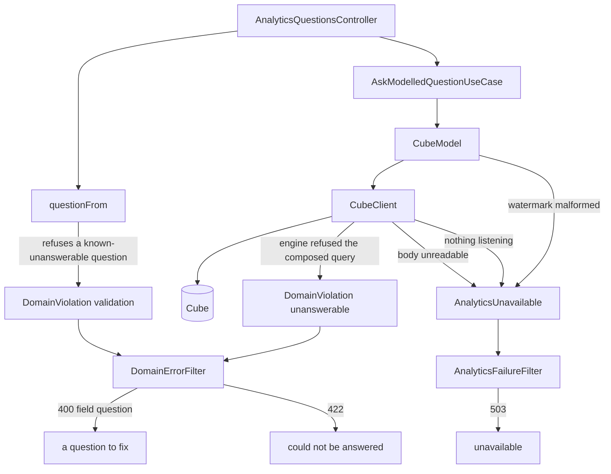
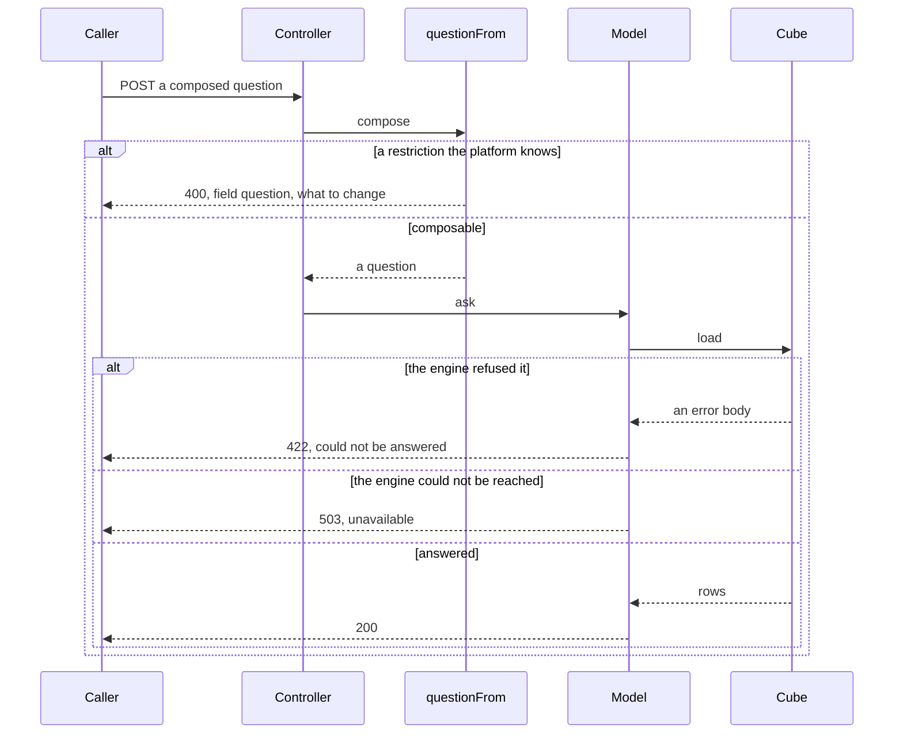

# Design — analytics-question-refusals

## Overview

A question the model cannot compose is reported today as `503 "the answer is
unavailable"`. A person is told the service could not be reached and offered a
retry that can never succeed; whoever is on call is sent to inspect a container
that is answering perfectly well.

This design answers by **fault**, in three classes where there is one today:

1. **A question the platform knows it cannot compose** is refused before the
   model is asked, in the platform's own words, naming what to change. It
   becomes a rejection like the over-long period already is.
2. **A refusal the platform did not anticipate** is reported as a question that
   could not be answered and nobody's mistake — neither an outage nor the
   caller's error.
3. **Everything else** — an engine that cannot be reached, an answer that
   cannot be read, a malformed watermark, a timeout — remains the unavailable
   service it already is.

The first needs no new mechanism: `refuseIfOverBound` already refuses a
question from inside the use case with a readable sentence, and the domain
already publishes which measures are cumulative and which groupings are days.
The second is the real work, and it is a taxonomy change rather than a feature.

## Goals

- Stop telling a person a question can be retried when it cannot (1.1–1.4).
- Say what to change, in the platform's own words, for the one restriction the
  platform knows (1.3, 1.5, 2.1).
- Keep the engine's text out of every answer (2.2, 2.3).
- Give an unanticipated refusal an honest answer that blames nobody (3.1, 3.2).
- Keep "unavailable" meaning unavailable, and keep the classes an operator
  reads distinct (4.1–4.3).

## Non-goals

- **Publishing the restriction through the vocabulary.** A caller would then
  refuse the combination before spending one of its ten questions a minute.
  That is prevention and belongs to `analytics-vocabulary`; this is the
  correction, and it is needed regardless because a dashboard is not the only
  possible caller.
- **Changing the model.** The rolling window is correct as modelled.
- **Discovering every restriction the engine has.** One is measured; §Open
  questions records what that leaves unknown.
- **Deciding whether a refused question costs one of the ten a minute.**

---

## Boundary Commitments

### This spec owns

- **The rule that a cumulative measure cannot meet more than one grouping by
  day**, stated in the platform's published terms, and the sentence that
  refuses it.
- **The classification of an analytics failure into an answer**: which failures
  are questions, which are blameless, and which are the service being
  unavailable.
- **The reasons an operator reads**, and keeping them distinct.

### Out of boundary

- **The dashboard's screens, wording and composer.** One coordinated change is
  required of its request layer — reading `422` — and it belongs to
  `dashboard-analytics`. This spec owns neither that code nor its schedule.
- **The vocabulary route and what it publishes.**
- **The semantic model**, its members and their definitions.
- **When data is exported, and when a prepared answer is rebuilt.**

### Allowed dependencies

- `domain/semantic/vocabulary.ts` — read, for `MEASURE_TRAITS` and
  `GROUPING_SHAPES`. The rule reads what the platform already publishes and
  introduces no second source.
- `domain/errors.ts` — the closed `DomainError` union and its exhaustive map.
- `application/analytics/analytics-failure.ts` — the closed reason set.
- Nothing new. No dependency is added to the project.

### Revalidation triggers

- **The dashboard has not yet learned to read `422`.** Until it has, this
  feature turns a false "could not be reached" into a false "not available".
  The order is not optional, and §Rollout states it.
- **The engine stops refusing the combination** — because it gained support, or
  the model stopped using a rolling window. The platform would go on refusing a
  question that is now answerable, and nothing would fail. One integration test
  asks the engine the forbidden question and requires it to refuse.
- **Another restriction is found.** The rule set is a list, not a principle;
  a second entry is an ordinary change, but a restriction discovered in
  production is a gap in §Open questions rather than a surprise.
- **A new producer of a blameless refusal appears.** Every reason must have a
  producer, by this repository's rule.

---

## Architecture



### Where each decision is taken

**The known restriction is refused in the domain, before anything is asked.**
`questionFrom` is already documented as *"the only way to compose one, and it
refuses three things"*; it becomes four. Refusing there means no token is
signed, no question is spent against the allowance, and the rule is provable by
a pure domain spec with no engine, no container and no fixture.

It also repairs that module's own stated premise. It says today that any
measures may meet any groupings *"with no definition written for the
combination"*. Each part does carry its own bound; what the measurement showed
is that the combination carries one too.

**The unanticipated refusal is classified where it happens.** `CubeClient`
already distinguishes the connection (`model-unreachable`) from a body that
came back; what it cannot distinguish today is *the engine refused this query*
from *the engine's answer was unreadable*. Those become two reasons with two
producers, and only the first is blameless rather than unavailable.

This follows the rule `analytics-failure.ts` states for itself: classify where
it happened, never by matching an error string afterwards, *"because matching on
those is how a rephrased library message silently turns every failure into the
wrong kind."* Nothing here reads the engine's wording.

### One request, refused three ways



---

## File Structure Plan

### Created

| Path | Responsibility |
|---|---|
| `src/domain/semantic/askable.ts` | The combination rules: which questions the platform knows it cannot compose, and the sentence each refusal carries |
| `src/domain/semantic/askable.spec.ts` | Every rule, and that a question with one day grouping is composable |

### Modified

| Path | Change |
|---|---|
| `src/domain/semantic/question.ts` | `questionFrom` consults `askable.ts` and refuses as it already refuses a name and a period |
| `src/domain/errors.ts` | `DomainError` gains `{ kind: 'unanswerable' }` |
| `src/adapters/http/domain-error.filter.ts` | Maps `unanswerable` to `422`; the exhaustive switch makes this mandatory |
| `src/application/analytics/analytics-failure.ts` | `model-rejected` splits; the reason for an unreadable answer keeps the unavailable path |
| `src/adapters/semantic/cube-client.ts` | Raises the blameless refusal where the engine refused the composed query; keeps `AnalyticsUnavailable` for an unreadable body |
| `src/adapters/semantic/cube-model.ts` | The malformed watermark stays unavailable, under its own reason |
| `src/adapters/http/analytics-failure.filter.ts` | Documents that it no longer answers every analytics failure |
| `src/domain/semantic/question.spec.ts` | The fourth refusal, and the three it already makes |
| `src/adapters/http/domain-error.filter.spec.ts` | `unanswerable` answers `422`, with no field |
| `src/adapters/semantic/cube-client.spec.ts` | An engine refusal is blameless; an unreadable body is unavailable |
| `src/adapters/semantic/cube-model.spec.ts` | A malformed watermark stays unavailable |
| `src/application/analytics/analytics-failure.spec.ts` | The reasons after the split |
| `test/integration/semantic-questions.integration-spec.ts` | The three answers, against the running engine |

No file is deleted. No dependency is added.

---

## Components and Interfaces

### The combination rules — `domain/semantic/askable.ts`

```typescript
/**
 * Why the platform knows it cannot compose this combination, as the sentence a
 * caller reads — or `null` when it knows of no reason, which is not a promise
 * that the engine will accept it.
 */
export function whyUnaskable(
  measures: readonly MeasureName[],
  groupings: readonly GroupingName[],
): string | null;
```

The one rule today, stated in published terms rather than the engine's: a
measure whose `MEASURE_TRAITS` say it counts movements recorded before the
period cannot be asked beside more than one grouping whose `GROUPING_SHAPES`
say it is a day (1.5).

Its sentence names what to change (1.3) and only words the vocabulary already
publishes (2.4), for example: *"on_hand_quantity counts movements from before
the period, and cannot be grouped by both recorded_day and occurred_day. Ask
for one of them."*

`null` rather than a boolean, because the caller needs the sentence and a
boolean would put it somewhere else.

### `questionFrom` — `domain/semantic/question.ts`

Consults `whyUnaskable` after the names and the period are known, and refuses
with the shape it already uses for the other three:

```typescript
throw new DomainViolation({
  kind: 'validation',
  field: 'question',
  detail: why,
});
```

`field: 'question'` is deliberate: `cubeforge-web` shows a rejection carrying
that field verbatim, which is what makes 1.3 reach a person as written.

### The blameless refusal — `domain/errors.ts`

```typescript
export type DomainError =
  | …
  /**
   * The platform could not answer the question, and nobody did anything wrong.
   * It carries no field: there is no part of the question to point at, and
   * pointing at one would blame the caller for the platform's own limit.
   */
  | { readonly kind: 'unanswerable' };
```

Mapped to `422` in `DomainErrorFilter`. The union is exhaustive by
construction, so the mapping cannot be forgotten: adding the member fails the
build until it is decided.

**Why `422`.** The request is well formed, authorised and about an existing
tenant; it simply cannot be processed. `400` would say the caller sent
something malformed, which is untrue, and `409` describes a conflicting state
that does not exist. The cost is a coordinated change in `cubeforge-web`, which
reads `422` as "not available" today — recorded as a revalidation trigger and
owned by `dashboard-analytics`.

The message is the platform's own and names nothing: *"the question could not
be answered"*. No field, no engine text, no statement, no location (2.2, 2.3).

### The reasons, split — `application/analytics/analytics-failure.ts`

`model-rejected` covers three unlike producers today. After the split:

| Producer | Reason | Answer |
|---|---|---|
| `CubeClient` — the engine refused the composed query | *(no longer an `AnalyticsUnavailable`)* | `422`, blameless |
| `CubeClient` — the engine's answer could not be read | `model-unreadable` | `503` |
| `CubeModel` — the watermark is absent, the wrong type, or not a moment | `model-unreadable` | `503` |
| `CubeClient` — nothing listening, name does not resolve, reset | `model-unreachable` | `503` |

`model-rejected` is **removed** rather than kept with a narrower meaning: a
reason that no longer has a producer is the defect this repository's own rule
warns about, and leaving the word would invite a future reader to reach for it.

The engine's body still travels as `cause`, to the log and nowhere else (3.3).

### What does not change

`AnalyticsFailureFilter` keeps answering `503` for every `AnalyticsUnavailable`
it still catches; what changes is that one class no longer reaches it. Its
documentation gains a sentence saying so, because the argument it makes for
`503` is sound for what remains and was never true of a question nobody can
ask.

---

## Error handling

| Situation | Answer | Who reads what |
|---|---|---|
| A restriction the platform knows (1.1, 1.5) | `400` `{ message, field: 'question' }` | The caller reads what to change; the log records a `validation` |
| The engine refused the composed query (3.1) | `422` `{ message: 'the question could not be answered' }` | The caller learns nobody is at fault; the engine's body is in the log |
| The engine's answer could not be read (4.2) | `503` `reason: 'model-unreadable'` | An operator is sent to the engine, not to the caller |
| Nothing listening (4.1) | `503` `reason: 'model-unreachable'` | An operator is sent to the container |
| Over the row bound | `400` `field: 'question'` | Unchanged |
| An unknown name, a bad period | `400` | Unchanged (5.3) |

**Nothing the engine wrote reaches any of them** (2.2, 2.3). The cause is
attached to the log line against the request's correlation identifier, exactly
as today.

---

## Testing strategy

**Unit — `domain/semantic/askable.spec.ts`**
- A cumulative measure with both day groupings is unaskable; its sentence names
  both groupings and the measure (1.3, 1.5, 2.4).
- The same measure with one day grouping, or with none, is askable — the rule
  refuses a combination rather than a measure.
- A non-cumulative measure with both day groupings is askable (1.5 is about the
  combination, and `net_quantity` with all five groupings was measured
  answering).
- The sentence names only words the vocabulary publishes: a scan over
  `MEASURE_TRAITS` and `GROUPING_SHAPES` keys (2.4).

**Unit — `domain/semantic/question.spec.ts`**
- `questionFrom` refuses the combination with `field: 'question'`, and the same
  question refused twice is refused identically (1.2, 1.4).
- The three refusals it already makes are unchanged (5.3).

**Unit — `adapters/http/domain-error.filter.spec.ts`**
- `unanswerable` answers `422`, with no field and a message naming nothing
  (3.1, 2.3).

**Unit — `adapters/semantic/cube-client.spec.ts`**
- An error body from the engine raises the blameless refusal, not an
  `AnalyticsUnavailable` (3.1, 3.2).
- A body that cannot be read raises `model-unreadable` (4.2).
- The engine's text is in the cause and in no message (2.2, 3.3).

**Unit — `adapters/semantic/cube-model.spec.ts`**
- A malformed watermark is still unavailable, under `model-unreadable` (4.2).

**Integration — `semantic-questions.integration-spec.ts`**, against the running
engine:
- The measured question — a cumulative measure with both day groupings — is
  answered `400` before the engine is reached, and **the engine is not asked**
  (1.1). Asserted by a request count, because an empty answer and an unasked
  question look identical from outside.
- A question with one day grouping beside that measure still answers `200`
  (5.1).
- **The engine still refuses what the platform refuses.** The rule is asked of
  Cube directly, bypassing `questionFrom`, and must come back an error. This is
  the test that fails the day the engine gains support and the platform's rule
  becomes a lie.

**Verification by breaking.** Each of these is shown to fail when what it
guards is removed: the rule deleted from `questionFrom`; the sentence stripped
of its grouping names; `unanswerable` mapped to `503`; the engine's body
forwarded into a message; the engine-refusal producer pointed back at
`AnalyticsUnavailable`.

---

## Rollout

The order is a constraint, not a preference.

1. `cubeforge-web` learns to read `422` as a question that could not be
   answered. Owned by `dashboard-analytics`; until it lands, a person sees
   "this is not available" where they see "could not be reached" today —
   a different false sentence, not an improvement.
2. This feature ships.

An environment where the dashboard is the only caller must not receive step 2
before step 1.

---

## Requirements Traceability

| Requirement | Where |
|---|---|
| 1.1 | `askable.ts` + `questionFrom` |
| 1.2 | `DomainViolation` `validation`, `field: 'question'` |
| 1.3 | The sentence in `askable.ts` |
| 1.4 | Pure function over the question; same input, same refusal |
| 1.5 | The rule, read from `MEASURE_TRAITS` and `GROUPING_SHAPES` |
| 2.1 | Sentences composed in the domain |
| 2.2 | `CubeClient` keeps the engine's body in `cause` |
| 2.3 | `unanswerable` carries no field and names nothing |
| 2.4 | Scan over the published keys |
| 3.1 | `unanswerable` → `422` |
| 3.2 | The engine-refusal producer no longer raises `AnalyticsUnavailable` |
| 3.3 | The cause on the log line, against the correlation identifier |
| 4.1 | `model-unreachable` unchanged |
| 4.2 | `model-unreadable` for an unreadable body and a malformed watermark |
| 4.3 | Three reasons, three producers, three log lines |
| 5.1 | Integration: a composable question still answers `200` |
| 5.2 | No change to `vocabulary.ts` beyond reading it |
| 5.3 | `question.spec.ts` keeps the existing refusals |
| 5.4 | No route, command or control added |

---

## Open questions

- **Other restrictions are unmeasured.** The rolling-window rule is the one
  found. Probing costs a question each against the ten a minute and an engine
  run; enumerating Cube 1.7.19's rules for rolling-window measures would be
  cheaper than discovering them one incident at a time.
- **The second half of the engine's sentence is unexplored.** It reads
  *"requires one time dimension **and equal date ranges**"*. Only the first
  clause was tripped; the platform asks with a single period, which may make
  the second unreachable. Worth settling during implementation rather than
  leaving as folklore.
- **Whether `by` interacts with the time-dimension count.** Unmeasured.
- **Whether a refused question should cost one of the ten a minute.** Out of
  scope here, and a real question: a caller discovering the rule by being
  refused pays for the discovery.
- **Whether the rule deserves a seam of its own.** It sits in the domain
  because the alternative fails silently, not because the domain is where a
  model's capabilities belong. A later reading might give the platform an
  explicit place for "what this model can be asked", separate from "what the
  platform offers" — which is also where the vocabulary would read it from if
  it ever publishes the restriction. Left as a question rather than built now:
  one rule does not justify a seam, and the cost of the current placement is
  written down where the next reader meets it.
