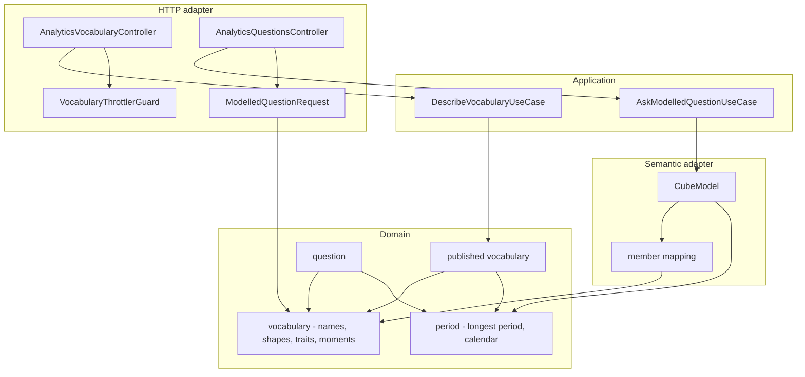
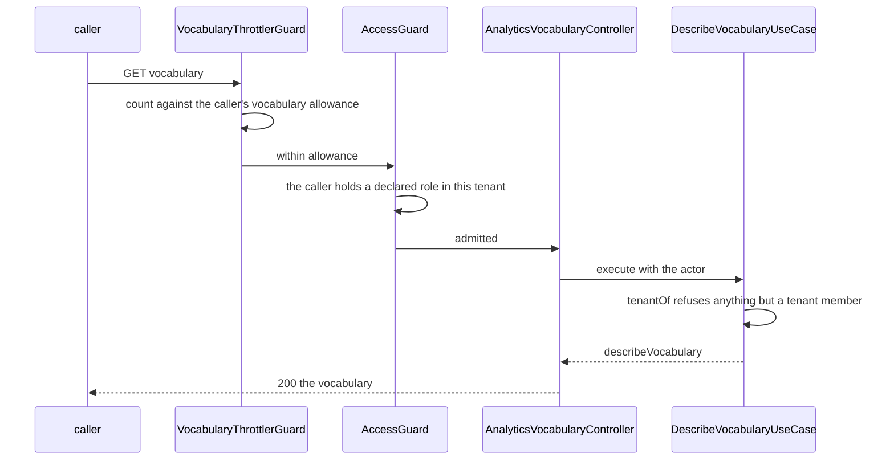

# Design — analytics-vocabulary

## Overview

One read-only route answers "what may be asked": the measures, the groupings,
what shape each grouping is and which row columns it fills, the moments to read
by, the longest period, and the calendar.

Serving a list is trivial. The work is in requirement 2: **what the route says
must be exactly what a question accepts and returns.** Five of the nine facts it
states are not declared anywhere a route could read without restating them:
- a grouping's row columns, which live in an adapter;
- a grouping's shape, which is inferred;
- a measure's cumulativeness, which only the model knows;
- the moments, which are written twice;
- the calendar, which is decided by leaving it out.

A route that restated them would be a second vocabulary. It would be right on
the day it was written and wrong on the day somebody added a grouping.

So the design moves each of those facts into the domain, beside the names, and
makes the question path **consume** them from there. The published vocabulary is
then a projection of what the question path is built from. There is no second
list to keep in step. Tests remain, but they are the second line, not the only
one.

## Goals

- A consumer can learn everything it needs to compose a question and read its
  rows, from the platform, before asking.
- Every fact published is the same declaration the question path consumes.
- Asking costs nothing the question allowance rations, and is still limited.

## Non-goals

- Changing the vocabulary, the question route, its answers or its refusals
  (5.1, 5.2).
- Publishing the row bound (5.3), or display labels (5.4).
- Rate limiting `GET /me` and the members routes. That gap is recorded in
  `product.md`, not closed here.

---

## Boundary Commitments

### This spec owns

- **The vocabulary route**, `GET /tenants/:tenantId/analytics/vocabulary`: its
  admission, its allowance and its body.
- **The published vocabulary** as a domain value, and the pure function that
  produces it.
- **Declaring five facts in the domain.** A grouping's shape, its row columns,
  a measure's cumulativeness, the moments to read by, and the calendar. The
  question path is re-pointed at those declarations.
- **The vocabulary throttling bucket.**

### Out of boundary

- **What any measure computes, and what any grouping means.** The model owns
  both (`cube/model/*.yml`). This spec publishes a flag the model's behaviour
  must agree with, and checks that it does. It does not define the behaviour.
- **The question route's behaviour.** It is re-pointed at declarations whose
  values are unchanged. Every existing question suite must pass without editing
  an assertion. An edit to one is a finding, not a fix.
- **The consumer.** `cubeforge-web` consumes the route. Its design proposed the
  shape this design adopts unchanged.
- **Rate limiting routes that have none today.**

### Allowed dependencies

The hexagonal rule is ESLint's, unchanged:

```
domain  ←  application  ←  adapters (http, semantic)  ←  modules
```

- `domain/semantic/published-vocabulary.ts` imports only other domain modules.
- `DescribeVocabularyUseCase` imports the domain and `tenantOf`, and has **no
  injected dependency at all.** It holds no port. That absence is 4.1.
- `adapters/semantic/member-mapping.ts` imports the domain's shapes. It keeps the
  model's member names and **no platform name of its own**.
- The controller imports the use case and the DTO layer, never an adapter from
  `adapters/semantic`.
- Nothing in this spec imports `PersistenceModule`, the same rule
  `SemanticModule` already states.

### Revalidation triggers

- **A consumer asks for a field**, which changes the shape `cubeforge-web`
  adopted. Its design lists that as its own trigger.
- **A grouping shape other than `day`, `category` or `labelled`** is needed.
  `GroupingShape` and every exhaustive switch over it change.
- **A per-tenant vocabulary**, which would make 3.4 false by design.
- **A calendar other than UTC.** The emulator dialect refuses it today, so the
  change starts in `cube/configuration.js`, not here.
- **Cube's `/meta` stops reporting `cumulative`.** The check for 2.5 falls back
  to the question suite's measurement.

---

## Architecture



**Key decisions, all visible above.** Every arrow into `VOC` and `PER` is a
consumer of the same declaration:
- the vocabulary publishes it;
- the question refuses against it;
- the DTO validates against it;
- the mapping keys on it;
- the model's query and rows are built from it.

`UC` has no arrow to `CM`, which is why a model that is down cannot touch the
route (4.1).

### One request



A refusal at the guard or at `tenantOf` becomes the platform's one `404` through
the existing `DomainErrorFilter`. An exceeded allowance becomes a `429` with a
plain `Retry-After`, set by `BucketThrottlerGuard`.

---

## File Structure Plan

### Created

| Path | Responsibility |
|---|---|
| `src/domain/semantic/published-vocabulary.ts` | `PublishedVocabulary`, `describeVocabulary()` |
| `src/domain/semantic/published-vocabulary.spec.ts` | Content, order, and each fact equal to what a question accepts (1.x, 2.1, 2.2, 2.4, 3.4) |
| `src/application/semantic/describe-vocabulary.use-case.ts` | Admission through `tenantOf`, then the vocabulary |
| `src/application/semantic/describe-vocabulary.use-case.spec.ts` | A member answered; a machine and a tenantless person refused; no dependencies (3.1, 3.2, 4.1) |
| `src/adapters/http/analytics-vocabulary.controller.ts` | The route |
| `src/adapters/http/analytics-vocabulary.controller.spec.ts` | Answers with the model failing (4.1); the body is the domain value |
| `src/adapters/http/vocabulary-throttling.ts` | Config, options and guard for the vocabulary bucket |
| `src/adapters/http/vocabulary-throttling.spec.ts` | Defaults, environment overrides, refusals |
| `test/integration/vocabulary-route.integration-spec.ts` | The route over HTTP: body, identical refusals, the same body for two tenants |
| `test/integration/vocabulary-throttling.integration-spec.ts` | Exhausted allowance with `Retry-After`; the two allowances independent (4.2–4.4) |

### Modified

| Path | Change |
|---|---|
| `src/domain/semantic/vocabulary.ts` | `READ_BY`, `MEASURE_TRAITS`, `GroupingShape`, `GROUPING_SHAPES`, `rowColumnsOf` |
| `src/domain/semantic/vocabulary.spec.ts` | Shapes and traits exhaustive over the names |
| `src/domain/analytics/period.ts` | `CALENDAR` beside `LONGEST_PERIOD_DAYS` |
| `src/domain/semantic/question.ts` | `by: ReadBy` in place of the literal union |
| `src/adapters/http/dto/analytics.dto.ts` | `@IsIn(READ_BY)` in place of the literal list |
| `src/adapters/semantic/member-mapping.ts` | Keyed by shape, holding only member names; `READ_BY_MEMBER` over `ReadBy`; `columnsOf(grouping)` |
| `src/adapters/semantic/cube-client.ts` | `CubeQuery.timezone` |
| `src/adapters/semantic/cube-model.ts` | Rows from `columnsOf`; the query carries `timezone: CALENDAR` |
| `src/adapters/semantic/cube-model.spec.ts` | Row keys equal the published columns for every grouping (2.3); the zone sent equals the published calendar (2.6) |
| `src/adapters/http/throttling-buckets.ts` | `VOCABULARY_BY_CALLER` in `EVERY_BUCKET` |
| `src/adapters/http/platform-throttling.ts` | Registers the bucket; refuses a vocabulary allowance not above the question allowance (4.3) |
| `src/adapters/http/semantic-edge.spec.ts` | Every published moment accepted by the DTO, and nothing else (2.4) |
| `src/semantic.module.ts` | The controller and the use case |
| `src/adapters/http/access/route-inventory.spec.ts` | The route and its admission |
| `src/adapters/http/access/declaration-drift.spec.ts` | The route's roles are the question route's roles |
| `test/integration/role-matrix.integration-spec.ts` | Every role, a machine key and a stranger against the route |
| `test/integration/semantic-vocabulary.integration-spec.ts` | Published `cumulative` equals the model's, per measure (2.5) |
| `.kiro/steering/product.md` | "Known gaps": reads that belong to no throttling bucket |

---

## Components and Interfaces

| Component | Layer | Intent | Requirements |
|---|---|---|---|
| Vocabulary declarations | domain | Names, shapes, traits, moments — declared once | 1.1–1.6, 1.9, 2.1, 2.3–2.5 |
| `CALENDAR` | domain | The zone every day is counted in | 1.8, 2.6 |
| `describeVocabulary` | domain | The published projection | 1.x, 3.4, 5.3, 5.4 |
| `DescribeVocabularyUseCase` | application | Admission, then the projection | 3.1–3.3, 4.1 |
| `AnalyticsVocabularyController` | http | The route | 1.1, 3.x, 4.x |
| Vocabulary throttling | http | The allowance of its own | 4.2–4.4 |
| Member mapping, `CubeModel` (changed) | semantic | Consume the declarations | 2.3, 2.6, 5.1, 5.2 |
| `ModelledQuestionRequest` (changed) | http | Moments from the declaration | 2.4, 5.1 |

### The vocabulary declarations — `domain/semantic/vocabulary.ts`

`MEASURES`, `GROUPINGS`, `measuresFrom`, `groupingsFrom` and the refusal are
unchanged. Added beside them:

```typescript
export const READ_BY = ['recorded', 'occurred'] as const;
export type ReadBy = (typeof READ_BY)[number];

export interface MeasureTraits {
  /** Counts movements recorded before a question's period as well as within it. */
  readonly cumulative: boolean;
}

export const MEASURE_TRAITS: { readonly [M in MeasureName]: MeasureTraits };

export type GroupingShape =
  | { readonly shape: 'day'; readonly column: string }
  | { readonly shape: 'category'; readonly column: string }
  | {
      readonly shape: 'labelled';
      readonly codeColumn: string;
      readonly nameColumn: string;
    };

/** `satisfies` a mapped type over `GroupingName`, and keeps each literal shape. */
export const GROUPING_SHAPES: {
  readonly recorded_day: { shape: 'day'; column: 'recorded_day' };
  readonly occurred_day: { shape: 'day'; column: 'occurred_day' };
  readonly kind: { shape: 'category'; column: 'kind' };
  readonly product: { shape: 'labelled'; codeColumn: 'product_code'; nameColumn: 'product_name' };
  readonly location: { shape: 'labelled'; codeColumn: 'location_code'; nameColumn: 'location_name' };
};

/** The row keys a grouping fills, code before name. */
export function rowColumnsOf(shape: GroupingShape): readonly string[];
```

- **Keyed exhaustively.** A mapped type over the names, so a measure or grouping
  added to the tuples without a trait or a shape fails the build. This is the
  guard `member-mapping.ts` already uses, moved to where the names live.
- **Literal shapes are kept** (`as const satisfies …`), so the adapter's record
  can be typed per shape. A labelled grouping mapped to one member does not
  compile.
- The row column names are platform names. They were in the adapter only because
  the adapter was where the model's names had to be paired with them.

### The calendar — `domain/analytics/period.ts`

```typescript
/** Every day this platform counts is a day in this zone. */
export const CALENDAR = 'UTC';
```

It sits beside `LONGEST_PERIOD_DAYS` because `Day` is already defined there as
"`YYYY-MM-DD` in UTC", and this names what that sentence always meant.

### The published projection — `domain/semantic/published-vocabulary.ts`

```typescript
export interface PublishedVocabulary {
  readonly measures: readonly {
    readonly name: MeasureName;
    readonly cumulative: boolean;
  }[];
  readonly groupings: readonly ({ readonly name: GroupingName } & GroupingShape)[];
  readonly readBy: readonly ReadBy[];
  readonly longestPeriodDays: number;
  readonly calendar: typeof CALENDAR;
}

/** Pure, and the same for every caller. It takes no tenant because it has none to take (3.4). */
export function describeVocabulary(): PublishedVocabulary;
```

- Order is the tuples' order: `MEASURES`, `GROUPINGS`, `READ_BY` (1.9).
- Every value is read from a declaration: `MEASURE_TRAITS`, `GROUPING_SHAPES`,
  `LONGEST_PERIOD_DAYS` and `CALENDAR`. None is written here.
- It carries no row bound and no label (5.3, 5.4). Adding either is a change to
  this type, so it is visible in review.
- The wire body **is** this value. A presenter mapping it field by field to
  itself would be a second place to add a field.

### `DescribeVocabularyUseCase` — `application/semantic/describe-vocabulary.use-case.ts`

```typescript
/** The same callers as the questions this describes, and structurally so. */
export const DESCRIBE_VOCABULARY_ROLES = ASK_MODELLED_QUESTION_ROLES;

export interface DescribeVocabularyQuery {
  readonly actor: ActorContext;
}

@Injectable()
export class DescribeVocabularyUseCase {
  /** No constructor parameters. Nothing to reach, so nothing to fail (4.1). */
  execute(query: DescribeVocabularyQuery): PublishedVocabulary;
}
```

`tenantOf(query.actor)` runs first and its result is discarded. The vocabulary
does not depend on the tenant. The call is there for its refusal: anything that
is not a tenant member — a machine credential, even one issued into the tenant,
or a person acting in no tenant — is refused as `not-found` (3.2).

**Membership is not checked here, and does not need to be.** A person with no
active membership, and a tenant that does not exist, are refused earlier by the
`AccessGuard`, which resolves the caller's role in the tenant before any handler
runs (3.3). That is the division the question route already relies on:
`SemanticModule` imports no persistence, so its use cases cannot re-read a
membership, and the guard is where that check lives. Both refusals reach the
caller as the one `404` through the existing `DomainErrorFilter`.

### `AnalyticsVocabularyController` — `adapters/http/analytics-vocabulary.controller.ts`

```typescript
@Controller('tenants/:tenantId/analytics/vocabulary')
@UseGuards(VocabularyThrottlerGuard)
@SkipThrottle(everyBucketExcept(VOCABULARY_BY_CALLER))
export class AnalyticsVocabularyController {
  constructor(private readonly vocabulary: DescribeVocabularyUseCase) {}

  @Get()
  @Access({ roles: DESCRIBE_VOCABULARY_ROLES })
  describe(@Req() request: Request): PublishedVocabulary;
}
```

No `machines: true`, for the same reason as the question route. Machines are
refused twice: by the declaration and by `tenantOf`.

### Vocabulary throttling — `adapters/http/vocabulary-throttling.ts`

```typescript
export interface VocabularyThrottlingConfig {
  readonly windowSeconds: number;       // ANALYTICS_VOCABULARY_WINDOW_SECONDS, default 60
  readonly requestsPerCaller: number;   // ANALYTICS_VOCABULARY_REQUESTS_PER_CALLER, default 60
}

export function loadVocabularyThrottlingConfig(env: Env): VocabularyThrottlingConfig;
export function vocabularyThrottlerOptions(config: VocabularyThrottlingConfig): ThrottlerOptions[];

@Injectable()
export class VocabularyThrottlerGuard extends BucketThrottlerGuard {}
```

- **Counted per caller** with `callerOf`, the tracker the question bucket uses. A
  person is one allowance across tenants (4.3).
- **`VOCABULARY_BY_CALLER` joins `EVERY_BUCKET`.** Every existing route's skip
  list is derived from that list, so the question route skips the new bucket
  and the new route skips the question bucket, with no edit to either (4.2).
- **`platformThrottlerOptions` refuses an inversion.** If the vocabulary
  allowance per second is not above the question allowance per second, the API
  refuses to start and names both settings. That matches how the throttling
  loaders already refuse an invalid value. Sixty a minute against ten.
- The `429` and its `Retry-After` come from `BucketThrottlerGuard`, unchanged
  (4.4).

### The question path, re-pointed — `member-mapping.ts`, `cube-model.ts`, `cube-client.ts`, the DTO

```typescript
type MembersFor<S extends GroupingShape> =
  S extends { shape: 'day' } ? { readonly timeDimension: string; readonly day: string }
  : S extends { shape: 'labelled' } ? { readonly code: string; readonly name: string }
  : { readonly member: string };

export const GROUPING_MEMBERS: {
  readonly [G in GroupingName]: MembersFor<(typeof GROUPING_SHAPES)[G]>;
};

export const READ_BY_MEMBER: { readonly [R in ReadBy]: string };

/** Row key from the domain, member from here — paired in one place. */
export function columnsOf(grouping: GroupingName): readonly MappedColumn[];
```

- `CubeModel.rowFrom` and `loadFor` use `columnsOf`, so a row's keys **are**
  `rowColumnsOf(GROUPING_SHAPES[g])` (2.3).
- `loadFor` sends `timezone: CALENDAR`. It is the value Cube defaulted to, now
  stated, so the zone an answer counts in is the zone the vocabulary publishes
  (2.6). Anything else would reach the dialect, which refuses non-UTC.
- `ModelledQuestionRequest.by` is `@IsIn(READ_BY)`, and `ModelledQuestion.by` is
  `ReadBy` (2.4).
- **No value changes.** Every column name, member, moment and zone is the one in
  use today (5.1, 5.2).

---

## Data Models

No data is stored. The one model is the body:

```json
{
  "measures": [
    { "name": "net_quantity", "cumulative": false },
    { "name": "movement_count", "cumulative": false },
    { "name": "on_hand_quantity", "cumulative": true }
  ],
  "groupings": [
    { "name": "recorded_day", "shape": "day", "column": "recorded_day" },
    { "name": "occurred_day", "shape": "day", "column": "occurred_day" },
    { "name": "kind", "shape": "category", "column": "kind" },
    { "name": "product", "shape": "labelled",
      "codeColumn": "product_code", "nameColumn": "product_name" },
    { "name": "location", "shape": "labelled",
      "codeColumn": "location_code", "nameColumn": "location_name" }
  ],
  "readBy": ["recorded", "occurred"],
  "longestPeriodDays": 366,
  "calendar": "UTC"
}
```

This is the shape `cubeforge-web`'s design proposed, adopted field for field, so
that design needs no revalidation.

---

## Error handling

| Case | Status | Body | Source |
|---|---|---|---|
| No credential, not a member, absent tenant, machine key | `404` | The platform's one refusal | `AccessGuard`, `tenantOf`, `DomainErrorFilter` — all existing |
| Vocabulary allowance exceeded | `429` | Nest's throttler body | `BucketThrottlerGuard`, with `Retry-After` |
| Semantic layer unreachable | — | The route answers `200` | It has no path to the model |
| Vocabulary allowance not above the question allowance | — | The API refuses to start, naming both settings | `platformThrottlerOptions` |

No new refusal kind, filter or message is introduced.

---

## Testing strategy

Unit tests run in Jest with no infrastructure. The integration suites need the
compose stack, and they share one Postgres, so they run one at a time. Every
assertion is shown to fail by breaking what it guards.

**Domain — `published-vocabulary.spec.ts`**
- The measures and groupings are exactly `MEASURES` and `GROUPINGS`, in that
  order, and the moments are exactly `READ_BY` (1.1, 1.6, 1.9).
- **Every listed name is accepted by `questionFrom`, and a name built to be
  absent is refused** (2.1). This is run over the published list, not over the
  tuples, so it is the published claim being tested.
- A period of `longestPeriodDays` is accepted by `periodFrom`, and one day more
  is refused (2.2).
- `on_hand_quantity` is cumulative and the other two are not (1.2).
- Each grouping's shape and columns, with product and location labelled (1.3–1.5).
- Two calls are deeply equal, and no field holds a row bound or a label (3.4,
  5.3, 5.4).
- *Break:* restate a name in `describeVocabulary` in place of reading the tuple,
  then add a name to the tuple. The spec fails.

**Domain — `vocabulary.spec.ts`**
- Traits and shapes cover exactly the names. The type guards this at compile
  time, and the spec pins it for a reader.

**Application — `describe-vocabulary.use-case.spec.ts`**
- Each tenant role is answered (3.1).
- A machine actor issued into the tenant is refused, and so is a person acting
  in no tenant, as the same `not-found` `tenantOf` raises for the question route
  (3.2).
- Strangers and absent tenants are not this spec's to assert here: the guard
  refuses them before the use case exists. They are asserted over HTTP in the
  route suite and the role matrix (3.3).
- The class has no constructor parameters. That is asserted with
  `Reflect.getMetadata('design:paramtypes')`, so a port added later fails here
  (4.1).

**HTTP — `analytics-vocabulary.controller.spec.ts`, and the edge suites**
- With `TENANT_SCOPED_MODEL` overridden by a model that throws on every call,
  the route answers `200` (4.1).
- The body equals `describeVocabulary()` (1.1).
- `semantic-edge.spec.ts`: every published moment is accepted by the question
  DTO, and a value outside it is refused (2.4).
- `route-inventory.spec.ts` and `declaration-drift.spec.ts` list the route with
  the question route's roles and no machines.

**Semantic adapter — `cube-model.spec.ts`**
- For every grouping, a row's keys equal the published columns for that grouping
  (2.3). This is driven over `GROUPINGS`, so a new grouping is covered without
  a new test.
- The query sent carries `timezone` equal to the published calendar (2.6).
- The existing row, period and watermark assertions pass unedited (5.2).

**Integration — `vocabulary-route.integration-spec.ts`**
- A member of each role receives the body above, over HTTP (1.x, 3.1).
- Two tenants receive byte-identical bodies (3.4).
- A stranger, an absent tenant and a machine key issued into the tenant all
  receive a response byte-identical to the absent tenant's (3.2, 3.3).

**Integration — `vocabulary-throttling.integration-spec.ts`**
- Spending the configured allowance, then one more, gives `429` with a positive
  plain `Retry-After` (4.4).
- After the vocabulary allowance is exhausted, a question is not refused as
  throttled. After the question allowance is exhausted, the vocabulary still
  answers `200` (4.2). The question may answer anything else, because Cube's
  availability is not what is under test.

**Integration — `role-matrix.integration-spec.ts`**
- The route added with `admits: ['admin', 'editor', 'viewer']` and no machines.
  The matrix drives every role, a machine key and a stranger (3.1–3.3).

**Integration — `semantic-vocabulary.integration-spec.ts`**
- For every measure, the published `cumulative` equals the flag Cube's `/meta`
  reports for its member (2.5). The flag's presence on 1.7.19 is confirmed in
  the task that writes this. The fallback is in `research.md`.

**Integration — the existing semantic suites, unedited**
- `semantic-questions`, `semantic-isolation`, `semantic-preparation` and
  `semantic-http` pass with no assertion changed. In particular:
  - `product_code` and `product_name` still arrive (2.3, 5.2);
  - a prepared answer still reports `servedFrom: 'prepared'` with the zone sent
    explicitly (2.6, 5.2).

---

## Requirements Traceability

| Requirement | Summary | Components | Verified by |
|---|---|---|---|
| 1.1 | Measures and groupings, by question names | `describeVocabulary`, controller | published-vocabulary spec, route suite |
| 1.2 | Cumulative per measure | `MEASURE_TRAITS` | published-vocabulary spec |
| 1.3 | Shape per grouping | `GROUPING_SHAPES` | published-vocabulary spec |
| 1.4 | Row names per grouping | `GROUPING_SHAPES`, `rowColumnsOf` | published-vocabulary spec |
| 1.5 | Which is code, which is name | `labelled` shape's `codeColumn`, `nameColumn` | published-vocabulary spec |
| 1.6 | Moments | `READ_BY` | published-vocabulary spec |
| 1.7 | Longest period | `LONGEST_PERIOD_DAYS` | published-vocabulary spec |
| 1.8 | Calendar | `CALENDAR` | published-vocabulary spec |
| 1.9 | One stable order | Tuple order | published-vocabulary spec |
| 2.1 | Listed iff a question accepts it | `questionFrom` over the same tuples | published-vocabulary spec |
| 2.2 | Longest period equal to what a question accepts | `periodFrom` over `LONGEST_PERIOD_DAYS` | published-vocabulary spec |
| 2.3 | Row names equal an answer's | `columnsOf` from `GROUPING_SHAPES` | cube-model spec, semantic-questions |
| 2.4 | Moments iff a question accepts them | `@IsIn(READ_BY)`, `ReadBy` | semantic-edge spec |
| 2.5 | Cumulative iff an answer counts before | `MEASURE_TRAITS` against `/meta` | semantic-vocabulary suite |
| 2.6 | Calendar equal to an answer's | `timezone: CALENDAR` in `loadFor` | cube-model spec, semantic suites |
| 3.1 | Every tenant role answered | `@Access`, `tenantOf` | use-case spec, role matrix, route suite |
| 3.2 | Machines refused as absence | No `machines` in the declaration; `tenantOf` | use-case spec, role matrix, route suite |
| 3.3 | Strangers and absent tenants refused as absence | `AccessGuard`, filter | route suite, role matrix |
| 3.4 | Same for every tenant, no tenant data | `describeVocabulary()` takes no tenant | published-vocabulary spec, route suite |
| 4.1 | Answers while the model is down | Use case has no dependencies | use-case spec, controller spec |
| 4.2 | Independent of the question allowance | `EVERY_BUCKET`-derived skips | throttling suite |
| 4.3 | Per person, larger than questions | `callerOf`; start-up inversion check | vocabulary-throttling spec |
| 4.4 | Refused with a wait when exceeded | `BucketThrottlerGuard` | throttling suite |
| 5.1 | Questions accept what they did | Re-pointed declarations, same values | existing semantic suites, unedited |
| 5.2 | Questions answer as they did | Same | existing semantic suites, unedited |
| 5.3 | No row bound published | `PublishedVocabulary` has no such field | published-vocabulary spec |
| 5.4 | No labels or descriptions | Same | published-vocabulary spec |

---

## Open questions

- **Whether Cube 1.7.19's `/meta` reports `cumulative`.** It is settled in the
  first task that touches `semantic-vocabulary`. Both answers have a path
  (`research.md`, section 1).
- **Whether stating the zone changes rollup matching.** It should not, because
  the value is Cube's default. `semantic-preparation` is the judge. If it
  changes, that is a finding, recorded before anything is adjusted.
