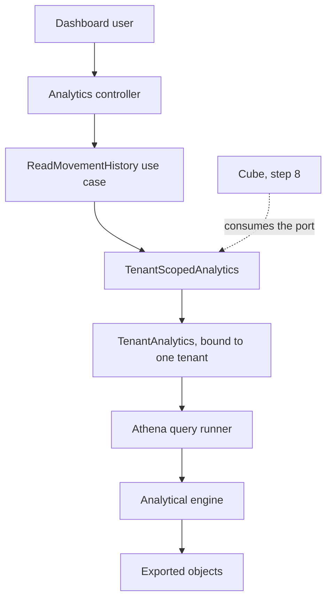
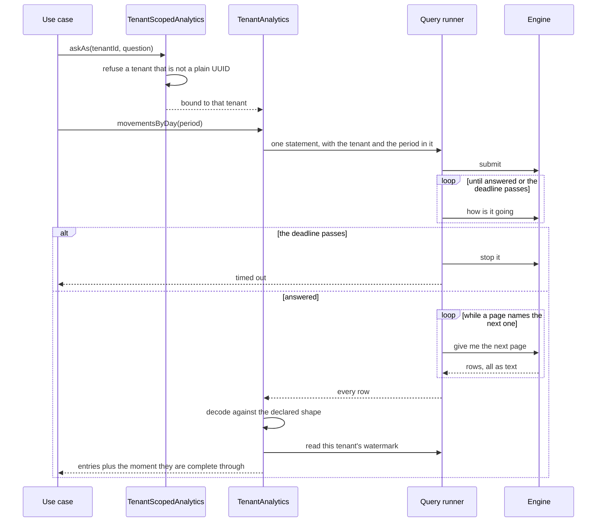

# Design — athena-analytics-query

## Overview

A named pair of inventory questions answered from the exported objects, behind a
port, with the tenant bound by a seam the caller cannot reach past. One of the
two is also served over HTTP, so the isolation is shown surviving a real request
rather than only an adapter test.

The design is shaped by one finding more than by anything in the requirements:
**the local engine is not the engine this code will run against.** Floci's
analytics is DuckDB reading Parquet, and it is more forgiving than Athena in
three specific ways — it needs no partitions, it reports every column as text,
and it drops query parameters. Each of those turns into a decision below whose
purpose is to stop the local engine's generosity from being mistaken for
correctness. `research.md` §1 records the probes.

## Goals

- Two questions answered from the exported data, never from the transactional
  store (1.1, 1.2, 3.4).
- An answer contains one tenant's records, and a query cannot be phrased without
  a tenant (2.1–2.4).
- Every answer says how far it reaches, and "never exported" is a distinct
  answer rather than an empty one (3.1, 3.3).
- Values arrive typed, ordered and drawable without repair (4.1, 4.3).
- A failure is quick, classified, and discloses nothing (6.1–6.4).

## Non-goals

- Defining what a metric means — `cube-semantic-layer`.
- Caching, pre-aggregation, or any stored answer.
- A question the caller composes.
- Anything that requires a real cloud account.

## Boundary Commitments

### This spec owns

- **The named questions** — what may be asked, and what an answer contains.
- **The tenant seam for analytics**: `TenantScopedAnalytics`, and the rule that
  a tenant is bound by it and never named in a question.
- **The catalogue definition** — the tables over the exported prefixes, their
  partition arrangement, and the command that creates them.
- **The query adapter**: submitting, waiting with a deadline, and decoding a
  result into declared types.
- **One HTTP route** and its refusals.
- **The `Period` rules**: what a caller may ask for and how much.

### Out of boundary

- **The exported data** — its keys, columns, partitioning and completeness are
  `s3-data-export`'s. This design reads them and changes nothing about them,
  with one exception, declared below.
- **Metric definitions and pre-aggregation** — `cube-semantic-layer` (step 8).
- **Drawing an answer** — `dashboard-frontend` (step 9).
- **Who the caller is** — `authentication`; **whether the role may** —
  `rbac-authorization-guards`. This design declares which roles, and nothing
  more.
- **Real deployment**, and with it **every permission one would require.**
  Nothing in this repository is authorized: the emulator answers `iam` and
  enforces nothing. A deployment would need, at least, `s3:GetObject` and
  `s3:ListBucket` on the export bucket, `s3:PutObject` on the results location,
  `athena:StartQueryExecution`, `athena:GetQueryExecution`,
  `athena:GetQueryResults` and `athena:StopQueryExecution`, and `glue:GetTable`
  with `glue:GetPartitions` on the catalogue. That surface has no local coverage
  whatsoever, and this design neither grants nor tests it. It is listed so the
  deployment feature inherits a list rather than a discovery.
- **The catalogue arrangement** this design commits to is written for Athena and
  exercised against an emulator that does not need it.

### One upstream change, declared

**`s3-data-export` will publish a watermark**: one row per tenant recording the
moment its last successful run finished, written as a fourth dataset under
`watermarks/tenant_id=…/watermark.parquet`.

Requirements 3.1 and 3.4 have no solution without it. The only completeness
marker on the platform is `export_cursors.exported_through` — an `xid8`, not a
moment, living in the transactional database that 3.4 puts out of reach. That
spec's boundary already claims the fact ("how far each tenant has been carried");
the gap is only that it keeps it to itself.

This fires that spec's revalidation trigger, handled by the precedent this
repository already set when `s3-data-export` added a column to
`inventory-sync-api`'s table: the change is additive, it is recorded in the
owning spec's notes, and that spec's suites are re-run.

### Allowed dependencies

| Layer | May import |
|---|---|
| `src/domain/analytics/**` | `src/domain/**` only |
| `src/application/analytics/**` | `src/domain/**`, `src/application/ports/**`, the application's own pure helpers (`actor-context.ts`, `tenant-authorization.ts`), Nest decorators |
| `src/adapters/**` | anything |

Specific to this feature:

- The analytics path **never opens a database transaction**. It does not reach
  `TenantScopedUnitOfWork`, and nothing it does touches PostgreSQL.
- No inventory or export code imports anything from
  `src/application/analytics/**`. The dependency runs one way.
- Every statement sent to the engine is built in one file, so the dialect
  surface is reviewable in one place.

### Revalidation triggers

- A dataset gaining a column, or a column changing type. The answer shapes are
  declared here and parsed against that declaration.
- The export changing its key layout. The catalogue's partition arrangement is
  written against it.
- A second consumer wanting a question this design did not name — that is step 8
  arriving, and the port's shape is the thing to revisit.
- Anything running against a real account, which would make the three
  declared-not-verified claims below testable and therefore obligatory to test.

## Architecture



The seam is the whole isolation story. It hands a caller a `TenantAnalytics`
already bound to one tenant, exactly as `TenantScopedUnitOfWork` hands out
repositories — so "forgot to filter" is not expressible rather than merely
refused. It is **not** a unit of work: there is no transaction to open, and
modelling one would promise a rollback that does not exist.

### One question, end to end



## File Structure Plan

### Created

| Path | Responsibility |
|---|---|
| `src/domain/analytics/period.ts` | `Day`, `Period`, the longest period allowed, and the refusals |
| `src/domain/analytics/period.spec.ts` | The period rules, pure |
| `src/domain/analytics/answer.ts` | `AnalyticalAnswer`, `StockOnHandEntry`, `MovementsOnDayEntry` |
| `src/domain/analytics/answer.spec.ts` | Answered, empty and never-exported as distinct states |
| `src/domain/analytics/answer-shape.ts` | `AnswerColumn`, `ValueKind`, and decoding text into declared types |
| `src/domain/analytics/answer-shape.spec.ts` | Decoding, including a column that is absent or unparseable |
| `src/application/ports/tenant-scoped-analytics.ts` | `TenantScopedAnalytics`, `TenantAnalytics`, the token |
| `src/application/analytics/read-movement-history.use-case.ts` | The period question, and the roles that may ask it |
| `src/application/analytics/read-movement-history.use-case.spec.ts` | With the double, including empty and never-exported |
| `src/application/analytics/read-exported-stock.use-case.ts` | The on-hand question, for the port's second consumer |
| `src/application/analytics/read-exported-stock.use-case.spec.ts` | With the double, including the labelled answer |
| `src/application/analytics/analytics-failure.ts` | `AnalyticsUnavailable` and its closed reason set |
| `src/application/analytics/analytics-failure.spec.ts` | Classification, and what a reason may not carry |
| `src/adapters/analytics/athena-query-runner.ts` | Waiting against a deadline, stopping, and following every page |
| `src/adapters/analytics/athena-engine.ts` | The only file that speaks to the client, and where a refusal is classified |
| `src/adapters/analytics/athena-analytics.ts` | The seam's real implementation, and the only file holding a statement |
| `src/adapters/analytics/analytics-config.ts` | Catalogue, workgroup and result location from the environment |
| `src/adapters/analytics/analytics-config.spec.ts` | Every missing setting named at once |
| `src/adapters/analytics/catalogue-definition.ts` | The four tables and their partition arrangement, as data |
| `src/adapters/analytics/glue-catalogue.ts` | Applying that definition, and creating what the engine writes to |
| `src/adapters/analytics/catalogue-definition.spec.ts` | The arrangement, asserted as the values it will send |
| `src/adapters/analytics/in-memory-analytics.ts` | The double the use-case tests run against |
| `src/adapters/http/analytics.controller.ts` | The one route |
| `src/adapters/http/dto/analytics.dto.ts` | The period a caller may name |
| `src/adapters/http/analytics-throttling.ts` | Its bucket and limit |
| `src/analytics.module.ts` | Binds this feature's ports to these adapters |
| `scripts/analytics-catalogue.ts` | `pnpm ops:analytics-catalogue` — creates or refreshes the tables |
| `test/integration/analytics-catalogue.integration-spec.ts` | The tables exist and describe the exported layout |
| `test/integration/analytics-queries.integration-spec.ts` | Real questions against real objects, read back |
| `test/integration/analytics-isolation.integration-spec.ts` | Two tenants, and what one can reach of the other |
| `test/integration/analytics-http.integration-spec.ts` | The route: roles, refusals, disclosure |

### Modified

| Path | Change |
|---|---|
| `src/adapters/storage/object-storage-config.ts` | `requireLocalEmulator` moves out to be shared |
| `src/adapters/aws/require-local-emulator.ts` | **Created** — the refusal both features apply |
| `src/app.module.ts` | Import `AnalyticsModule` — this one *is* reachable by a request |
| `src/domain/export/partition.ts` | A key for the watermark dataset |
| `src/domain/export/exported-row.ts` | The watermark's single column |
| `src/application/export/export-tenant.use-case.ts` | Write the watermark on a successful run; gains a `Clock` |
| `.env.example` | The catalogue database and the result location |
| `package.json` | `ops:analytics-catalogue`; `@aws-sdk/client-athena`, `@aws-sdk/client-glue` |
| `.kiro/specs/s3-data-export/tasks.md` | Note that a revalidation trigger fired |

**Two questions, one route, deliberately.** Decision 1 of the requirements
settled that a full analytical HTTP surface would be work built to be deleted
when step 8 arrives. So the port answers both questions and the route exposes
the one carrying the period rules, where refusing an absent or oversized period
is observable at the edge. The on-hand question is answered by the port and
proven at the use-case and adapter levels — which is where Cube will meet it
anyway.

## Components and Interfaces

| Component | Layer | Intent | Requirements |
|---|---|---|---|
| `Period`, `Day` | domain | What may be asked for, and how much | 1.2, 1.4, 1.5 |
| `AnalyticalAnswer` | domain | Answered, empty, or never exported | 3.1, 3.3, 4.2 |
| `AnswerShape` | domain | Text in, declared types out | 4.1 |
| `TenantScopedAnalytics` | port | The tenant is bound, never named | 2.1, 2.2, 2.3 |
| `ReadMovementHistoryUseCase` | application | The period question and its roles | 1.2, 5.2 |
| `ReadExportedStockUseCase` | application | The on-hand question, labelled | 1.1, 1.3 |
| `AthenaAnalytics` | adapter | The only file holding a statement | 2.4, 3.2, 4.3 |
| `AthenaQueryRunner` | adapter | Submit, wait, stop, fetch | 6.1, 6.2 |
| `catalogue-definition.ts` | adapter | The tables and the partition arrangement | 3.5 |
| `AnalyticsController` | adapter | The one route | 5.1, 5.3, 5.4, 5.5 |

### The period

```ts
/** A day, as `YYYY-MM-DD` in UTC — the same shape the export partitions by. */
export type Day = Branded<string, 'Day'>;

export interface Period {
  readonly from: Day;
  readonly to: Day;
  covers(day: Day): boolean;
}

/** Inclusive of both ends: a caller asking for one day names it twice. */
export function periodFrom(from: Day, to: Day): Period;

/**
 * The longest span answerable in one question. It exists because a question
 * with no bound reads a tenant's whole history, and the cost of that is paid by
 * whoever is next in the queue.
 */
export const LONGEST_PERIOD_DAYS = 366;
```

`periodFrom` refuses a period that ends before it starts and one longer than
`LONGEST_PERIOD_DAYS`, naming the limit (1.5). There is no constructor for an
unbounded period, which is how 1.4 is enforced rather than checked.

### The answer

```ts
export type AnalyticalAnswer<Entry> =
  | {
      readonly state: 'answered';
      /** The moment through which this answer is complete. */
      readonly completeThrough: Date;
      readonly entries: readonly Entry[];
    }
  | { readonly state: 'never-exported' };

export interface StockOnHandEntry {
  readonly sku: string;
  readonly name: string;
  readonly onHand: number;
}

export interface MovementsOnDayEntry {
  readonly day: Day;
  readonly kind: string;
  readonly quantity: number;
}
```

`answered` with no entries and `never-exported` are different answers, which is
the whole of 3.3 and 4.2: a period with nothing in it is a fact, and a tenant
that has never been carried out of the database is not the same fact.

### Reading a result

```ts
export type ValueKind = 'text' | 'whole-number' | 'moment' | 'day';

export interface AnswerColumn {
  readonly name: string;
  readonly kind: ValueKind;
}

export type DecodedValue = string | number | Date;
export type DecodedRow = ReadonlyMap<string, DecodedValue | null>;

export function decodeRows(
  columns: readonly AnswerColumn[],
  header: readonly string[],
  rows: readonly (readonly (string | null)[])[],
): readonly DecodedRow[];
```

**The declaration is the contract, not what the engine says.** Every value
arrives as text on both engines, and the local one reports every column as
`varchar` regardless of its real type — so an adapter typing a result from the
engine's own metadata would be correct in production and wrong here, which is
the worst of both. `decodeRows` parses against the columns the question
declared, and refuses loudly when a declared column is absent from the header or
a value will not parse (4.1).

### The seam

```ts
export interface TenantAnalytics {
  stockOnHand(): Promise<AnalyticalAnswer<StockOnHandEntry>>;
  movementsByDay(period: Period): Promise<AnalyticalAnswer<MovementsOnDayEntry>>;
}

export interface TenantScopedAnalytics {
  askAs<T>(
    tenantId: TenantId,
    question: (analytics: TenantAnalytics) => Promise<T>,
  ): Promise<T>;
}
```

Each method answers with its entries **and** the moment they are complete
through, which costs a second statement: the watermark is a different dataset
and joining it into every question would widen the dialect surface for one
value. Two round trips per answer is the price, and it is paid where an
analytical question already costs seconds.

No method takes a tenant. It is bound when the seam hands the object over, and
the identifier is refused there unless it is a plain UUID — the same check
`partition.ts` applies before a tenant becomes a path segment, and for the same
reason: this is the one way a tenant identifier reaches a statement. Parameter
binding was rejected because the emulator drops parameters, so no local test
could exercise it (`research.md` §4).

### Reading every page

```ts
export interface QueryResult {
  readonly header: readonly string[];
  readonly rows: readonly (readonly (string | null)[])[];
}

export interface QueryRunner {
  run(statement: string, deadline: Date): Promise<QueryResult>;
}
```

**Two files, not one.** The plan named a single one, and the split is what makes
the paragraph below testable: the local engine answers in milliseconds and
returns small results in one page, so neither the deadline nor the paging would
ever be reached by pointing a test at it. The runner works against four named
operations and the engine adapter is the only file holding a client.

**The runner follows the continuation token until there is none.** A result
arrives in pages of at most a thousand rows in a real deployment, and the first
page carries a token for the next. A runner that read one page would answer a
question about a busy month with the first thousand rows and no error — an
answer that is wrong rather than missing, which is the worst kind.

The local engine returns small results in one page, so nothing here would ever
have shown it. It is written now, while the cost is one loop, rather than found
later in the only environment where it is visible.

### Failure

```ts
export type AnalyticsFailureReason =
  | 'not-configured'
  | 'store-unreachable'
  | 'store-rejected'
  | 'question-timed-out'
  | 'question-failed';

export class AnalyticsUnavailable extends Error {
  constructor(readonly reason: AnalyticsFailureReason, cause: unknown) {}
}
```

Classified where it happens, with the cause travelling beside the error and
never inside its message — the shape `s3-data-export` settled on, and for the
same reason: a driver's wording can carry the statement, a key or a record
(6.3). Every reason has a producer, which the previous feature's validation gate
had to point out once.

## Data Models

### The catalogue

Three external tables over the exported prefixes, plus the watermark:

| Table | Location | Partitions |
|---|---|---|
| `movements` | `movements/` | `tenant_id`, `recorded_date` |
| `products` | `products/` | `tenant_id` |
| `locations` | `locations/` | `tenant_id` |
| `watermarks` | `watermarks/` | `tenant_id` |

Columns are exactly the published contract in
`src/domain/export/exported-row.ts`. Nothing is renamed on the way through; a
reader of the objects and a reader of these tables see the same names.

**Partition projection, not a registered catalogue.** The keys are perfectly
regular, and projection removes the class of failure in which a day is exported
but invisible because nothing registered it (3.5). `tenant_id` uses the
`injected` type, which carries a second property worth more than the
convenience: **the engine refuses a query that does not constrain an injected
column.** The adapter binds the tenant, and the catalogue makes a query without
one fail — the platform's two-independent-layers rule arriving in analytics.

**This is declared, not verified.** The emulator infers partitions from the key
path and needs none of this, so no local test can distinguish a correct
arrangement from a missing one, and none can exercise the `injected` refusal.
The first isolation layer is probed locally and is sufficient on its own; the
second is recorded as belt over braces and is never the reason isolation holds.

### The watermark

One row per tenant, one column:

| Column | Type | Meaning |
|---|---|---|
| `complete_through` | timestamp | When the last successful run for this tenant finished |

Written by `s3-data-export` under a fixed key, so it replaces rather than
accumulates — the same rule its catalogue datasets already follow. A tenant with
no such object has never been carried, which is `never-exported` (3.3) and not a
default moment.

**Written after the cursor is confirmed, not before**, and the asymmetry is the
point. A run that dies between the two leaves a watermark that is *behind* the
data, so an answer understates how current it is and the next run repairs it.
Writing it first would leave one that is ahead, and a watermark claiming a
completeness the data does not have is worse than no watermark at all. This is
the same reasoning that put the export's cursor in two phases.

The moment comes from the platform `Clock`, which `ExportTenantUseCase` does not
currently hold and gains for this. Reading the wall clock directly would make
the one value this feature reports untestable.

## Error handling

- **Unconfigured** — the catalogue, workgroup or result location missing is
  refused naming every missing setting at once (7.1), and the endpoint is
  refused unless it is the local emulator (7.3). **The reading happens at the
  first question, not at module construction.** Requirement 7.1 says the
  Analytics Query refuses to *answer*; an API that refused to *boot* over a
  setting only one route uses would take every other route down with it. This is
  the same trap the export's validation gate found from the other side, where a
  missing setting surfaced as a stack trace instead of a sentence.
- **Unreachable or refused** — classified from the status the engine returns,
  the way `ParquetExportSink.reachable()` does (6.1). The route reports the
  answer is unavailable; it does not answer from the transactional database.
- **Too slow** — the runner carries a deadline. On expiry it asks the engine to
  stop the query and reports that it timed out (6.2). Abandoning a query without
  stopping it would leave work running that nobody is waiting for.
- **Failed** — a class of problem, never the statement, the location or a
  credential (6.3), recorded against the request's correlation identifier (6.4)
  by the platform's existing filter.

## Testing strategy

Derived from the acceptance criteria.

**Pure**

- A period ending before it starts, and one longer than the limit, are refused;
  the limit is named (1.4, 1.5).
- `answered` with no entries and `never-exported` are distinguishable (3.3, 4.2).
- Decoding turns text into a number, a moment and a day, and refuses a declared
  column that is absent (4.1).

**With the double**

- The on-hand answer carries code and name (1.1, 1.3).
- A question is answered for the tenant the seam bound, and no method accepts
  another (2.1, 2.2).
- An answer carries the watermark, and a tenant without one answers
  `never-exported` (3.1, 3.3).

**Against the emulator and the objects**

- Two tenants holding the same SKU get their own numbers, compared against what
  the export wrote for each (2.1, 2.3, 4.4).
- A statement built for one tenant reads no other tenant's objects (2.4).
- Entries come back typed and in a stable order (4.1, 4.3).
- A period with no activity answers with no entries (4.2).
- An exported day is answerable with nothing prepared by hand (3.5) — **as far
  as the emulator can show it**, which is not far; see below.
- The catalogue command creates tables describing the exported layout, and
  running it twice is safe.
- A result larger than one page comes back whole. Asserted against a fake page
  boundary rather than against the engine, because the local one returns
  everything at once and would let a single-page runner pass.

**Through the running application**

- The three tenant roles may ask; a caller with no active membership is answered
  as for a tenant that does not exist (5.2, 5.3).
- A missing or oversized period is refused before anything is read (5.4).
- The limit on how often one caller may ask (5.5).
- An unreachable store reports unavailable and the transactional database is not
  consulted (6.1, 3.4).

**Probes each of these must survive:** removing the tenant from the statement;
letting the seam accept an identifier that is not a UUID; typing a result from
the engine's metadata instead of the declaration; returning a default moment
instead of `never-exported`; letting a timed-out query keep running; stopping at the first page of a result.

**What no local test settles.** Stated here because the requirements' scope
boundaries promised it would be:

1. **The partition arrangement** (3.5). The emulator needs none, and answers
   whether or not the arrangement is right.
2. **The `injected` refusal** — the second isolation layer. It has no local
   probe, and nothing in this design relies on it.
3. **The dialect.** Every statement runs against DuckDB here and Presto there.
   Mitigated by keeping every statement in one file, restricted to constructs
   both accept, and by keeping the result contract in the code rather than in
   the engine's metadata.
4. **Authorization.** No call this feature makes is authorized locally, so no
   test can show a permission that is missing or one that is broader than it
   needs. The permissions a deployment requires are listed under Out of
   boundary; granting them is the deployment feature's, and the list is there so
   that work starts from an inventory instead of from a stack trace.

## Requirements Traceability

| Requirement | Where it lives |
|---|---|
| 1.1 | `ReadExportedStockUseCase`, `TenantAnalytics.stockOnHand` |
| 1.2 | `ReadMovementHistoryUseCase`, `TenantAnalytics.movementsByDay`; the runner follows every page, so a busy period is answered whole |
| 1.3 | The on-hand statement joins the catalogue; `StockOnHandEntry` carries both |
| 1.4 | No constructor exists for an unbounded period |
| 1.5 | `periodFrom` refuses beyond `LONGEST_PERIOD_DAYS`, naming it |
| 1.6 | `TenantAnalytics` has two methods and no statement parameter |
| 2.1 | The seam binds the tenant into every statement |
| 2.2 | No method on `TenantAnalytics` takes a tenant |
| 2.3 | `analytics-isolation.integration-spec.ts` |
| 2.4 | The tenant constrains the partition, so no other tenant's objects are read |
| 2.5 | `AnalyticsUnavailable` carries a reason and no record |
| 3.1 | `AnalyticalAnswer.completeThrough`, from the watermark |
| 3.2 | The watermark bounds the answer, not the clock |
| 3.3 | `never-exported` when the tenant has no watermark |
| 3.4 | The analytics path opens no database transaction and imports no repository |
| 3.5 | Partition projection — declared, not locally verifiable |
| 4.1 | `decodeRows` against the declared shape |
| 4.2 | `answered` with no entries |
| 4.3 | Every statement carries an explicit order |
| 4.4 | The exported datasets carry no person; nothing else is read |
| 5.1 | `AnalyticsController`, tenant from the path |
| 5.2 | The use case's roles, checked by the existing guard |
| 5.3 | The platform's existing not-found-or-forbidden rule |
| 5.4 | The DTO validates the period before the use case runs |
| 5.5 | `analytics-throttling.ts` |
| 6.1 | `AthenaQueryRunner` classifies; the route reports unavailable |
| 6.2 | The runner's deadline, and stopping the query |
| 6.3 | The closed reason set; the cause never enters the message |
| 6.4 | The existing correlation filter |
| 7.1 | `loadAnalyticsConfig` names every missing setting at once |
| 7.2 | Configuration read from the environment only |
| 7.3 | `requireLocalEmulator`, shared with the export |

## Open questions

- **How much of a period is too much?** `LONGEST_PERIOD_DAYS` is set at 366 so a
  year-over-year question fits in one request. Nothing measured that; it is a
  first value, and the first real dashboard is what should move it.
- **Whether step 8 wants the port or the statements.** Cube can consume
  `TenantScopedAnalytics` or define its own models over the same tables. This
  design assumes the port and does nothing to prevent the other.
