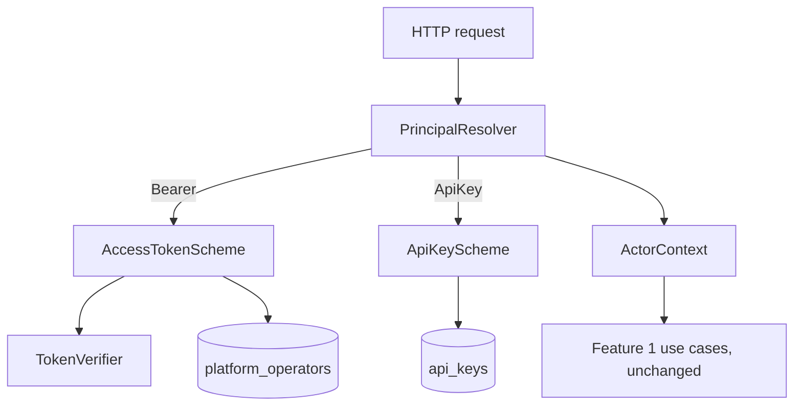
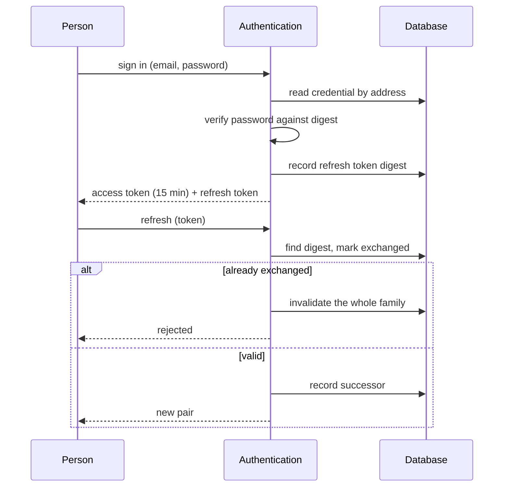
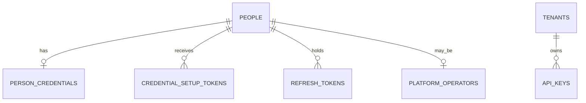

# Design — authentication

## Overview

Every request currently arrives with an `ActorContext` that a middleware read
from headers and believed. This feature replaces that middleware with credential
verification, and does so without changing the shape the rest of the system
consumes: use cases keep receiving an `ActorContext`, and feature 1's
authorization keeps resolving membership from stored records on every request.

Three credentials are introduced — a password, a refresh token, an API key — but
they are three answers to one question, so the design has one seam for resolving
a principal and one resolver per scheme behind it.

---

## Boundary Commitments

### This spec owns

- The credential tables (`person_credentials`, `credential_setup_tokens`,
  `refresh_tokens`, `api_keys`, `platform_operators`), their policies, and the
  fourth database identity that reads them.
- Turning a presented secret into an `ActorContext`, for all three schemes.
- The session lifecycle: issuing, rotating, expiring and invalidating tokens.
- The shape of `ActorContext` itself, which gains an operator identity and a
  machine kind.
- Provisioning a tenant together with its first administrator, amending
  feature 1's requirement 1.
- Throttling of its own endpoints.

### Out of boundary

- **Deciding what a principal may do.** This feature establishes identity, tenant
  and — for machine callers — role. Feature 3 turns that into enforcement. No
  reusable Guard, decorator or metadata convention is introduced here; the
  existing inline `authorizeInTenant` continues to be called by use cases
  unchanged.
- **The identity records.** People, tenants and memberships remain feature 1's.
  The only record this feature creates in that space is the bootstrap membership
  of requirement 8.
- **Rate limiting as a platform-wide concern.** Only the endpoints defined here
  are throttled. Applying it to every route is feature 3's or a later
  cross-cutting pass.
- **Credential recovery.** Without email delivery there is no self-service path;
  an operator re-issuing a setup token is the whole of it.

### Allowed dependencies

| From | May depend on |
|---|---|
| `src/domain/**` | itself only |
| `src/application/**` | `src/domain`, its own ports, Nest DI decorators |
| `src/adapters/http/**` | `src/application`, `src/domain`, Nest, validation |
| `src/adapters/persistence/**` | `src/application` ports, `src/domain`, Drizzle |
| `src/adapters/crypto/**` | `src/application` ports, the hashing and token libraries |

Enforced by the existing `no-restricted-imports` rules. A violation is a failing
lint, not a review comment.

### Revalidation triggers

Reopen this design if tokens must be verified outside this application, if a
second process serves requests, if email delivery arrives, or if feature 3 needs
a claim the access token deliberately omits.

---

## Architecture



Credential resolution and credential management are separate paths. Resolution
runs on every request and reads only what it must. Management — signing in,
refreshing, issuing keys — goes through use cases like any other operation.



---

## Components & Interfaces

| Component | Layer | Intent | Requirements |
|---|---|---|---|
| Principal resolution | inbound | Presented secret → `ActorContext` | 3.3, 3.4, 7.3, 7.4, 10.1–10.3, 11.2 |
| Password hashing port | outbound | Digest and verify, algorithm-agnostic | 1.2, 1.7, 2.1 |
| Token issuing port | outbound | Sign and verify access tokens | 3.1, 3.2, 3.5 |
| Secret generation port | outbound | Opaque secrets and their digests | 1.1, 4.1, 7.1 |
| Session use cases | application | Sign in, refresh, sign out | 2.x, 4.x, 5.x, 6.x |
| Credential use cases | application | Issue setup token, redeem it | 1.x |
| API key use cases | application | Issue, list, revoke | 7.x |
| Tenant provisioning (amended) | application | Tenant plus first administrator | 8.x |
| Authenticator repositories | outbound | The credential tables | all persistence |

### The principal, widened

```typescript
export type ActorContext =
  | { readonly kind: 'platform-operator'; readonly personId: PersonId }
  | {
      readonly kind: 'tenant-member';
      readonly personId: PersonId;
      readonly tenantId: TenantId;
    }
  | {
      readonly kind: 'machine';
      readonly apiKeyId: ApiKeyId;
      readonly tenantId: TenantId;
      readonly role: Role;
    };
```

Two changes, both consequences of requirements rather than conveniences. The
operator now carries a `personId` (11.2, 11.6): an operator is a person, and
their actions must be attributable. The `machine` kind is new (7.3).

Nothing downstream needs to handle `machine` yet — `tenantOf` already refuses
any actor that is not a tenant member, so a machine principal reaching a
feature 1 route is answered as an absence. That is correct, not a gap: those
routes are for people.

### Principal resolution

```typescript
export interface PrincipalResolver {
  resolve(credential: PresentedCredential): Promise<ActorContext | null>;
}

export type PresentedCredential =
  | { readonly scheme: 'access-token'; readonly token: string; readonly tenantId: TenantId | null }
  | { readonly scheme: 'api-key'; readonly secret: string };
```

Returning `null` rather than throwing is deliberate: "no principal" is the
normal outcome for an anonymous request, and requirement 10.3 says it must be
indistinguishable from an absent record — which the existing error filter
already produces when a use case finds no actor.

The `tenantId` on the access-token variant comes from the request path, never
from the token (3.1). Resolution attaches it; it does not verify membership,
because feature 1 already does that per request and duplicating it here would
create two places to keep in agreement.

### Ports

```typescript
export const PASSWORD_HASHER = Symbol('PASSWORD_HASHER');
export interface PasswordHasher {
  hash(password: string): Promise<PasswordDigest>;
  verify(password: string, digest: PasswordDigest): Promise<boolean>;
}

export const ACCESS_TOKEN_ISSUER = Symbol('ACCESS_TOKEN_ISSUER');
export interface AccessTokenIssuer {
  issue(subject: PersonId, issuedAt: Date): Promise<AccessToken>;
  verify(token: string, now: Date): Promise<PersonId | null>;
}

export const SECRET_GENERATOR = Symbol('SECRET_GENERATOR');
export interface SecretGenerator {
  generate(): OpaqueSecret;
  digest(secret: OpaqueSecret): SecretDigest;
}
```

`PasswordDigest`, `AccessToken`, `OpaqueSecret` and `SecretDigest` are branded
strings, as the identifiers in feature 1 are. The branding matters more here
than elsewhere: it makes handing a raw secret where a digest belongs a
compile-time error rather than a silent leak into a column.

`verify` returning `PersonId | null` rather than throwing keeps every failure
mode of 3.4 — absent, malformed, expired, unverifiable — indistinguishable at
the type level, so no caller can accidentally branch on which one occurred.

Digesting an opaque secret is a plain SHA-256, not a password hash: these are
128-bit random values, so there is nothing to brute-force and no reason to make
verification slow. Passwords get Argon2id because they are chosen by humans.

### Session use cases

```typescript
export interface SignInCommand {
  readonly email: string;
  readonly password: string;
}

export interface IssuedSession {
  readonly accessToken: AccessToken;
  readonly refreshToken: OpaqueSecret;
  readonly expiresAt: Date;
}
```

Sign-in performs the same work whether or not the address is known: when no
credential exists it verifies the password against a fixed decoy digest, so the
rejection in 2.2 costs the same as a wrong password. Skipping the comparison
would make an unknown address measurably faster, which is the timing channel the
disclosure rules exist to close.

Refresh rotation stores a `sign_in_id` shared by every token descended from one
sign-in. Presenting an already-exchanged token invalidates that whole family
(4.2), which is the standard response to a token that may have been stolen: the
legitimate holder and the thief cannot both continue, so the session ends.

### The amended provisioning use case

`ProvisionTenantUseCase` gains an administrator email. It runs the tenant
insert as the operator identity and the person resolution and membership insert
as the tenant-scoped identity — two connections, therefore two transactions,
therefore not atomic. Requirement 8.2 demands that a rejected provisioning leave
neither record, so the tenant insert happens first and the membership second: if
the name is taken, nothing else has run yet. The reverse order could leave a
membership pointing at no tenant.

---

## Data Models



| Table | Key columns | Why it is separate |
|---|---|---|
| `person_credentials` | `person_id`, `password_digest`, `updated_at` | `people` is readable by the tenant-scoped identity under `people_app_read`; a digest column there would be visible to every tenant a person belongs to |
| `credential_setup_tokens` | `id`, `person_id`, `secret_digest`, `expires_at`, `redeemed_at` | single-use, short-lived, written by the operator path only |
| `refresh_tokens` | `id`, `sign_in_id`, `person_id`, `secret_digest`, `expires_at`, `exchanged_at`, `invalidated_at` | rotation and family invalidation need a row per token, not per session |
| `api_keys` | `id`, `tenant_id`, `label`, `role`, `secret_digest`, `created_at`, `last_used_at`, `revoked_at` | tenant-owned *and* a credential — the only table with two audiences |
| `platform_operators` | `person_id`, `granted_at` | operator status is a fact about a person, and its absence is the default |

No secret is ever stored. Every table holds a digest.

### The fourth identity

Resolving an API key must discover which tenant it belongs to, so it cannot run
under a policy keyed on the tenant it is trying to learn. `cubeforge_authenticator`
exists for that: it holds grants on the credential tables and has no tenant
context at all.

| Table | `cubeforge_authenticator` | `cubeforge_app` | `cubeforge_operator` |
|---|---|---|---|
| `person_credentials` | select, insert, update | none | none |
| `credential_setup_tokens` | select, update | none | insert |
| `refresh_tokens` | select, insert, update | none | none |
| `api_keys` | select, update (`last_used_at`) | all, where `tenant_id = current_tenant_id()` | none |
| `platform_operators` | select | none | none |

`api_keys` carries two policies for two audiences: an unscoped one for the
authenticator, which must resolve a key before any tenant is known, and a
tenant-predicated one for the administrator who lists and revokes. Every table
above is `ENABLE`d and `FORCE`d, which the policy-coverage test from feature 1
already checks for tables that do not exist yet.

---

## Error Handling

No new error type. Feature 1's `DomainViolation` union already collapses
`not-found` and `forbidden` into one response, which is exactly what
requirements 1.3, 2.2, 4.4 and 10.3 ask for. Authentication failures raise
`not-found`; the filter logs the real cause and returns the generic body (12.2).

`validation` covers the password-length rule of 1.4. Throttling is the one
outcome that must be distinguishable, because a caller has to know to wait —
`@nestjs/throttler` answers 429 before a use case runs.

---

## Testing Strategy

Derived from acceptance criteria, not from layering.

**Domain and use-case tests, in-memory:**
- Sign-in with an unknown address, a known address without a credential, and a
  wrong password produce one identical rejection (2.2).
- A person with no membership anywhere still receives tokens (2.4).
- Redeeming a setup token twice fails the second time, and the failure is
  indistinguishable from an expired or invented token (1.3).
- Establishing a credential invalidates existing refresh tokens (1.5).
- Exchanging a refresh token twice invalidates the family (4.2).
- Deactivating a person prevents issuance and refresh (6.1, 6.2).

**Integration tests against PostgreSQL:**
- `cubeforge_app` cannot read `person_credentials`, `refresh_tokens` or
  `platform_operators` — asserted as `permission denied`, not as an empty result.
- An administrator lists only their own tenant's API keys, while the
  authenticator resolves a key without any tenant context.
- A key presented against another tenant's URL is answered as an absence (7.4).
- Withdrawing operator status takes effect on the next request without the token
  changing (11.4).
- Provisioning with a duplicate name creates neither tenant nor membership (8.2).

**End to end, through the assembled application:**
- The full path: provision a tenant with an administrator, issue a setup token,
  redeem it, sign in, act, refresh, sign out. This is the flow that proves the
  bootstrap gap is closed.
- No route accepts a header-asserted principal any more (10.2) — the same
  requests that worked in feature 1's tests must now be refused.
- A response body for a throttled address is identical whether or not the
  address exists (9.4).

**Verified in the negative**, as feature 1's guards were: removing the operator
check, the family invalidation, or the decoy verification must each fail a test.

---

## File Structure Plan

### Created

| Path | Responsibility |
|---|---|
| `src/domain/credential/password-policy.ts` | The length rule of 1.4, as a pure function |
| `src/domain/credential/session.ts` | Refresh family rules: rotation, reuse, expiry |
| `src/application/ports/password-hasher.ts` | Hashing contract |
| `src/application/ports/access-token-issuer.ts` | Token contract |
| `src/application/ports/secret-generator.ts` | Opaque secret contract |
| `src/application/ports/credential.repository.ts` | Credentials and setup tokens |
| `src/application/ports/session.repository.ts` | Refresh tokens |
| `src/application/ports/api-key.repository.ts` | Keys, in both audiences |
| `src/application/ports/authenticator-unit-of-work.ts` | The fourth identity's transaction |
| `src/application/authentication/sign-in.use-case.ts` | Requirement 2 |
| `src/application/authentication/refresh-session.use-case.ts` | Requirement 4 |
| `src/application/authentication/sign-out.use-case.ts` | Requirement 5 |
| `src/application/credential/issue-setup-token.use-case.ts` | Requirement 1.1 |
| `src/application/credential/redeem-setup-token.use-case.ts` | Requirements 1.2–1.5 |
| `src/application/api-key/issue-api-key.use-case.ts` | Requirement 7.1 |
| `src/application/api-key/list-api-keys.use-case.ts` | Requirement 7.5 |
| `src/application/api-key/revoke-api-key.use-case.ts` | Requirement 7.6 |
| `src/application/principal-resolver.ts` | Presented credential → `ActorContext` |
| `src/adapters/crypto/argon2-password-hasher.ts` | `@node-rs/argon2` |
| `src/adapters/crypto/jose-access-token-issuer.ts` | `jose` |
| `src/adapters/crypto/random-secret-generator.ts` | `node:crypto` |
| `src/adapters/persistence/postgres/schema/credentials.ts` | The five new tables |
| `src/adapters/persistence/postgres/postgres-authenticator-unit-of-work.ts` | Fourth identity |
| `src/adapters/persistence/postgres/postgres-*.repository.ts` | Credential, session, API key |
| `src/adapters/persistence/in-memory/in-memory-authenticator-unit-of-work.ts` | Same ports, for tests |
| `src/adapters/http/authentication.controller.ts` | Sign in, refresh, sign out |
| `src/adapters/http/credentials.controller.ts` | Setup token issue and redeem |
| `src/adapters/http/api-keys.controller.ts` | Tenant-scoped key management |
| `src/adapters/http/principal.middleware.ts` | Replaces the provisional middleware |
| `src/authentication.module.ts` | Binds this feature's ports |
| `scripts/grant-operator.ts` | The bootstrap act of 11.5, outside the API |
| `scripts/bootstrap-operator.ts` | The first way in: creates the person, records the operator, issues the first setup token |
| `src/adapters/http/operator-action.interceptor.ts` | Records which operator did what (11.6) |
| `drizzle/0005_*.sql` … | Tables, the fourth role, grants and policies |

### Modified

| Path | Change |
|---|---|
| `src/application/actor-context.ts` | Operator gains `personId`; `machine` kind added |
| `src/application/tenant/provision-tenant.use-case.ts` | Also creates the first administrator |
| `src/adapters/http/tenants.controller.ts` | Provisioning accepts an administrator address |
| `src/adapters/http/actor-context.middleware.ts` | **Deleted** |
| `src/app.module.ts` | Imports `AuthenticationModule`; registers the real middleware |
| `src/adapters/persistence/postgres/database-config.ts` | A fourth identity |
| `test/integration/support/application.ts` | Seeds through credentials rather than SQL |
| `pnpm-workspace.yaml` | Only if a new dependency needs a reviewed build script |

---

## Requirements Traceability

| Requirement | Criteria | Components |
|---|---|---|
| 1 Credential establishment | 1.1–1.7 | `issue-setup-token`, `redeem-setup-token`, `password-policy`, `credential.repository` |
| 2 Signing in | 2.1–2.4 | `sign-in.use-case`, `argon2-password-hasher`, decoy verification |
| 3 Access tokens | 3.1–3.5 | `jose-access-token-issuer`, `principal-resolver` |
| 4 Refreshing | 4.1–4.4 | `refresh-session.use-case`, `session.ts`, `session.repository` |
| 5 Ending a session | 5.1–5.3 | `sign-out.use-case`, `session.repository` |
| 6 Deactivation | 6.1–6.3 | `sign-in.use-case`, `refresh-session.use-case`, `api-key.repository` |
| 7 API keys | 7.1–7.9 | `issue/list/revoke-api-key`, `api_keys` policies, `principal-resolver` |
| 8 Tenant bootstrap | 8.1–8.4 | `provision-tenant.use-case`, `tenants.controller` |
| 9 Guessing resistance | 9.1–9.4 | `@nestjs/throttler`, decoy verification |
| 10 Verified principals | 10.1–10.3 | `principal.middleware`, deletion of `actor-context.middleware` |
| 11 Operators are people | 11.1–11.6 | `platform_operators`, `principal-resolver`, `scripts/grant-operator.ts`, `scripts/bootstrap-operator.ts`, `operator-action.interceptor` |
| 12 What is recorded | 12.1, 12.2 | `domain-error.filter`, logging in the resolver |

---

## Open Questions

- Argon2id parameters are configuration, to be measured rather than guessed
  during implementation. The starting point is the OWASP baseline.
- Whether `sign_in_id` warrants its own table proved unnecessary: a column on
  `refresh_tokens` carries the family, and no attribute belongs to the sign-in
  itself that is not already on its tokens. Recorded so the question is not
  reopened without a reason.
