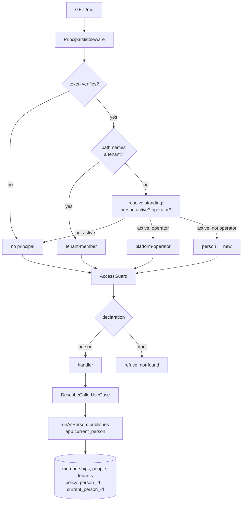

# Design — caller-identity

## Overview

A caller asks who they are, and one query answers: the person, their address,
whether the platform records them as an operator, and every tenant they can
currently act in with the role they hold there.

Four things stand between the request and that answer, and this feature builds
each by extending a pattern the platform already has rather than inventing one.

- **A person acting in no tenant is not a principal the system can produce.**
  The actor union gains a fourth kind, and the resolver learns to produce it.
- **No route can say "any authenticated person".** The access declaration gains
  the shape, and the guard the branch.
- **No database identity can read one person's memberships across tenants.** The
  authenticating identity gains a policy confined by a published person, exactly
  as tenant-owned tables are confined by a published tenant.
- **The answer itself.** One use case, one route.

The last of those is the smallest. That order — mechanism first, endpoint last —
is also the implementation order.

---

## Boundary Commitments

### This spec owns

- **The person principal**: the fourth actor kind, how the resolver produces it,
  and what it means to every place that switches on the union.
- **The `person` access declaration** and the guard branch that enforces it.
- **Publishing a person into an authenticating transaction**, and the policy
  that confines reads to their rows.
- **The caller's own standing**: what it contains, and the route that answers it.

### Out of boundary

- **The access token's payload.** Unchanged, deliberately, and requirement 4.3
  forbids taking anything but identity from it.
- **Whether a membership grants access.** `decideAccess` (feature 1) decides;
  this feature reports the outcome and does not restate the rule.
- **Any standing but the caller's own.** No route, no use case, and no
  repository method that takes a person other than the one who is asking.
- **Machine callers.** A key has no standing of its own here; giving it one is
  feature 5's business if it turns out to need it.
- **Tenant switching, sessions, preferences, profile data.** Nothing is stored
  by this feature; it only reads.

### Allowed dependencies

- The existing authenticating unit of work, extended with one entry point.
- `decideAccess` and the `Role` vocabulary from the domain.
- The access declaration and guard from `rbac-authorization-guards`.
- Nothing new. No library is added.

**Forbidden:** reading `memberships` through the tenant-scoped identity for this
purpose (it can only ever see one tenant), and any query that takes a person
identifier from the request rather than from the resolved principal.

### Revalidation triggers

- A capability needs another person's memberships.
- A route needs "any person" *and* a tenant in its path.
- Machine callers gain a standing of their own.

---

## Architecture



Two things to read off it. A person principal is produced only where a tenant is
absent from the path — a request inside a tenant is still a tenant member, which
keeps feature 2's rule that one person may act in several tenants. And the
confinement to the caller's own rows happens at the database, below the query,
so a repository that forgot its predicate still returns only their memberships.

---

## Components & Interfaces

### The person principal

```typescript
export type ActorContext =
  | { readonly kind: 'platform-operator'; readonly personId: PersonId }
  | { readonly kind: 'person'; readonly personId: PersonId }
  | { readonly kind: 'tenant-member'; /* … unchanged … */ }
  | { readonly kind: 'machine'; /* … unchanged … */ };
```

A person who authenticated and is acting inside no tenant. Distinct from
`tenant-member` because that kind carries a tenant and every check on it assumes
one; making that tenant nullable instead would leave every existing check
compiling and quietly wrong.

**Correction, found in task 1.1: the compiler names nothing.** This design
claimed a new kind would make it point at every site that has to decide. It does
not — nothing switches on `ActorContext` exhaustively. The `unreachable` pattern
this repository uses is applied to `DomainError`, not to actors, and every
actor check is a negative comparison (`!== 'tenant-member'`,
`!== 'platform-operator'`). Adding the kind compiles cleanly.

The consequence is not that the behaviour is wrong — negative comparisons fail
closed, so a person is refused everywhere tenant-scoped, which is correct. It is
that nothing *enforces* it, and a future check written as a positive chain would
admit the new kind silently. Tests pin the refusals for that reason.

**An operator is not also a person here.** The resolver produces whichever the
caller is, so `operator` routes and `person` routes both need their own branch,
and a route declared for a person admits an operator too — see the guard below.

### `PrincipalResolver`, on a tenantless path

```typescript
private async resolveStanding(
  personId: PersonId,
): Promise<ActorContext | null>;
```

One authenticating transaction reads whether the person is active and whether
they are recorded as an operator, and answers:

| Person | Operator record | Principal |
|---|---|---|
| not active | either | `null` |
| active | yes | `platform-operator` |
| active | no | `person` |

The active check is new here and matters: a deactivated person's token verifies
until it expires, and until now no tenantless route existed for a plain person
to reach with it.

### The declaration

```typescript
export type AccessDeclaration =
  | { readonly public: true }
  | { readonly operator: true }
  | { readonly person: true }
  | { readonly roles: readonly Role[]; readonly machines?: true };
```

`{ person: true }` admits any principal that names a person — a `person` or a
`platform-operator`. It does not admit a machine, and it does not admit a
`tenant-member`, because a request that named a tenant is not the kind of
request this shape describes.

The guard gains one branch and `assertUsable` one rule: `person` combines with
nothing else.

### `AuthenticatorUnitOfWork.runAsPerson`

```typescript
runAsPerson<T>(
  personId: PersonId,
  work: (repositories: AuthenticatorRepositories) => Promise<T>,
): Promise<T>;
```

Opens the authenticating transaction and publishes the person into it with
`set_config('app.current_person', …, true)`. Transaction-local for the same
reason the tenant is: connections are pooled, and a session-level setting would
carry the person into whatever request took the connection next.

`runAuthenticating` stays exactly as it is — sign-in runs before any person is
known, and most of feature 2 has no person to publish.

### `StandingRepository`

```typescript
export interface CallerStanding {
  readonly personId: PersonId;
  readonly email: EmailAddress;
  readonly isOperator: boolean;
  readonly memberships: readonly StandingMembership[];
}

export interface StandingMembership {
  readonly tenantId: TenantId;
  readonly tenantName: string;
  readonly role: Role;
}

export interface StandingRepository {
  /** Of the published person, and of nobody else — the policy sees to that. */
  describeCaller(): Promise<CallerStanding | null>;
}
```

The method takes no person. It cannot: the person is whoever the transaction
published, which removes the shape of the mistake requirement 2.1 forbids.

### `DescribeCallerUseCase`

Reads the standing, and drops every membership that does not currently grant
access by asking `decideAccess` — the same rule the guard and the use cases
apply, so a tenant this reports is a tenant the caller can actually reach.

---

## Data Models

No table changes. One function and one policy:

```sql
CREATE OR REPLACE FUNCTION current_person_id() RETURNS uuid
  LANGUAGE sql STABLE
  AS $$ SELECT nullif(current_setting('app.current_person', true), '')::uuid $$;

GRANT SELECT ON memberships TO cubeforge_authenticator;

CREATE POLICY memberships_authenticator_own ON memberships
  FOR SELECT TO cubeforge_authenticator
  USING (person_id = current_person_id());
```

`SELECT` only, and confined to one person's rows. With no person published,
`current_person_id()` is null and the policy matches nothing — the same failure
shape the tenant policies have, and tested the same way.

---

## Error Handling

| Situation | Outcome |
|---|---|
| No credential | Guard refuses: `not-found` |
| Machine credential | Guard refuses: `not-found`, reason names the kind |
| Token verifies, person deactivated | No principal resolves; guard refuses |
| Person active, no memberships | **200**, with an empty list — requirement 2.4 |
| Membership revoked or tenant inactive | Omitted from the list, not an error |

An empty answer is an ordinary answer. Refusing a person who belongs nowhere
would tell them something about the platform's shape and would break a client
that has a legitimate signed-in user with nothing yet.

---

## Testing Strategy

**Unit — the resolver**

- A deactivated person resolves to nothing on a tenantless path, whatever their
  operator record says (4.3, and feature 2's 6.1 extended to this route).
- An active non-operator resolves to `person`; an active operator to
  `platform-operator`; a path naming a tenant still resolves to `tenant-member`.

**Unit — the declaration and guard**

- `{ person: true }` admits a person and an operator, refuses a machine, a
  tenant-member and a caller with no principal (3.1, 3.2, 3.3).
- `person` combined with anything else is refused at construction (3.4).
- The route inventory reports the new shape, and the drift check tolerates it.

**Unit — the use case, against in-memory adapters**

- Reports identifier, address, operator flag and memberships (1.1, 1.2, 1.5).
- Omits a revoked membership and one in a deactivated tenant (1.3).
- An operator with no memberships gets `isOperator: true` and an empty list
  (1.4, 2.4).

**Integration — against PostgreSQL**

- With a person published, `SELECT * FROM memberships` as the authenticating
  identity returns only theirs; with nobody published, none; with another person
  published, only that other person's (5.1, 5.2).
- The route answers a member, an operator and a member of two tenants (1.1–1.4).
- Changing a role, revoking a membership and deactivating a tenant each show up
  in the next answer with the same credential (4.1, 4.2).
- A machine key and an anonymous caller are refused identically (3.2, 3.3).
- Every existing isolation and role-matrix assertion still passes (5.3).

**Verification by breaking**

- Drop the policy's `USING` clause: the isolation assertion must fail.
- Return the person from the request instead of the transaction: nothing should
  compile, because the repository method takes no person.
- Remove the active check in the resolver: the deactivated-person test must fail.

---

## File Structure Plan

### Created

| Path | Responsibility |
|---|---|
| `src/application/ports/standing.repository.ts` | `CallerStanding`, `StandingMembership`, `StandingRepository` |
| `src/application/identity/describe-caller.use-case.ts` | Reads the standing, drops what does not grant access |
| `src/application/identity/describe-caller.use-case.spec.ts` | Its rules |
| `src/adapters/persistence/postgres/postgres-standing.repository.ts` | The three-table read under the published person |
| `src/adapters/persistence/in-memory/in-memory-standing.repository.ts` | The same contract for unit tests |
| `src/adapters/http/caller.controller.ts` | `GET /me`, declared `{ person: true }` |
| `drizzle/0011_caller_standing.sql` | `current_person_id()`, the grant and the policy |
| `test/integration/caller-standing.integration-spec.ts` | The route, and the policy's confinement |

### Modified

| Path | Change |
|---|---|
| `src/application/actor-context.ts` | The `person` kind |
| `src/application/principal-resolver.ts` | Produces it; checks the person is active |
| `src/application/ports/authenticator-unit-of-work.ts` | `runAsPerson`, and `standing` among the repositories |
| `src/adapters/persistence/postgres/postgres-authenticator-unit-of-work.ts` | Publishes the person; provides the repository |
| `src/adapters/persistence/in-memory/in-memory-authenticator-unit-of-work.ts` | The same |
| `src/adapters/http/access/access.decorator.ts` | The `person` shape and its rule in `assertUsable` |
| `src/adapters/http/access/access.guard.ts` | The `person` branch |
| `src/adapters/http/dto/responses.ts` | `CallerResponse` |
| `src/authentication.module.ts` | Binds the use case and the controller |
| `test/integration/role-matrix.integration-spec.ts` | Re-aim the guard probe; cover `GET /me` |
| `src/application/tenant-authorization.ts` | `authorizeInTenant` and `tenantOf` refuse the new kind as they refuse an operator — a person acting in no tenant has no standing in one |
| `src/adapters/testing/identity-test-context.ts` | A `person` actor for the fixtures, beside `operator` |

Those two, plus the resolver and the guard above, are every place that reads
`actor.kind` today. The list came from the code rather than from memory, and the
union's exhaustive handling turns any site missed here into a compile error
rather than a silent default.

---

## Requirements Traceability

| Requirement | Where |
|---|---|
| 1.1 | `DescribeCallerUseCase`, `CallerStanding` |
| 1.2 | `StandingMembership` — tenant id, name, role |
| 1.3 | The use case filters through `decideAccess` |
| 1.4 | `isOperator` reported; memberships still only their own |
| 1.5 | `email` on the standing, the caller's own |
| 2.1 | `describeCaller()` takes no person; the policy confines the read |
| 2.2 | Only tenants reached through their own memberships |
| 2.3 | No route or method accepts another person |
| 2.4 | Empty list, 200 — see Error Handling |
| 3.1 | `{ person: true }` admits a person and an operator |
| 3.2 | The guard refuses a machine on that declaration |
| 3.3 | No principal, no admission |
| 3.4 | The declaration union gains the shape; `assertUsable` keeps it exclusive |
| 4.1 | Read per request; nothing cached |
| 4.2 | `decideAccess` re-evaluated per request |
| 4.3 | The token still carries `{ sub, iss, exp }` |
| 5.1 | `memberships_authenticator_own`, `SELECT` only |
| 5.2 | The policy names `current_person_id()`; nothing else can publish it |
| 5.3 | No existing grant or policy is altered; the suites prove it |

---

## Open Questions

- **The name `person` for the fourth kind.** It reads well beside
  `platform-operator` and `machine`, and badly beside `tenant-member`, which is
  also a person. The alternative considered was `signed-in-person`. Left as
  `person` with the union's comment carrying the distinction; a reviewer who
  disagrees should say so before the tasks are written rather than after.
