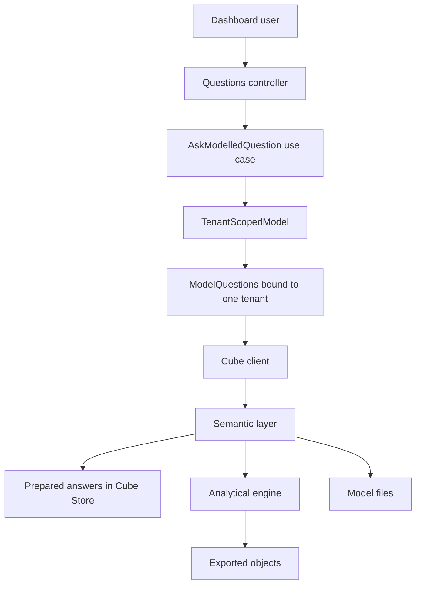
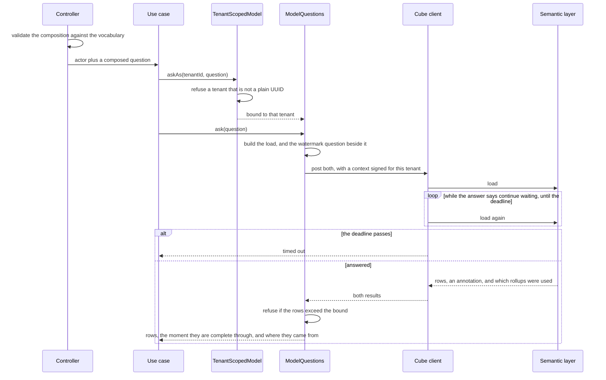

# Design — cube-semantic-layer

## Overview

One model, defined once, over the same exported objects the query adapter reads.
A caller composes measures, groupings and a period; the platform validates that
composition against a declared vocabulary, mints a security context from the
tenant it has already authorized, and asks the semantic layer. The tenant is
never in the question.

Three findings from the experiment recorded in `research.md` shape this design
more than anything in the requirements:

- **The driver reaches the emulator through an undocumented path.** An
  `endpoint` key passed to the Athena driver is spread into the AWS client
  because the driver forwards every option it does not recognise. The feature
  rests on that, so the design pins it and tests it.
- **No write of any kind reaches the local engine.** The emulator wraps every
  statement in `COPY (…)`, so `CTAS` and `UNLOAD` are parse errors. The
  documented pre-aggregation strategies are therefore unreachable here, and the
  read-only path — Cube materializing a rollup in Cube Store from a plain
  `SELECT` — is the one this design uses and verifies.
- **Every column comes back as text, and that stops rollups rather than merely
  mislabelling numbers.** No SQL repairs it; the repair is a driver subclass
  overriding the type mapping, installed only when the endpoint is the emulator.

The fourth decision is the one the requirements settled: **Cube does not consume
`TenantScopedAnalytics`.** It reads the same Glue catalogue through its own
connection, so the port stays closed and the model gets to be a model.

## Goals

- Measures and groupings defined once, composable without a definition per
  combination (1.1–1.6).
- A composed question carries a bound it cannot be asked without (2.1–2.4).
- A modelled answer contains one tenant's records, decided by the platform and
  never by the question (3.1–3.4).
- One door: every question arrives through the API, authorized and counted there
  (4.1–4.6).
- An answer says how current it is, and "never exported" stays distinct from
  "nothing happened" (5.1–5.5).
- One question prepared in advance, rebuilt when the export moves, and
  observably served from what was prepared (6.1–6.6).
- A refusal names a class of problem and takes nothing else down with it
  (7.1–7.4, 8.1–8.3).

## Non-goals

- Drawing an answer — `dashboard-frontend` (step 9).
- A second source over the transactional store, at any freshness.
- Replacing the two existing analytical routes or their port.
- Any deployment beyond the local compose stack, and any claim about a real
  cloud account.
- Arbitrary Cube JSON as the platform's public API. The route accepts a
  composed question in the platform's own vocabulary, not the model's.

## Boundary Commitments

### This spec owns

- **The model** — every cube, measure, dimension, join and rollup under
  `cube/`, and the configuration file the container reads.
- **The vocabulary** — the platform-facing names a caller may compose from, the
  refusal when a name is not one of them, and the mapping from those names to
  the model's members.
- **The composed question** — what a caller may express, the period rules
  applied to it, and the bound on how many rows one answer may carry.
- **The security context** — minting it from the tenant the platform already
  authorized, and the secret it is signed with.
- **The outbound call** — the first one this platform makes: its deadline, its
  continue-wait loop, and how a transport failure becomes a named reason.
- **One HTTP route** and its refusals.
- **The semantic layer's place in the compose stack** — which source it reads,
  which ports it publishes, and that it needs no real credential.

### Out of boundary

- **The exported data** — columns, partitioning and how far each tenant has been
  carried are `s3-data-export`'s. This design reads them and changes nothing.
- **The catalogue over them** — the Glue tables, their partition arrangement and
  the `injected` projection are `athena-analytics-query`'s. This design models
  over that catalogue; it does not redefine it, and it adds no table.
- **`TenantScopedAnalytics` and its two routes.** They keep answering through
  their own port, including the three-state union this design reproduces rather
  than borrows.
- **Who the caller is** — `authentication`; **whether the role may** —
  `rbac-authorization-guards`. This design declares which roles may ask.
- **Real deployment, and the permissions it would require.** The semantic layer
  would need the same Athena, Glue and S3 surface the query adapter listed, plus
  `s3:PutObject` on a pre-aggregation location if a deployment ever chose the
  export-bucket strategy this design cannot use locally. Nothing here is
  authorized; the emulator enforces nothing.
- **Drawing an answer** — step 9.

### One upstream change, declared

**`athena-analytics-query`'s failure taxonomy gains two reasons**:
`model-unreachable` and `model-rejected`.

Requirement 7 needs a closed set of reasons covering a service that does not
answer and one that answers with an error, and that spec's set has neither — it
was written for an engine reached through an SDK, not for a service reached over
HTTP. The alternatives were both worse: a second taxonomy meaning the same five
things in different words, or classifying a transport failure as
`store-unreachable`, which would send an operator to look at object storage when
the thing that is down is a container.

The change is additive, the filter that renders these reasons already returns
503 for every member of the set, and both new reasons have a producer in this
design — which is the rule that spec wrote for itself. It is recorded in
`athena-analytics-query/tasks.md` as a fired revalidation trigger, and that
spec's suites are re-run.

**The same note records that this feature reversed that spec's assumption.**
`athena-analytics-query/requirements.md:67` says Cube will consume the port and
its architecture diagram draws that edge; decision 1 of these requirements says
it does not, and why. The assumption is corrected where it was made rather than
left for a reader to discover from two documents that disagree.

### Allowed dependencies

| Layer | May import |
|---|---|
| `src/domain/semantic/**` | `src/domain/**` only |
| `src/application/semantic/**` | `src/domain/**`, `src/application/ports/**`, the application's own pure helpers, Nest decorators |
| `src/adapters/semantic/**` | anything |
| `cube/**` | nothing from `src/` — a separate process reads it |

Specific to this feature:

- **The semantic path opens no database transaction and imports no repository.**
  It does not reach PostgreSQL at all, and neither does the container: the cube
  service's only configured source is the analytical engine (5.2).
- **Nothing in `src/adapters/analytics/**` imports anything from
  `src/adapters/semantic/**`.** The two are separate lifecycles that share a
  vocabulary of failure, and the sharing runs one way.
- **One file composes a Cube query.** `cube-model.ts` is to this feature what
  `athena-analytics.ts` is to the previous one: the whole surface a tenant could
  go missing from, reviewable at once.
- **`cube/` holds no secret and no credential value.** Everything it needs
  arrives as an environment variable, and it refuses a non-emulator endpoint.

### Revalidation triggers

- A dataset gaining or losing a column, or a column changing type. The model
  names columns directly.
- The export changing its key layout, which the catalogue's partitions are
  written against and the model inherits.
- A Cube major version. Two behaviours this design depends on are version-bound:
  the driver forwarding unrecognised options, and a rollup lacking a dimension
  being declined rather than misused.
- A real engine replacing the emulator, which makes the type repair unnecessary
  and the three declared-not-verified claims below testable, and therefore
  obligatory to test.
- A second consumer wanting to ask the model something the vocabulary does not
  name.

## Architecture



The seam is the same shape as the analytical one and for the same reason: a
caller receives a `ModelQuestions` already bound to one tenant, so "forgot to
scope" is not expressible rather than merely refused. The tenant crosses the
process boundary twice over — as a signed claim the semantic layer turns into a
filter, and as the filter itself once `queryRewrite` has run.

**Four gates stand between a caller and another tenant's rows**, and they fail
independently: the platform's membership resolution, the signed context, the
model's rewrite, and the engine's `injected` projection. Only the first three
have a local probe; the fourth is declared, as it was in the previous feature.

### One question, end to end



The continue-wait loop is not a design choice: Cube answers a long query with
`200` and `"Continue wait"` rather than holding the connection, so a client that
reads one response and stops would report an empty answer for every slow
question. It is the same submit-and-poll shape the Athena runner already carries,
which is why the deadline lives in the same place.

## File Structure Plan

### Created

| Path | Responsibility |
|---|---|
| `src/domain/semantic/vocabulary.ts` | The measures and groupings a caller may name, and the refusal that lists them |
| `src/domain/semantic/vocabulary.spec.ts` | An unknown name is refused and the offer is named; the list is not empty |
| `src/domain/semantic/question.ts` | `ModelledQuestion`: measures, groupings, a period, a row bound — and no tenant |
| `src/domain/semantic/question.spec.ts` | No measure, no period, an unknown name, a period beyond the limit |
| `src/domain/semantic/modelled-answer.ts` | `ModelledAnswer`: answered with provenance, or never exported |
| `src/domain/semantic/modelled-answer.spec.ts` | Answered-and-empty, never-exported and prepared-or-not as distinct states |
| `src/application/ports/tenant-scoped-model.ts` | `TenantScopedModel`, `ModelQuestions`, the token |
| `src/application/semantic/ask-modelled-question.use-case.ts` | The one question, and the roles that may ask it |
| `src/application/semantic/ask-modelled-question.use-case.spec.ts` | With the double: roles, machines refused, empty, never-exported, over the bound |
| `src/adapters/semantic/cube-model.ts` | The seam's real implementation, and the only file that composes a Cube query |
| `src/adapters/semantic/cube-client.ts` | The outbound call: deadline, continue-wait, and classification |
| `src/adapters/semantic/cube-client.spec.ts` | Continue-wait followed, deadline honoured, each failure classified |
| `src/adapters/semantic/security-context.ts` | Minting a short-lived context for one tenant |
| `src/adapters/semantic/security-context.spec.ts` | It carries the tenant, it expires, and it is not an access token |
| `src/adapters/semantic/member-mapping.ts` | Platform names to model members, in one table |
| `src/adapters/semantic/semantic-config.ts` | The URL, the secret and the deadline, with every missing key named at once |
| `src/adapters/semantic/semantic-config.spec.ts` | Missing keys, a secret shared with the platform's, a URL that is not one |
| `src/adapters/semantic/deferred-model.ts` | Built at the first question, so a missing setting refuses a question and not a boot |
| `src/adapters/semantic/deferred-model.spec.ts` | A failed build refuses and is not remembered |
| `src/adapters/semantic/in-memory-model.ts` | The double the use-case tests run against |
| `src/adapters/semantic/cube-configuration.spec.ts` | The configuration file, loaded and asserted — see below |
| `src/adapters/http/analytics-questions.controller.ts` | The one route |
| `src/adapters/http/dto/modelled-question.dto.ts` | What a caller may send, validated before the use case runs |
| `src/semantic.module.ts` | Binds this feature's port to these adapters |
| `cube/cube.js` | The configuration: the driver, the type repair, the rewrite, the emulator refusal |
| `cube/model/movements.yml` | The movements cube, its measures, its dimensions and the rollup |
| `cube/model/products.yml` | The product cube and its join |
| `cube/model/locations.yml` | The location cube and its join |
| `cube/model/watermarks.yml` | How far a tenant has been carried, as a cube |
| `test/integration/semantic-questions.integration-spec.ts` | Real composed questions against real objects |
| `test/integration/semantic-isolation.integration-spec.ts` | Two tenants, asked directly and through what was prepared |
| `test/integration/semantic-preparation.integration-spec.ts` | A rollup is built, used, and rebuilt when the export moves |
| `test/integration/semantic-vocabulary.integration-spec.ts` | Every declared name exists in the model, and nothing is offered that does not |
| `test/integration/semantic-http.integration-spec.ts` | The route: roles, refusals, throttling, disclosure |

`cube/cube.js` is JavaScript outside the TypeScript project, which the gap
analysis filed as the cost of Option C: nothing type-checks it. A unit spec
recovers most of what was lost — the driver's endpoint, the type
repair being installed only for the emulator, the rewrite adding a filter, and
the refusal of a non-emulator endpoint are all assertable without a container.

The spec lives in `src/`, not beside the file it tests: Jest's `rootDir` is
`src`, so a spec anywhere else is never collected — a test that cannot run is
worse than an absent one, because it looks like coverage. It reaches the
configuration through a runtime `require` of the path rather than an `import`,
which keeps a file outside `rootDir` out of the TypeScript build graph.

The model files stay untested by anything but real questions, which is why three
integration suites ask them.

### Modified

| Path | Change |
|---|---|
| `src/application/analytics/analytics-failure.ts` | Two reasons: `model-unreachable`, `model-rejected` |
| `src/application/analytics/analytics-failure.spec.ts` | Both classified, and neither carrying a record |
| `src/app.module.ts` | Import `SemanticModule` — a request can reach it |
| `docker-compose.yml` | The cube service reads the engine, not PostgreSQL; publishes nothing; dev mode off |
| `docker-compose.playground.yml` | **Created** — the override that republishes the playground for a demonstration |
| `.env.example` | `CUBE_URL`, `CUBE_QUESTION_TIMEOUT_MS`, and the Athena settings the container needs. `CUBEJS_API_SECRET` is already there and is now read by both sides |
| `.kiro/specs/athena-analytics-query/tasks.md` | The fired revalidation trigger, and the reversed assumption |

**No new dependency.** The outbound call uses Node 22's global `fetch`, and the
context is signed with `@nestjs/jwt`, already present for access tokens. The
first outbound call on this platform arrives without adding a client library,
which is the answer to the gap analysis's "no convention behind it": the
convention is the one in `cube-client.ts`, and it is small enough to read.

## Components and Interfaces

| Component | Layer | Intent | Requirements |
|---|---|---|---|
| `Vocabulary` | domain | What may be named, and what is offered when a name is wrong | 1.1, 1.7 |
| `ModelledQuestion` | domain | A composition that carries its own bounds | 1.6, 2.1–2.3 |
| `ModelledAnswer` | domain | Answered with provenance, or never exported | 5.1, 5.3, 5.4, 6.3 |
| `TenantScopedModel` | port | The tenant is bound, never named | 3.1–3.3 |
| `AskModelledQuestionUseCase` | application | The one question, its roles, and the bound | 2.4, 4.4, 4.6 |
| `CubeModel` | adapter | The only file that composes a Cube query | 1.6, 3.1, 5.1 |
| `CubeClient` | adapter | The outbound call, its deadline and its failures | 7.1, 7.2 |
| `SecurityContext` | adapter | The tenant, signed, short-lived | 4.2, 4.3 |
| `DeferredModel` | adapter | A missing setting refuses a question, not a boot | 8.1, 8.2 |
| `loadSemanticConfig` | adapter | Every missing setting named at once | 8.3, 8.4 |
| `AnalyticsQuestionsController` | adapter | The one route, validated at the edge | 1.7, 2.1, 2.2, 4.1, 4.5 |
| The model | `cube/` | Definitions, once | 1.1–1.6, 3.5, 5.2, 6.1–6.6 |

### The vocabulary

Two names for the same thing, deliberately. The platform publishes
`net_quantity`; the model calls it `movements.net_quantity`. The mapping is one
table in one adapter file.

The cost is a name to keep in step. The reason is that the dashboard's contract
would otherwise be the model's internal naming, so renaming a cube would break a
chart — which is exactly the coupling `exported-row.ts` was written to prevent
one layer down. The names are kept honest mechanically rather than by care:
`semantic-vocabulary.integration-spec.ts` reads the model's own metadata and
asserts the mapping is total in both directions. A member the model defines and
the vocabulary does not offer is as much a finding as the reverse.

```ts
export type MeasureName =
  | 'net_quantity'
  | 'movement_count'
  | 'on_hand_quantity';

export type GroupingName =
  | 'recorded_day'
  | 'occurred_day'
  | 'kind'
  | 'product'
  | 'location';

export interface VocabularyRefusal {
  readonly unknown: readonly string[];
  readonly measures: readonly MeasureName[];
  readonly groupings: readonly GroupingName[];
}

export type VocabularyResult<T> =
  | { readonly ok: true; readonly names: readonly T[] }
  | { readonly ok: false; readonly refusal: VocabularyRefusal };
```

A refusal names **every** unrecognised name at once and lists what is offered
(1.7), for the reason the configuration loader gives for reporting every missing
key together.

### The question

```ts
export interface ModelledQuestion {
  readonly measures: readonly MeasureName[];
  readonly groupings: readonly GroupingName[];
  readonly period: Period;
  readonly by: 'recorded' | 'occurred';
  readonly limit: RowLimit;
}

export function questionFrom(input: {
  measures: readonly string[];
  groupings: readonly string[];
  period: Period;
  by: 'recorded' | 'occurred';
}): ModelledQuestion;
```

- **`Period` is the existing one**, imported from `domain/analytics/period.ts`
  with its refusals intact: there is no constructor for an absent period and
  none for one longer than `LONGEST_PERIOD_DAYS`, which is 366 and states itself
  when it refuses (2.1, 2.2). The rules move to a new edge; they are not
  rewritten there.
- **No tenant field exists** (3.2). A caller cannot name one because the type
  has nowhere to put it.
- **At least one measure**, refused otherwise. A question with only groupings is
  a list of a tenant's records rather than an analysis of them.
- **`limit` is not the caller's.** `MAX_ANSWER_ROWS` is a constant of this
  design, set at 5,000: enough for a year of daily rows across several
  groupings, and far short of a history export.

### The answer

```ts
export type ModelledAnswer =
  | {
      readonly state: 'answered';
      readonly completeThrough: Date;
      readonly servedFrom: 'prepared' | 'exported-objects';
      readonly rows: readonly ModelledRow[];
    }
  | { readonly state: 'never-exported' };

export interface ModelledRow {
  readonly values: Readonly<Record<string, string | number | null>>;
}
```

**A separate type from `AnalyticalAnswer<T>`, on purpose.** The union is the same
three states, and reproducing it is a real cost — but this answer carries
provenance (6.3) that the port's answer has no reason to hold, and adding a
field only this feature sets to a closed feature's published type would push
this spec's concern into that one's contract. The states are the same because
the data underneath is the same; the shapes differ because what they must report
differs.

`servedFrom` is 6.3, and 6.3 is what makes 6.2 a claim about the system rather
than about the test. It is read from what the semantic layer reports about which
rollups it used, not inferred from how long an answer took.

### The seam

```ts
export interface ModelQuestions {
  ask(question: ModelledQuestion): Promise<ModelledAnswer>;
}

export interface TenantScopedModel {
  askAs<T>(
    tenantId: TenantId,
    question: (model: ModelQuestions) => Promise<T>,
  ): Promise<T>;
}

export const TENANT_SCOPED_MODEL = Symbol('TENANT_SCOPED_MODEL');
```

The same shape as `TenantScopedAnalytics` and for the same reason, stated there:
the tenant is bound by the seam, and no method below it accepts one. `askAs`
refuses a tenant identifier that is not a plain UUID before anything is signed,
because the value is about to become a claim in a token and a filter in a query.

This is a port with one real implementation and one double, which is the case
`structure.md` permits — the double is what the use-case tests run against, the
same standing `TenantRepository` and `TenantScopedAnalytics` have.

### The client

```ts
export interface CubeLoad {
  readonly queries: readonly CubeQuery[];
  readonly context: string;
}

export interface CubeResult {
  readonly data: readonly Readonly<Record<string, unknown>>[];
  readonly usedPreAggregations: readonly string[];
}

export class CubeClient {
  load(load: CubeLoad): Promise<readonly CubeResult[]>;
}
```

The first outbound call this platform makes, so it establishes the convention:

- **A deadline, not a timeout per attempt.** `CUBE_QUESTION_TIMEOUT_MS`
  (default 30,000) bounds the whole exchange including every continue-wait
  retry, and an `AbortSignal` carries it into `fetch`. On expiry the client
  raises `question-timed-out` (7.2). There is nothing to stop remotely: unlike
  Athena, the semantic layer holds no handle this side can cancel, and saying so
  is more useful than implying a `StopQueryExecution` exists.
- **Continue-wait is a loop, not a failure.** A `200` carrying
  `error: "Continue wait"` means the answer is still being computed; the client
  asks again until the deadline.
- **Every failure is classified where it happened**, through the existing
  `askingAs`: a connection refused or a DNS failure is `model-unreachable`
  (7.3, 8.2); a `4xx` or an error body is `model-rejected`; the deadline is
  `question-timed-out`. The cause travels as `cause` and never as a message,
  because a Cube error body routinely contains the SQL it generated (7.4).
- **No retry beyond continue-wait.** An analytical question is expensive and a
  refused one is refused for a reason; retrying it would double the cost of
  every incident.

### The security context

```ts
export interface SecurityContextIssuer {
  for(tenantId: TenantId): Promise<string>;
}
```

A JWT signed HS256 with `CUBEJS_API_SECRET`, carrying one claim — the tenant — and
an expiry of sixty seconds. It is minted per question rather than cached: the
saving would be a signature, and a context living longer than the question it
was minted for is a credential somebody can replay.

**A different secret from `AUTH_TOKEN_SECRET`, enforced.** `loadSemanticConfig`
refuses a configuration where the two are equal (8.3). Sharing one would mean a
platform access token could be presented directly to the semantic layer, which
is precisely what 4.2 forbids — and the failure would be silent, because both
would verify.

**The caller's own claims are never forwarded** (4.3). The context is built from
the tenant the platform resolved for this request, and the caller's token is not
in scope in the file that mints it.

### The route

```
POST /tenants/:tenantId/analytics/questions
```

```ts
class ModelledQuestionRequest {
  measures!: string[];
  groupings!: string[];
  from!: string;
  to!: string;
  by?: 'recorded' | 'occurred';
}
```

- **`POST` for a read**, because a composition carries lists and a query string
  that encodes them is a query string nobody can read in a log. Nothing about
  the request changes state.
- **The three tenant roles, and no `machines`** (4.4). Reading exported data is
  reading, so every member may; an API key may not, for the reason the existing
  analytical route gives — admitting machines lets an automated client decide
  how often an expensive question is paid for. The use case refuses a machine
  caller again on the kind of caller, not on the role.
- **The existing `analytics-caller` bucket**, mounted exactly as the movements
  route mounts it (4.5). A modelled question costs what an analytical one costs,
  so it is counted in the same bucket rather than given its own allowance —
  otherwise a caller at the limit of one has a second budget in the other.
- **A caller with no active membership is answered as for a tenant that does not
  exist** (4.6), by the platform's existing rule. No new mechanism.
- **The composition is validated at the edge** (1.7, 2.1, 2.2), before a use
  case runs and long before anything is signed. An unknown measure, an absent
  period and an over-long one are all the caller's mistake and all arrive as
  `DomainViolation`, which the platform renders as a validation refusal naming
  the field.
- **Over the bound is a refusal, not a truncation** (2.4). The model is asked for
  `MAX_ANSWER_ROWS + 1` rows; if that many come back, the question is refused
  naming the bound. Returning the first five thousand of a larger answer would
  be a chart that is wrong without saying so.

## Data Models

Nothing is created. The model is defined over the four tables
`athena-analytics-query` catalogued, and adds no column and no dataset.

### The cubes

| Cube | Reads | Carries |
|---|---|---|
| `movements` | `movements` | The measures, the day dimensions, `kind`, and the tenant |
| `products` | `products` | `sku`, `name`, `category` — joined on the movement's `sku` |
| `locations` | `locations` | `code`, `name` — joined on the movement's `location_code` |
| `watermarks` | `watermarks` | `complete_through`, one row per tenant |

Each cube declares `sql_table` **unqualified** — `movements`, not
`cubeforge.movements`. The catalogue is supplied per connection, exactly as
`AthenaAnalytics` supplies it through `QueryExecutionContext`, and a qualified
name fails locally with a schema that does not exist.

**`tenant_id` is a dimension on every cube**, although `exported-row.ts` declares
no such column: it is the partition, and the engine exposes a partition as a
column. That is what makes it filterable, and it is why the filter and the
partition pruning are the same act rather than two.

**Measures** (1.2, 1.3):

- `net_quantity` — `sum(quantity)`. Movements are signed, so the sum of a
  product's movements is the quantity on hand.
- `movement_count` — `count`.
- `on_hand_quantity` — `sum(quantity)` over a **rolling window with an unbounded
  trailing bound**, so the measure ignores the period while the rest of the
  question keeps it. On hand is an all-time sum by definition, and requirement
  2.1 makes an unbounded question inexpressible; a rolling window is how both
  stay true at once. A question mixing it with a period-bounded measure gets
  both, correctly, in one row.

**Dimensions** (1.4, 1.5): `recorded_day` and `occurred_day` as time dimensions
over `recorded_at` and `occurred_at`; `kind`; and, through the joins, a product
and a location labelled by code **and** current name. The name is the exported
catalogue's latest, which means a renamed product relabels its history — the
behaviour the export chose, inherited here rather than decided here.

### The prepared answer

```yaml
pre_aggregations:
  - name: movements_by_day_and_kind
    measures: [net_quantity, movement_count]
    dimensions: [tenant_id, kind]
    time_dimension: recorded_day
    granularity: day
    refresh_key:
      sql: SELECT max(complete_through) FROM watermarks
```

- **Chosen because it is what a dashboard asks constantly** (6.1): a period of
  daily totals, split by kind. Every other composition falls through to the
  engine (6.6), which is the correct behaviour and not a gap.
- **It carries `tenant_id` as a dimension**, which is what confines it (6.5).
  The confinement is the same act as for a directly read answer — the filter
  `queryRewrite` adds — rather than a second mechanism that could disagree with
  the first. The experiment tested the two wrong shapes available here: a rollup
  without the dimension is declined by Cube and the question falls to the engine,
  and a model parameterized by the security context without an application
  identity does not start at all.
- **The refresh key is the export's own watermark** (6.4). When any tenant's
  export finishes, `max(complete_through)` moves and the rollup rebuilds without
  a person asking. The cost is honest and worth stating: one tenant's export
  rebuilds the whole rollup. A per-tenant rollup would avoid that and would
  replace one confinement mechanism with two, which 6.5 asks it not to.
- **It is built through the read-only path.** With no export bucket configured
  the driver reports itself read-only, Cube reads a plain `SELECT` and
  materializes the result in Cube Store. The documented batching and
  export-bucket strategies both write to the source and are unreachable here,
  because the emulator wraps every statement in `COPY (…)` and refuses anything
  that is not a `SELECT`. This is recorded as a limit of the local environment,
  not of the design: a real Athena would use either strategy unchanged.

### How current an answer is

The watermark is asked for in the same load as the question, as a second query.
One round trip, and the two values come from the same read of the same objects.

- **A tenant with no watermark row is `never-exported`** (5.3), which stays
  distinct from a period that simply contains nothing (5.4). The union survives
  the HTTP edge, exactly as the movements route keeps it.
- **The reported moment is the watermark's and nothing else** (5.1, 5.5). Not
  the clock, not the moment the rollup was built, not the latest `recorded_at`
  in the answer — every one of those can be later than the data is complete
  through, which is the one thing 5.5 forbids.
- **Nothing reads the transactional store** (5.2). The cube service is
  configured with one source, and the configuration spec asserts it.

### The configuration the container reads

`cube/cube.js` holds four things and no secret:

1. **A driver pointed at the emulator.** The `endpoint` key is undocumented and
   works because the Athena driver spreads every option it does not recognise
   into the AWS client. The design depends on it, so `cube-configuration.spec.ts` asserts the
   key is passed and `research.md` records why it reaches the SDK.
2. **The type repair, installed only for the emulator.** A driver subclass
   overrides the method that turns response metadata into column types, so a
   numeric measure is typed as a number. Without it **no rollup of any shape can
   be read**: every rollup read ends in a sum, including a count, and Cube Store
   refuses to sum text. The subclass is installed only when the endpoint is the
   local emulator; against a real engine the stock driver is used unchanged.
   This is the same note the export carries about its own local repairs — the
   repair exists because of the emulator, and it must never teach the adapter to
   distrust a real engine's types.
3. **`queryRewrite`**, which pushes a filter on `tenant_id` taken from the
   security context (3.1, 3.4), and **throws when the context carries no
   tenant** — so a question that arrives without one is refused rather than
   answered across tenants (3.5). That refusal is this design's own; the
   engine's `injected` projection stands underneath it and is not locally
   verifiable, as the previous feature recorded.
4. **The emulator refusal** (8.4): a configured endpoint that is not the local
   emulator throws at startup, the same rule `requireLocalEmulator` applies on
   the TypeScript side. No credential belonging to a real account can be used
   here, and nothing has to be trusted to remember that.

### The compose stack

The cube service changes source and stops being reachable:

- `CUBEJS_DB_TYPE: athena` against the emulator, replacing the PostgreSQL
  settings that predate the export pipeline and contradict the rule this
  pipeline exists to honour (5.2).
- **No published ports and `CUBEJS_DEV_MODE: false`.** Requirement 4.2 says a
  caller the platform has not authorized gets no answer, and a semantic layer on
  `localhost:4000` with dev mode on contradicts it on a developer's machine —
  the playground answers without a credential. The API reaches the service by
  its compose name, which is all it needs.
- **`docker-compose.playground.yml`**, an override that republishes `4000` and
  enables dev mode for a demonstration. Being an explicit, separate, named act
  is the difference between a decision and an accident.

## Error handling

- **Unconfigured** — the URL, the secret or a secret equal to the platform's is
  refused naming every problem at once (8.3), at the first question and not at
  module construction (8.1). The API starts and serves everything else; only
  modelled questions refuse, as `not-configured` (8.2). `DeferredModel` does not
  remember a failure, so a setting supplied to a running process takes effect at
  the next question.
- **Unreachable** — a connection that is refused, reset or unresolved is
  `model-unreachable` (7.3). Every other route of the platform goes on answering,
  which is a property of where the failure is caught rather than a promise: the
  filter catches one exception type and this module is imported by nothing.
- **Rejected** — a `4xx` or an error body is `model-rejected`. In practice this
  is a member the vocabulary offers and the model no longer defines, which is
  the drift the vocabulary suite exists to catch before a caller does.
- **Too slow** — the deadline covers the whole exchange, including every
  continue-wait retry, and expires as `question-timed-out` (7.2).
- **Unreadable** — the exported objects being unreachable arrives as a Cube
  error, which is `model-rejected` with the engine's cause logged (7.1). The
  question is refused whole; a partial answer is never returned.
- **What a refusal contains** (7.4): the reason, and nothing else. The existing
  filter renders all seven reasons as 503 with no location, no statement and no
  identifier. A Cube error body regularly carries the SQL it generated, so it is
  logged against the correlation identifier and never serialised.
- **Over the bound** (2.4) is not one of these. It is the caller's question being
  too large, so it is a validation refusal naming the bound rather than a 503
  implying the platform is unwell.

## Testing strategy

Derived from the acceptance criteria.

**Pure**

- An unknown measure or grouping is refused, every unknown name is listed at
  once, and the refusal names what is offered (1.7).
- A question with no measure, no period, or a period beyond the limit cannot be
  constructed, and the limit states itself (2.1, 2.2).
- `answered` with no rows, `never-exported`, and `prepared` versus
  `exported-objects` are four distinguishable outcomes (5.3, 5.4, 6.3).
- `cube.js`, required directly: the endpoint reaches the driver; the type repair
  is installed for the emulator and **not** for another endpoint; the rewrite
  adds a tenant filter; the rewrite throws when the context names no tenant; a
  non-emulator endpoint is refused (3.5, 8.4).

**With the double**

- The three roles may ask; a machine caller may not (4.4).
- A question is asked for the tenant the seam bound, and no method below it
  accepts another (3.1, 3.2, 3.3).
- An answer over the bound is refused naming the bound, rather than truncated
  (2.4).
- A failed configuration refuses the question and is not remembered (8.1, 8.2).
- Continue-wait is followed until an answer arrives; the deadline is honoured
  across the whole exchange; each failure lands on its own reason (7.1, 7.2).

**Against the running stack**

- A composed question no definition was written for comes back with correct
  numbers, checked against what the export wrote (1.1, 1.2, 1.6).
- On-hand is the sum of a product's movements, and stays that under a period
  that excludes some of them (1.3).
- Every grouping groups, and products and locations arrive labelled by code and
  name (1.4, 1.5).
- Every name the vocabulary offers exists in the model's metadata, and every
  member the model defines is offered (1.1, 1.7).
- **Two tenants ask the same question and each receives their own rows** — once
  falling through to the engine and once served from what was prepared (3.4,
  6.5). This is the suite the gap analysis said was owed, and it is the one that
  must be shown failing before it is believed.
- A question is answered from what was prepared, and the answer says so (6.2,
  6.3); a composition that was not prepared is answered from the objects and
  says that instead (6.6).
- The rollup rebuilds after a new export moves the watermark, with nobody asking
  (6.4).
- A period containing nothing answers with no rows; a tenant that has never been
  exported answers `never-exported` (5.3, 5.4).
- The reported moment equals that tenant's watermark, and is never later (5.1,
  5.5).

**Through the running application**

- The three roles reach the route and a machine credential does not (4.4).
- A caller with no active membership is answered as for a tenant that does not
  exist (4.6).
- A tenant named in the body is not honoured — the path and the caller's
  standing decide, and nothing else (3.2, 3.3).
- The bucket refuses an eleventh question in a minute and says how long to wait
  (4.5).
- A stopped semantic layer refuses only these questions; sign-in and inventory
  keep answering (7.3).
- A refusal carries a reason and no location, no statement, no other tenant
  (7.4).

**Probes each of these must survive:** removing the tenant filter from
`queryRewrite`; dropping `tenant_id` from the rollup's dimensions; signing the
context with `AUTH_TOKEN_SECRET`; forwarding the caller's own token instead of a
minted context; letting the client read one response and stop; reporting the
clock instead of the watermark; returning the first page of an over-bound answer.

**What no local test settles.** Stated here because the requirements promised it
would be:

1. **The `injected` refusal** (3.5). The emulator needs no partitions and
   derives the tenant from the object's path, so it answers whether or not the
   arrangement behind the requirement is correct. This design's own refusal —
   the rewrite throwing on a context with no tenant — **is** locally testable,
   and it is a different claim.
2. **The documented pre-aggregation strategies.** Batching and the export bucket
   both write, and no write reaches the local engine. Requirement 6 is verified
   through the read-only path only, and a deployment would be exercising code
   paths this suite never touches.
3. **The dialect and the types.** Every question runs against DuckDB here and
   Presto there, and the type repair exists because of that difference. A real
   engine would need it removed, and nothing local can show it removed safely.
4. **Authorization.** No call this feature makes is authorized locally. The
   permissions a deployment requires are listed under Out of boundary.

## Requirements Traceability

| Requirement | Where it lives |
|---|---|
| 1.1 | The cubes in `cube/model/`; one definition per measure, served to every caller |
| 1.2 | `net_quantity` and `movement_count` on the `movements` cube |
| 1.3 | `on_hand_quantity`, a rolling window with an unbounded trailing bound |
| 1.4 | `recorded_day`, `occurred_day`, `kind`, and the product and location joins |
| 1.5 | `products.yml` and `locations.yml` — code and current name from the exported catalogue |
| 1.6 | `ModelledQuestion` composes; `CubeModel` builds one load from any composition |
| 1.7 | `vocabulary.ts` refuses at the edge, listing every unknown name and what is offered |
| 2.1 | `Period` has no unbounded constructor; the DTO requires both days |
| 2.2 | `periodFrom` refuses beyond `LONGEST_PERIOD_DAYS`, naming it |
| 2.3 | `MAX_ANSWER_ROWS`, applied as the load's limit |
| 2.4 | The model is asked for one row more than the bound; over it is a refusal naming the bound |
| 3.1 | `queryRewrite` adds a filter on `tenant_id` taken from the signed context |
| 3.2 | `ModelledQuestion` has no tenant field, and the DTO accepts none |
| 3.3 | `TenantScopedModel.askAs`, given the tenant the platform resolved for the request |
| 3.4 | `semantic-isolation.integration-spec.ts`, both paths |
| 3.5 | The rewrite throws on a context with no tenant; the `injected` projection underneath — declared, not locally verifiable |
| 3.6 | `AnalyticsUnavailable` carries a reason and no record; the filter renders nothing else |
| 4.1 | The route is the only caller of `CubeClient`; the service publishes no port |
| 4.2 | A context signed with a secret the platform does not share, verified by the semantic layer; dev mode off |
| 4.3 | `SecurityContextIssuer` mints from the resolved tenant; the caller's token is not in scope |
| 4.4 | `ASK_MODELLED_QUESTION_ROLES`, and no `machines` on the route |
| 4.5 | The existing `analytics-caller` bucket, mounted by this route too |
| 4.6 | The platform's existing not-found-or-forbidden rule |
| 5.1 | The watermark query, asked in the same load, carried on the answer |
| 5.2 | The cube service's only source is the analytical engine; no repository is imported |
| 5.3 | No watermark row is `never-exported`, distinct from a period with no rows |
| 5.4 | `answered` with no rows |
| 5.5 | The reported moment is the watermark's, never the clock and never the build time |
| 6.1 | `movements_by_day_and_kind` |
| 6.2 | The rollup is matched and used; asserted through 6.3's instrument |
| 6.3 | `servedFrom`, read from what the semantic layer reports about the rollups it used |
| 6.4 | `refresh_key` over `max(complete_through)` |
| 6.5 | `tenant_id` is a dimension of the rollup, confined by the same filter as a direct read |
| 6.6 | An unprepared composition falls through to the engine and says so |
| 7.1 | Objects unreachable arrives as `model-rejected`; the question is refused whole |
| 7.2 | The client's deadline across the whole exchange, including continue-wait |
| 7.3 | `model-unreachable` from this module only; the filter catches one type and nothing else imports it |
| 7.4 | The closed reason set; a Cube error body is logged and never serialised |
| 8.1 | `DeferredModel` builds at the first question, not at module construction |
| 8.2 | `not-configured`, rendered as unavailable by the existing filter |
| 8.3 | `loadSemanticConfig` names every problem at once, including a secret equal to the platform's |
| 8.4 | `cube.js` refuses a non-emulator endpoint; no real credential is required to run |

## Open questions

- **Is 5,000 rows the right bound?** Nothing measured it. It is a first value
  chosen to hold a year of daily rows across a few groupings, and the first real
  dashboard is what should move it.
- **One rollup, or one per tenant?** This design confines shared prepared data
  with the same filter it confines a read with, because 6.5 asks the confinement
  to be the same act. A deployment with unequal tenants may prefer per-tenant
  prepared data, which means an application identity per tenant and a different
  answer to 6.5 — a deliberate change, not a tuning knob.
- **Where does the vocabulary belong when step 9 arrives?** The dashboard needs
  the same list to build its controls from. Publishing it as a route is the
  obvious answer and is deliberately not built here, because a surface built
  before its consumer is a surface built to be changed.
- **What replaces the type repair against a real engine?** Nothing, is the
  intended answer: the subclass is installed only for the emulator. That claim
  has no local test that could fail, which is why it is written down here rather
  than trusted to a reader of `cube.js`.
