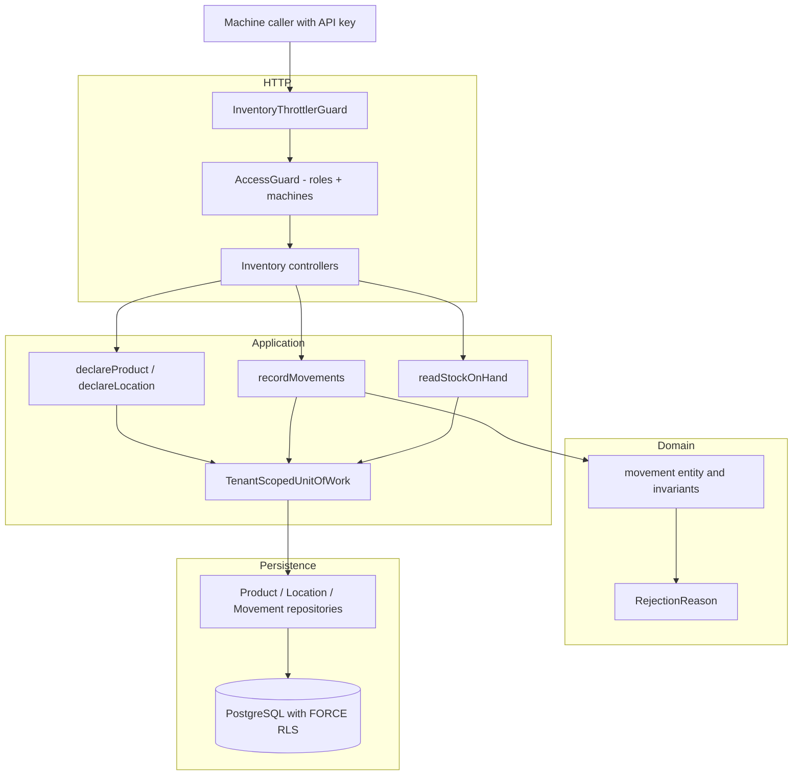
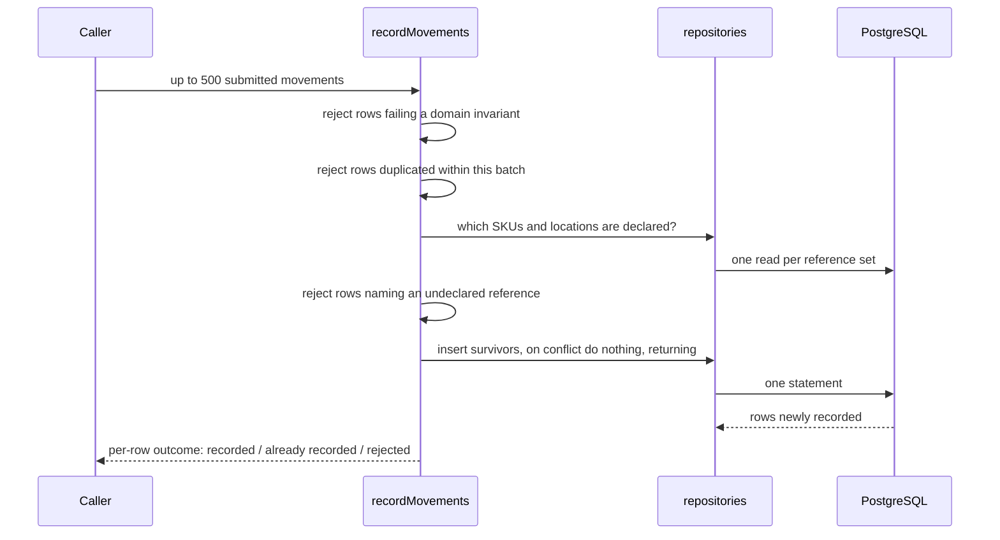
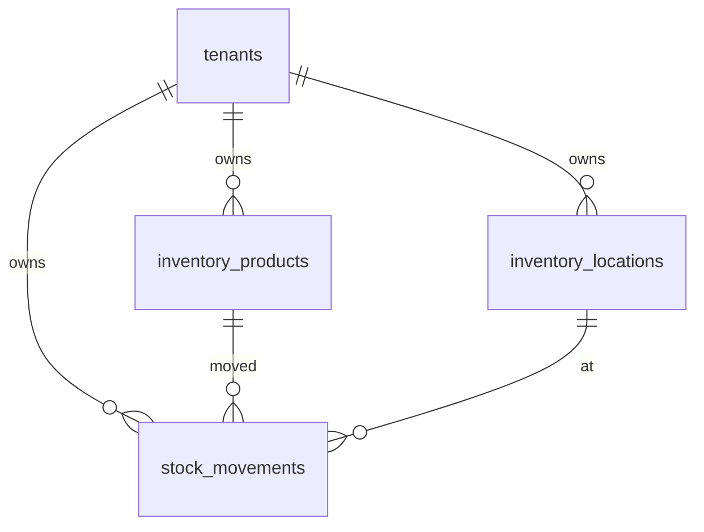

# Design — inventory-sync-api

## Overview

An upstream system declares what it tracks — products and locations — and then
pushes an append-only stream of stock movements, in batches, on a schedule,
retrying whenever it is unsure. The platform records each movement once,
reports per row what became of it, and answers what is on hand by summing.

Three properties shape every decision below:

1. **A batch is applied partially.** Success stops being a yes-or-no answer, so
   the outcome is a value the use case returns, not a status the error filter
   maps. The existing filter keeps whole-request failures; it never sees a row.
2. **Replay is expected, not exceptional.** Uniqueness is enforced by the
   database and merely *observed* by the query. Reading first and inserting
   second is a race that two concurrent retries eventually lose.
3. **Nothing is ever amended or deleted.** That is a requirement for the sake of
   readable history, and it happens to remove a class of concurrency problem and
   to make a later incremental export possible.

This feature introduces no new authorization mechanism, no second unit of work
and no service layer. It is the first consumer of an access path that was built
and never travelled.

## Boundary Commitments

### This spec owns

- The **product catalogue** and the **location register**: tenant-owned
  reference entities, declared idempotently, never deleted.
- The **stock movement stream**: append-only, tenant-owned, unique per tenant by
  the identifier the source system supplies.
- **Batch submission** and the per-row outcome report.
- **Replay safety** for movements, and the constraint that enforces it.
- **Stock on hand**, derived by summing movements.
- The **rate limit** applied to these routes, and its configuration.
- The **tables, indexes, grants and row-level security policies** for the three
  new tables.

### Out of boundary

- **Export to columnar storage, analytical query, the semantic layer and the
  dashboard.** Roadmap steps 6 through 9 read this data. This design stores
  `recordedAt` so an incremental export is possible later; it does not build
  one.
- **Pre-aggregation or caching of stock on hand.** Step 8 exists for that.
  Building it here builds it twice.
- **API key issuance, revocation and the role a key carries.** Owned by
  `authentication` and `tenant-and-user-management`.
- **Tenant isolation as a mechanism.** Owned by `rbac-authorization-guards` and
  by row-level security. This feature inherits it and proves it applies to
  three new tables.
- **Transfers as one operation, reservations, purchase orders, costing,
  valuation, units of measure.** Named out of scope in requirements.
- **A shared rate-limit store.** There is one instance until the deployment
  feature exists.

### Allowed dependencies

Dependencies point inward, and the existing ESLint boundary rule enforces the
first row.

| Layer | May import |
|---|---|
| `src/domain/inventory/**` | `src/domain/**` only |
| `src/application/inventory/**` | `src/domain/**`, `src/application/ports/**`, Nest decorators |
| `src/adapters/**` | anything |

Additionally, and specific to this feature:

- Inventory use cases reach persistence **only** through
  `TenantScopedUnitOfWork.runInTenant`. No inventory repository is injected
  directly into anything.
- The HTTP layer never constructs a domain movement. It hands validated data to
  a use case and renders what comes back.
- No inventory code imports from `src/application/authentication/**` or
  `src/application/credential/**`. Who the caller is has already been decided
  before a use case runs.

### Revalidation triggers

- Permitting deletion of a product or location.
- Permitting a movement to be amended or removed.
- Running more than one API instance.
- Adding a movement kind that names two locations.
- Any consumer beginning to read these tables directly rather than through the
  routes here.

## Architecture



Recording a batch, which is the only flow with more than one interesting step:



The order matters. Everything decidable without the database is decided first,
so a batch that is entirely malformed costs one round trip and no writes.

## Components & Interfaces

### Domain — `src/domain/inventory/`

Branded identifiers follow the existing `src/domain/identifiers.ts` pattern.

```ts
export type Sku = string & { readonly __brand: 'Sku' };
export type LocationCode = string & { readonly __brand: 'LocationCode' };
export type ExternalMovementId = string & {
  readonly __brand: 'ExternalMovementId';
};

export type MovementKind = 'receipt' | 'sale' | 'adjustment';

/** Every way a single submitted movement can fail, named once. */
export type RejectionReason =
  | 'unknown-sku'
  | 'unknown-location'
  | 'unknown-kind'
  | 'quantity-zero'
  | 'quantity-not-whole'
  | 'quantity-out-of-range'
  | 'quantity-sign-mismatch'
  | 'occurred-in-future'
  | 'duplicate-within-batch'
  | 'malformed-identifier';

export interface SubmittedMovement {
  readonly externalId: ExternalMovementId;
  readonly sku: Sku;
  readonly location: LocationCode;
  readonly kind: MovementKind;
  readonly quantity: number;
  readonly occurredAt: Date;
}

export interface Movement extends SubmittedMovement {
  readonly recordedAt: Date;
}
```

The invariants that need no database live in one pure function, which is what
makes requirement 3's rules testable without a container:

```ts
export type Judgement =
  | { readonly admissible: true }
  | { readonly admissible: false; readonly reason: RejectionReason };

/**
 * Every rule a movement can break on its own: kind, quantity, sign, and
 * whether it claims to have happened after `now`.
 */
export function judgeMovement(
  movement: SubmittedMovement,
  now: Date,
): Judgement;
```

**Sign is a domain rule, not validation.** A `receipt` must be positive and a
`sale` negative (3.3), which is the rule that catches an integration that
inverted its sign convention — the failure that otherwise surfaces months later
as a chart that sums the wrong way.

### Application — `src/application/inventory/`

#### Reference entities

Products and locations are one shape used twice. The interface is shared; the
implementations are two small concrete repositories, not a base class.

```ts
export interface ReferenceEntity<Code extends string> {
  readonly code: Code;
  readonly name: string;
  readonly createdAt: Date;
  readonly updatedAt: Date;
}

export interface ReferenceRepository<Code extends string, Attributes> {
  /** Records or replaces, and reports which it was. */
  declare(
    code: Code,
    attributes: Attributes,
  ): Promise<{ readonly outcome: 'created' | 'updated' }>;
  /** Which of these are declared in this tenant. Used before an insert. */
  declared(codes: readonly Code[]): Promise<ReadonlySet<Code>>;
  list(): Promise<readonly ReferenceEntity<Code>[]>;
}

export type ProductRepository = ReferenceRepository<
  Sku,
  { readonly name: string; readonly category: string | null }
>;
export type LocationRepository = ReferenceRepository<
  LocationCode,
  { readonly name: string }
>;
```

`declared()` returns a set rather than the entities, because the only question
asked before an insert is membership, and returning rows nobody reads is an
invitation to read them.

#### The movement repository

```ts
export interface StockLevel {
  readonly sku: Sku;
  readonly location: LocationCode;
  readonly onHand: number;
}

export interface MovementRepository {
  /**
   * Inserts every movement given, skipping any whose `externalId` is already
   * recorded in this tenant, and returns the identifiers actually inserted.
   *
   * The skip is the database's, not the caller's: uniqueness is a constraint,
   * and this method observes its outcome rather than predicting it. Reading
   * first and inserting second is a race two concurrent retries will lose.
   */
  record(
    movements: readonly SubmittedMovement[],
  ): Promise<ReadonlySet<ExternalMovementId>>;

  /** Sums movements per product and location. */
  stockOnHand(): Promise<readonly StockLevel[]>;
}
```

`stockOnHand` sits here rather than behind a `StockReadModel` token of its own.
It needs a port at all only because the in-memory adapter is a genuine second
implementation; a second token beside this one would be the uniform indirection
steering warns against.

These three join `TenantScopedRepositories`. No new unit of work: the existing
one hands repositories to a callback precisely so there is no construction path
that skips the tenant, and a second path would be worth exactly as much as the
number of ways around the first.

#### The use cases

```ts
export type MovementOutcome =
  | { readonly status: 'recorded'; readonly externalId: ExternalMovementId }
  | {
      readonly status: 'already-recorded';
      readonly externalId: ExternalMovementId;
    }
  | {
      readonly status: 'rejected';
      readonly externalId: ExternalMovementId | null;
      readonly reason: RejectionReason;
    };

export interface RecordMovementsReport {
  readonly recorded: number;
  readonly alreadyRecorded: number;
  readonly rejected: number;
  /** One entry per submitted movement, in submission order. */
  readonly outcomes: readonly MovementOutcome[];
}

export function recordMovements(
  command: {
    readonly tenantId: TenantId;
    readonly movements: readonly SubmittedMovement[];
  },
): Promise<RecordMovementsReport>;
```

**One use case serves both routes.** The single-movement endpoint submits a
batch of one and unwraps the single outcome. Two use cases would be two places
for the same rules to drift apart.

`outcomes` is positional and complete: one entry per submitted row, in the
order submitted. A caller correlates by position, and the report cannot be
shorter than what was sent — which is what stops a client from reading a
successful response as "all rows landed".

```ts
export function readStockOnHand(command: {
  readonly tenantId: TenantId;
}): Promise<readonly StockLevel[]>;

export function declareProduct(command: {
  readonly tenantId: TenantId;
  readonly sku: Sku;
  readonly name: string;
  readonly category: string | null;
}): Promise<{ readonly outcome: 'created' | 'updated' }>;

export function declareLocation(command: {
  readonly tenantId: TenantId;
  readonly code: LocationCode;
  readonly name: string;
}): Promise<{ readonly outcome: 'created' | 'updated' }>;
```

### HTTP — `src/adapters/http/`

Four controllers, one per resource, matching the existing one-controller-per-
resource layout. Every route declares:

```ts
@Access({ roles: ['admin', 'editor'], machines: true })   // writes
@Access({ roles: ['admin', 'editor', 'viewer'], machines: true })  // reads
```

`machines: true` is the point. The declaration model already supports it and no
shipped route has ever set it, so these are the first routes to travel that
path — which is why the testing strategy exercises every one of them with a
real API key and not only with a person's token.

Routes:

| Method | Path | Access |
|---|---|---|
| `PUT` | `/inventory/products/:sku` | admin, editor |
| `GET` | `/inventory/products` | admin, editor, viewer |
| `PUT` | `/inventory/locations/:code` | admin, editor |
| `GET` | `/inventory/locations` | admin, editor, viewer |
| `POST` | `/inventory/movements` | admin, editor |
| `POST` | `/inventory/movements/batch` | admin, editor |
| `GET` | `/inventory/stock` | admin, editor, viewer |

### Rate limiting — `InventoryThrottlerGuard`

Extends `ThrottlerGuard`, as `CredentialThrottlerGuard` already does, keyed on
the credential rather than on the network origin — so one integration
exhausting its allowance cannot silence another in the same tenant (8.4).
Configuration follows `throttling.config.ts`:

```ts
export interface InventoryThrottlingConfig {
  readonly windowSeconds: number;      // default 60
  readonly requestsPerCredential: number; // default 60
}
```

60 requests per minute against a 500-row batch is 30,000 movements per minute,
which satisfies 8.5 with no special arrangement.

## Data Models

Three tables, following the existing schema conventions: explicit `tenant_id`
on every row because that is the column both the repository predicate and the
row-level security policy key on.



| Table | Key columns | Constraints |
|---|---|---|
| `inventory_products` | `tenant_id`, `sku` | unique `(tenant_id, sku)`; no delete grant |
| `inventory_locations` | `tenant_id`, `code` | unique `(tenant_id, code)`; no delete grant |
| `stock_movements` | `tenant_id`, `external_id` | **unique `(tenant_id, external_id)`** — the idempotency mechanism; check on `kind`; check `quantity <> 0`; FKs to both reference tables, composite with `tenant_id`; no update or delete grant |

Two timestamps on a movement, and the distinction matters:

- **`occurred_at`** — when it happened, as reported. May be in the past;
  never in the future (3.5).
- **`recorded_at`** — when the platform stored it. Monotonic. A later
  incremental export keys on this, because an export partitioned by
  `occurred_at` must rewrite a partition whenever a backdated movement lands in
  it, and one partitioned by `recorded_at` never does.

Storing only `occurred_at` would force the export feature to add a column to a
table that by then has history in it.

**Row-level security**, in a second migration, matching the `0001` and `0006`
pattern: `ENABLE` plus `FORCE` on all three; policies keyed on
`current_setting('app.current_tenant')`; `SELECT, INSERT` and — for the two
reference tables only — `UPDATE` granted to `cubeforge_app`. **No `DELETE` grant
on any of the three, and no `UPDATE` on `stock_movements`.** Append-only is
enforced by the grant, not by remembering not to write the method.

Composite foreign keys `(tenant_id, sku)` rather than `(sku)` alone: a
single-column reference to a table that is itself tenant-scoped would let a
movement reference another tenant's product if the policy were ever misapplied.
The key makes it unrepresentable.

## Error Handling

Two channels, deliberately separate, because conflating them is the mistake
this design is most exposed to.

**Whole-request failures** keep the existing path: a tagged domain error through
`domain-error.filter.ts`, whose switch is exhaustive so an unhandled kind fails
the build. Used for: no credential (7.1), wrong role (7.3, 7.4), an unknown
tenant or one the caller has no standing in (7.2), a batch over 500 rows
(4.3 — a DTO array-size constraint through the global validation pipe), and a
malformed body.

**Per-row rejections** are not errors. They are values in the report, carrying a
`RejectionReason` from the closed union above (9.2), positional so the caller
knows which row (4.2), naming the rule that refused it (9.1), and never
mentioning anything the caller may not read (9.3) — `unknown-sku` is the same
answer whether the SKU exists in another tenant or nowhere at all (7.5).

**A batch over the size limit is refused whole** rather than reported as 500
rejections, so a caller cannot mistake a size refusal for a data problem.

**What is deliberately not an error:** a sale taking stock below zero (6.3). The
platform records what a source system reports; deciding what is possible in that
system's warehouse is not its job.

## Testing Strategy

Derived from the acceptance criteria, following the existing three-tier split.

**Domain (pure, no container)**
- `judgeMovement` accepts and refuses across every `RejectionReason` it can
  produce: each kind (3.2), each sign rule (3.3), zero, fractional and
  out-of-range quantities (3.4), and a moment in the future versus one in the
  past (3.5).

**Application (in-memory adapters)**
- A batch with three bad rows among many records the rest and reports each
  (4.1, 4.2).
- Re-submitting an identical batch records nothing further and reports every row
  as already recorded (5.2, 5.3, 5.5).
- Re-submitting a batch where some rows are new records only those (5.4).
- Two rows sharing an identifier within one batch: first recorded, second
  rejected as a duplicate (4.4).
- A movement naming an undeclared product or location is rejected, and the rest
  of the batch is not (2.3, 3.1).
- Declaring an existing product replaces its attributes and reports `updated`
  (1.2, 2.2).
- Stock on hand sums to zero for a product received and then sold, and that row
  is present rather than omitted (6.1, 6.2).
- A sale below zero is recorded and reported negative (6.3).

**Integration (real PostgreSQL, real RLS)**
- **Every route with a real API key**, not only with a person's token — the
  `machines` path has never carried traffic (7.1, 7.3, 7.4).
- Two tenants using the same SKU do not see each other's products or movements
  (1.3, 7.2).
- A movement whose `externalId` is already recorded **in another tenant** is
  recorded, not refused (7.6).
- Referencing another tenant's SKU answers exactly as referencing one that
  exists nowhere (7.5) — asserted by comparing the two responses, not by
  matching an expected string, so the two cannot drift apart.
- Concurrent submission of the same batch twice records each movement once
  (5.1, 5.5) — the test that would fail under a read-then-write implementation.
- `UPDATE` and `DELETE` on `stock_movements` are refused to `cubeforge_app` by
  the grant (3.6).
- Exceeding the allowance is refused with a wait, and the refused request
  records nothing (8.1, 8.2, 8.3); a second credential in the same tenant is
  unaffected (8.4).

**Not tested here:** that 30,000 movements per minute is achievable in wall
time (8.5). It follows arithmetically from 8.1 and the batch size, and a load
test would be measuring the machine it runs on.

## File Structure Plan

### Created

| Path | Responsibility |
|---|---|
| `src/domain/inventory/movement.ts` | `SubmittedMovement`, `Movement`, `MovementKind`, `judgeMovement` |
| `src/domain/inventory/movement.spec.ts` | The invariants, pure |
| `src/domain/inventory/rejection-reason.ts` | The closed union of reasons |
| `src/domain/inventory/identifiers.ts` | `Sku`, `LocationCode`, `ExternalMovementId` and their constructors |
| `src/application/ports/product.repository.ts` | `ReferenceRepository`, `ProductRepository` |
| `src/application/ports/location.repository.ts` | `LocationRepository` |
| `src/application/ports/movement.repository.ts` | `MovementRepository`, `StockLevel` |
| `src/application/inventory/declare-product.use-case.ts` | 1.1, 1.2, 1.4 |
| `src/application/inventory/declare-location.use-case.ts` | 2.1, 2.2 |
| `src/application/inventory/record-movements.use-case.ts` | The batch flow; serves both routes |
| `src/application/inventory/read-stock-on-hand.use-case.ts` | 6.1–6.3 |
| `src/application/inventory/inventory.use-case.spec.ts` | The application-tier cases above |
| `src/adapters/persistence/postgres/schema/inventory-products.ts` | Table |
| `src/adapters/persistence/postgres/schema/inventory-locations.ts` | Table |
| `src/adapters/persistence/postgres/schema/stock-movements.ts` | Table, unique `(tenant_id, external_id)` |
| `src/adapters/persistence/postgres/product.repository.ts` | Drizzle implementation |
| `src/adapters/persistence/postgres/location.repository.ts` | Drizzle implementation |
| `src/adapters/persistence/postgres/movement.repository.ts` | `on conflict do nothing … returning`, and the sum |
| `src/adapters/persistence/in-memory/product.repository.ts` | Test double |
| `src/adapters/persistence/in-memory/location.repository.ts` | Test double |
| `src/adapters/persistence/in-memory/movement.repository.ts` | Test double |
| `src/adapters/http/inventory-products.controller.ts` | Two routes |
| `src/adapters/http/inventory-locations.controller.ts` | Two routes |
| `src/adapters/http/inventory-movements.controller.ts` | Single and batch |
| `src/adapters/http/inventory-stock.controller.ts` | One route |
| `src/adapters/http/dto/inventory-catalogue.dto.ts` | Product and location payload shapes |
| `src/adapters/http/dto/inventory-movements.dto.ts` | Movement payloads, including the 500-row array limit |
| `src/adapters/http/inventory-throttling.ts` | `InventoryThrottlerGuard` |
| `src/inventory.module.ts` | Binds these ports to these adapters |
| `drizzle/0012_inventory_schema.sql` | Tables, indexes, constraints |
| `drizzle/0013_inventory_roles_and_rls.sql` | `ENABLE` + `FORCE`, policies, grants without `DELETE` |
| `test/inventory-machine-access.e2e-spec.ts` | Every route reached by a real API key |
| `test/inventory-isolation.e2e-spec.ts` | Cross-tenant invisibility and the disclosure rules |
| `test/inventory-replay.e2e-spec.ts` | Concurrent submission of one batch |
| `test/inventory-append-only.e2e-spec.ts` | Grants refuse update and delete |

### Modified

| Path | Change |
|---|---|
| `src/application/ports/tenant-scoped-unit-of-work.ts` | Add `products`, `locations`, `movements` to `TenantScopedRepositories` |
| `src/adapters/persistence/postgres/tenant-scoped-unit-of-work.ts` | Construct the three new repositories inside the transaction |
| `src/adapters/persistence/in-memory/*unit-of-work*` | The same, for tests |
| `src/adapters/persistence/postgres/schema/index.ts` | Export the three tables |
| `src/adapters/http/throttling.config.ts` | Add the inventory allowance |
| `src/app.module.ts` | Import `InventoryModule` |
| `src/adapters/http/access/route-inventory.spec.ts` | The new routes appear in the declared-route inventory |

The one shared file with a real chance of conflict is
`tenant-scoped-unit-of-work.ts`, on both sides. It is a three-line addition and
should be the first task, so nothing else waits on it.

Payload shapes are split by resource, and each integration concern writes its
own spec file, so the controller tasks and the validation tasks can genuinely
run alongside each other. One file per concern is also why they can: four tasks
appending to one spec file are not parallel however unrelated their assertions.

## Requirements Traceability

| Requirement | Where it lives |
|---|---|
| 1.1, 1.2 | `declareProduct`, `ReferenceRepository.declare` |
| 1.3 | unique `(tenant_id, sku)`; integration test across two tenants |
| 1.4 | `inventory-catalogue.dto.ts`, `identifiers.ts` constructors |
| 1.5 | no `DELETE` grant in `0013`; no repository method |
| 2.1, 2.2 | `declareLocation` |
| 2.3 | `declared()` check in `recordMovements`; `unknown-location` |
| 2.4 | no `DELETE` grant in `0013` |
| 3.1 | `recordMovements`, `MovementRepository.record` |
| 3.2, 3.3, 3.4, 3.5 | `judgeMovement` |
| 3.6 | no `UPDATE`/`DELETE` grant on `stock_movements` |
| 3.7 | no mechanism needed — an offsetting movement is an ordinary one |
| 3.8 | absence of a transfer route; `MovementKind` has three members |
| 4.1, 4.2 | `RecordMovementsReport`, positional `outcomes` |
| 4.3 | array-size constraint in `inventory-movements.dto.ts` |
| 4.4 | in-batch duplicate pass in `recordMovements` |
| 4.5 | single route submits a batch of one |
| 5.1 | unique `(tenant_id, external_id)` |
| 5.2, 5.4 | `on conflict do nothing … returning` |
| 5.3 | `already-recorded` distinct from `recorded` in `MovementOutcome` |
| 5.5 | the same, plus the concurrency integration test |
| 6.1, 6.2 | `stockOnHand` grouped over movements |
| 6.3 | no lower-bound check anywhere |
| 7.1, 7.3, 7.4 | `@Access` on every route; existing `AccessGuard` |
| 7.2 | `runInTenant` plus row-level security |
| 7.5 | `unknown-sku` regardless of where the SKU exists |
| 7.6 | uniqueness scoped by `tenant_id` |
| 8.1, 8.2 | `InventoryThrottlerGuard` |
| 8.3 | the guard refuses before the controller |
| 8.4 | keyed on the credential |
| 8.5 | 60 requests × 500 rows |
| 9.1, 9.2 | `RejectionReason`, a closed union |
| 9.3 | reasons name rules, never records |

## Open Questions

1. **A product with no movements at all reports no stock row**, because stock is
   grouped over movements and such a product has no location to be counted at.
   Requirement 6.2 covers only a product whose movements sum to zero, which this
   satisfies. Flagged because a dashboard may later want the catalogue with
   zeroes, and that is a join this design does not do.
2. **`category` is free text on a product.** It is the one attribute here that a
   later analytical feature will want to group by, and free text has the same
   typo problem locations were made a managed resource to avoid. Left as text
   because no requirement asks for it; named here so step 8 is not surprised.
