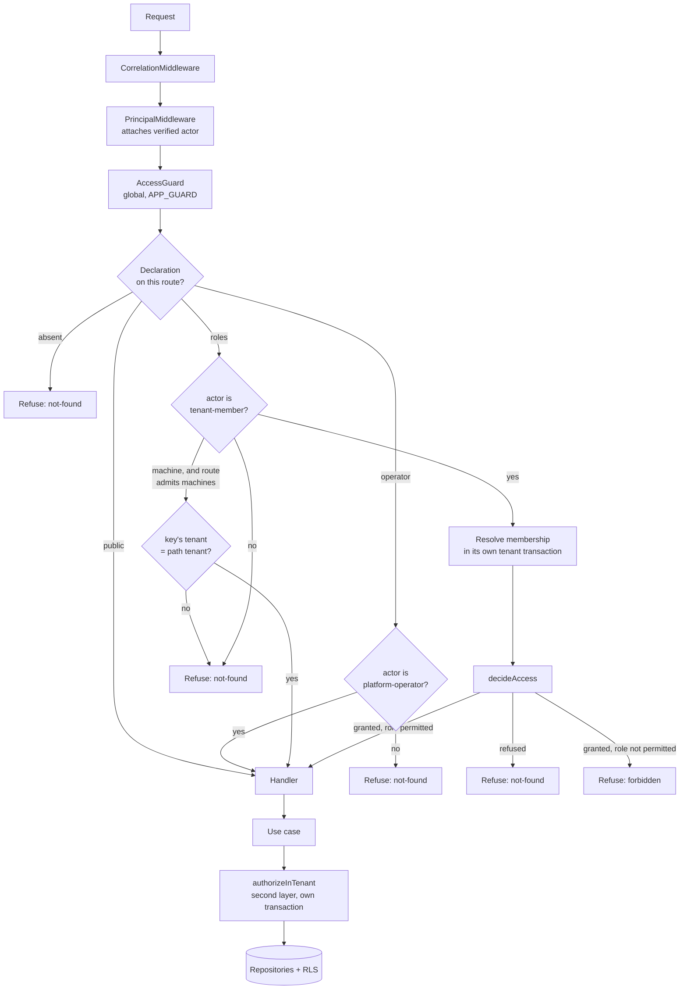

# Design — rbac-authorization-guards

## Overview

Every route states which principals may reach it, in one declaration attached to
the route. A guard registered globally reads that declaration and refuses before
the handler runs. A route with no declaration is refused, so protection stops
being something a developer has to remember and becomes something they have to
remove deliberately.

Nothing that already refuses stops refusing. The twelve use cases keep their own
authorization call, and the guard is a second layer in front of it — the same
shape as the two tenant-isolation layers, for the same reason: an operation
invoked from outside HTTP must still be refused, and a bug in either layer must
not be the only thing standing between a caller and another tenant's data.

The design's one difficult decision is that the guard cannot join the
transaction the use case opens, so it opens its own. That costs a second read of
the same three rows, buys refusal before application logic, and fails closed
when the two reads disagree. The alternatives — inverting who owns the
transaction, or letting the declaration be documentation nothing enforces — were
both worse. `research.md` records the comparison.

---

## Boundary Commitments

### This spec owns

- **The access declaration**: how a route states which principals may reach it,
  and what an absent declaration means.
- **The guard**: reading the declaration, resolving the acting principal against
  it, and refusing before the handler runs.
- **The route inventory**: the runtime enumeration of controllers and handlers
  that makes an undeclared or drifted route detectable without reading it.
- **The permitted-roles values** that the use cases enforce, promoted from
  literals inside calls to named values a test can compare against declarations.
- **The read/mutate split across the three roles**: which routes admit editor
  and viewer, which stay with the administrator.

### Out of boundary

- **Who the caller is.** Feature 2 owns credential verification and principal
  resolution. This spec consumes the resolved actor and never inspects a
  credential.
- **Whether an actor may act in a tenant at all.** `decideAccess` (feature 1)
  owns tenant status, person status and membership validity. The guard calls it;
  it does not restate it.
- **Tenant scoping in the repositories and the row-level security policies.**
  Untouched. This feature adds a check in front of them and removes none.
- **Role assignment.** Who holds which role, and how it changes, is feature 1's.
- **Permissions finer than roles**, per-resource rules, delegation, custom roles.
- **Any new route.** This feature declares the sixteen that exist; it adds
  none, and the machine-admission path ships proven by a fixture rather than by
  an endpoint feature 5 has not specified.

### Allowed dependencies

- `@nestjs/common` — `SetMetadata`, `CanActivate`, `ExecutionContext`.
- `@nestjs/core` — `APP_GUARD`, `Reflector`, `DiscoveryService`,
  `MetadataScanner`.
- The application layer's `ActorContext`, `TENANT_SCOPED_UNIT_OF_WORK` port and
  `AUTHENTICATOR_UNIT_OF_WORK` port, and the domain's `decideAccess` and `Role`.
- Nothing new. No library is added by this feature.

**Forbidden:** the application layer must not import the declaration, the guard,
or anything else under `src/adapters/http`. The ESLint boundary rule already
fails the build on this, and the drift check in 4.2 is designed around it rather
than through it.

### Revalidation triggers

- A route needs a rule that depends on the resource rather than the tenant.
- Feature 5 declares the first real machine-admissible route.
- The guard's extra transaction shows up in a latency budget.
- Roles become assignable per resource, or tenant-defined.

---

## Architecture



The guard and `authorizeInTenant` reach the same verdict by the same rule from
two independent reads. Both refuse through `DomainViolation`, so the existing
error filter maps them identically and the disclosure guarantees of feature 2
hold unchanged.

---

## Components & Interfaces

### The declaration

One decorator, one metadata key. Absence is the thing the guard tests for, which
is why this is a single key rather than four independent ones.

```typescript
export type AccessDeclaration =
  | { readonly public: true }
  | { readonly operator: true }
  | { readonly roles: readonly Role[]; readonly machines?: true };

export const ACCESS_DECLARATION = Symbol('ACCESS_DECLARATION');

export function Access(declaration: AccessDeclaration): CustomDecorator<symbol>;
```

A union rather than a record of optional fields, so the shapes are exclusive by
construction. Two corrections found while building it (task 1.1):

- **The type does not reject every illegal combination.** TypeScript's
  excess-property check against a union permits any property that appears in
  *some* member, so `{ public: true, roles: [...] }` and
  `{ operator: true, machines: true }` compile. It does reject an empty
  declaration, `machines` without roles, and a role outside the permitted three.
  The runtime assertion therefore covers *every* illegal shape rather than only
  the leftovers — including an empty role list, which permits nobody.
- **It decorates classes as well as methods.** The guard reads handler before
  controller so a class-wide declaration can be a default a method narrows, and
  a `MethodDecorator` could not express that. `SetMetadata` returns both.

Validation runs at import time, so a declaration nobody could have meant fails
the process rather than the first caller who trips over it.

### `AccessGuard`

```typescript
@Injectable()
export class AccessGuard implements CanActivate {
  constructor(
    private readonly reflector: Reflector,
    @Inject(TENANT_SCOPED_UNIT_OF_WORK)
    private readonly tenantScoped: TenantScopedUnitOfWork,
  ) {}

  canActivate(context: ExecutionContext): Promise<boolean>;
}
```

- Reads the declaration with `reflector.getAllAndOverride`, handler before
  controller, so a controller-wide declaration is a default a method may narrow.
- Refuses with `DomainViolation({ kind: 'not-found' })` for every shape of "you
  are not who this route is for", and `{ kind: 'forbidden' }` only when the
  actor is a member of the tenant and the role is wrong — the same distinction
  `authorizeInTenant` already draws, and the reason accompanies the refusal for
  the log (5.3).
- Registered once, in `AuthorizationModule`, as `APP_GUARD`. Global registration
  is what makes 1.2 true of routes nobody remembered.

**Ordering against the throttler.** `CredentialThrottlerGuard` is applied per
route on the credential endpoints, which are all `public`. Guard order is not
contractual in Nest, so the design does not depend on it: the access guard
admits those routes without touching storage, and throttling refuses
independently of the outcome.

### `RouteInventory`

```typescript
export interface DeclaredRoute {
  readonly controller: string;
  readonly handler: string;
  readonly method: string;
  readonly path: string;
  readonly declaration: AccessDeclaration | null;
}

@Injectable()
export class RouteInventory {
  constructor(
    private readonly discovery: DiscoveryService,
    private readonly scanner: MetadataScanner,
    private readonly reflector: Reflector,
  ) {}

  all(): readonly DeclaredRoute[];
}
```

Enumerates every controller handler and reports its declaration or its absence.
It exists for the tests of 1.2, 4.2 and 6.2 — it is not on any request path.

### The permitted roles, named

Each of the seven tenant-scoped use cases exposes what it enforces, instead of
passing a literal. The five operator-only use cases have no role list to name;
for them the drift check compares "the route declares `operator`" against "the
use case requires a platform operator", which is a presence check rather than a
set comparison.

```typescript
export const LIST_TENANT_MEMBERS_ROLES = ['admin', 'editor', 'viewer'] as const;
// …used by the use case, and compared against the route declaration by the
// drift test. The application layer still imports nothing from the adapter.
```

### The role split this feature applies

| Route | Declaration |
|---|---|
| `POST /auth/sign-in`, `/refresh`, `/sign-out`, `/credentials` | `{ public: true }` |
| `POST /tenants` | `{ operator: true }` |
| `GET /tenants` | `{ operator: true }` |
| `DELETE /tenants/:tenantId` | `{ operator: true }` |
| `DELETE /platform/people/:personId` | `{ operator: true }` |
| `POST /platform/people/:personId/setup-tokens` | `{ operator: true }` |
| `GET /tenants/:tenantId/members` | `{ roles: ['admin', 'editor', 'viewer'] }` — see the address carve-out below |
| `POST /tenants/:tenantId/members` | `{ roles: ['admin'] }` |
| `PATCH /tenants/:tenantId/members/:membershipId` | `{ roles: ['admin'] }` |
| `DELETE /tenants/:tenantId/members/:membershipId` | `{ roles: ['admin'] }` |
| `POST`, `GET`, `DELETE` on `/tenants/:tenantId/api-keys` | `{ roles: ['admin'] }` |

Sixteen routes, every one declared. `GET /tenants/:tenantId/members` is the
only widening, and `ListTenantMembersUseCase` widens with it.

### The listing's address carve-out

Widening that one route collided with requirement 10.3 of
`tenant-and-user-management`, which reserves a person's email address to
administrators of a tenant they belong to. The listing carries every member's
address, so admitting editors and viewers to the route would have weakened a
disclosure rule the platform already made — quietly, and for convenience.

The listing therefore varies by the caller's role. `ListTenantMembersUseCase`
returns a shape of its own rather than the repository's:

```typescript
export interface ListedMember {
  readonly membershipId: MembershipId;
  readonly personId: PersonId;
  /** `null` for every caller who is not an administrator here (2.1.1). */
  readonly email: EmailAddress | null;
  readonly role: Role;
  readonly active: boolean;
}
```

The decision lives in the use case, not in the response mapper: what a caller
may learn is a rule about access, and the layer that already resolved their role
is the one that knows it. `toMemberResponse` omits the field when it is null,
so a non-administrator's response has no `email` key at all rather than one
holding `null` — an absent field states "not for you" without implying the
person has no address.

---

## Data Models

None. This feature adds no table, no column and no migration. It reads
`tenants`, `people` and `memberships` through the existing tenant-scoped
repositories, and `platform_operators` through the existing authenticator path
that `PrincipalMiddleware` already used to decide the actor's kind.

---

## Error Handling

| Situation | Refusal | Response |
|---|---|---|
| No declaration on the route | `not-found`, reason "this route declares no access" | 404, identical to any absence |
| No principal, route not public | `not-found` | 404 |
| Operator route, actor is not an operator | `not-found` | 404 |
| Tenant route, actor is an operator or a machine on a route that does not admit machines | `not-found` | 404 |
| Machine admitted, but its tenant is not the path's | `not-found` | 404 |
| Tenant inactive, person deactivated, membership absent or revoked | `not-found` | 404 |
| Member of this tenant, role not permitted | `forbidden` | 404, byte-identical to the above by design |

Every refusal carries a reason for the log and none of it reaches the caller
(5.3). The existing `DomainErrorFilter` maps `forbidden` and `not-found` to the
same body on purpose; this feature adds no new mapping and no new status.

---

## Testing Strategy

**Unit — the guard, against in-memory adapters**

- A route with no declaration refuses a platform operator, a tenant
  administrator and an anonymous caller alike (1.2).
- A declaration on the controller applies to a handler that states none; a
  handler's own declaration overrides it (1.1).
- `public` admits a caller with no principal; every other declaration refuses
  one (1.5, 5.5).
- `operator: true` refuses a tenant member and admits an operator; `roles`
  refuses an operator (1.6, 6.4).
- A machine caller is refused by a route without `machines`, whatever role its
  key carries (3.2); a fixture route with `machines: true` admits it when the
  key's tenant matches the path and refuses it when it does not (3.3).
- The guard refuses before the handler runs, asserted by a handler that records
  whether it was entered (1.4).

**Unit — the inventory**

- Every route in the application carries a declaration; the test names the
  offenders (1.2, 6.2).
- Every declared role set equals the permitted roles its use case enforces
  (4.2).
- No declaration is internally contradictory or permits nobody.

**Integration — through the assembled application, against PostgreSQL**

- The tenant × role matrix over every route: each role, in its own tenant and
  against another, for all sixteen (6.1, 2.1–2.3).
- A viewer lists members and is refused every mutation; an editor likewise;
  an administrator is refused nothing (2.1, 2.2).
- A person holding different roles in two tenants is decided by the path (2.4).
- Withdrawn operator status refuses the next request with the same token (6.3).
- A tenant deactivated mid-session, and a person deactivated mid-session, are
  refused as absences (5.4).
- A refusal for a wrong role and a refusal for no membership are byte-identical
  in status and body (5.1, 5.2).

**Verification by breaking, as every suite here is**

- Delete the guard's registration: the matrix must fail, not only the unit
  tests.
- Delete `authorizeInTenant` from one use case: the second-layer test for that
  operation must fail while the route-level tests still pass, proving the layers
  are independent (4.1).
- Widen a declaration without widening its use case: the drift test must fail
  (4.2).

---

## File Structure Plan

### Created

| Path | Responsibility |
|---|---|
| `src/adapters/http/access/access.decorator.ts` | `AccessDeclaration`, `ACCESS_DECLARATION`, `Access()` |
| `src/adapters/http/access/access.decorator.spec.ts` | Rejects contradictory and empty declarations |
| `src/adapters/http/access/access.guard.ts` | `AccessGuard` |
| `src/adapters/http/access/access.guard.spec.ts` | The guard's decision table |
| `src/adapters/http/access/route-inventory.ts` | `RouteInventory`, `DeclaredRoute` |
| `src/adapters/http/access/route-inventory.spec.ts` | Every route declared; no declaration contradicts its use case |
| `src/authorization.module.ts` | Imports `PersistenceModule` and `DiscoveryModule`, binds `AccessGuard` as `APP_GUARD`, provides `RouteInventory` |
| `test/integration/role-matrix.integration-spec.ts` | The tenant × role matrix over every route |

### Modified

| Path | Change |
|---|---|
| `src/adapters/http/authentication.controller.ts` | `@Access({ public: true })` on all four routes |
| `src/adapters/http/tenants.controller.ts` | `@Access({ operator: true })` on all three |
| `src/adapters/http/platform-people.controller.ts` | `@Access({ operator: true })` |
| `src/adapters/http/credential-setup.controller.ts` | `@Access({ operator: true })` |
| `src/adapters/http/tenant-members.controller.ts` | Declarations; the listing widens to all three roles |
| `src/adapters/http/api-keys.controller.ts` | `@Access({ roles: ['admin'] })` on all three |
| `src/application/membership/list-tenant-members.use-case.ts` | Permitted roles become a named value, widened to all three; returns `ListedMember`, withholding addresses from non-administrators |
| `src/adapters/http/dto/responses.ts` | `MemberResponse.email` becomes optional and is omitted when withheld |
| `src/application/membership/create-tenant-member.use-case.ts` | Permitted roles become a named value |
| `src/application/membership/change-member-role.use-case.ts` | Permitted roles become a named value |
| `src/application/membership/revoke-membership.use-case.ts` | Permitted roles become a named value |
| `src/application/api-key/issue-api-key.use-case.ts` | Permitted roles become a named value |
| `src/application/api-key/list-api-keys.use-case.ts` | Permitted roles become a named value |
| `src/application/api-key/revoke-api-key.use-case.ts` | Permitted roles become a named value |
| `src/app.module.ts` | Imports `AuthorizationModule` |
| `src/application/tenant-authorization.ts` | The comment deferring enforcement to feature 3 is replaced by what was decided |
| `test/integration/isolation-matrix.integration-spec.ts` | Absorbed by or reconciled with the new role matrix, so one suite owns the claim |

---

## Requirements Traceability

| Requirement | Where it is satisfied |
|---|---|
| 1.1 | `Access()` decorator; `AccessGuard` reads it with `getAllAndOverride` |
| 1.2 | `AccessGuard` refuses on absent metadata; `RouteInventory` test names offenders |
| 1.3 | Declaration lives on the route; the guard reads it per request, use cases untouched |
| 1.4 | `AccessGuard` is a guard: Nest runs it before the handler |
| 1.5 | `{ public: true }`, required explicitly on the four `/auth` routes |
| 1.6 | `{ operator: true }`, distinct from `roles` in the declaration type |
| 2.1 | `GET /tenants/:tenantId/members` declares all three roles; the use case widens with it |
| 2.1.1 | `ListedMember.email` is null for a non-administrator, and the response omits the field |
| 2.2 | Member mutations declare `['admin']` |
| 2.3 | All three API key routes declare `['admin']` |
| 2.4 | The guard resolves the membership in the tenant named by the path |
| 3.1 | The guard resolves `roles` against a membership; a machine has none |
| 3.2 | The guard refuses a machine actor unless `machines: true` |
| 3.3 | With `machines: true`, the key's tenant is compared to the path's |
| 3.4 | No route in the declaration table sets `machines`; the fixture route lives in the test suite |
| 4.1 | `authorizeInTenant` stays in all twelve use cases |
| 4.2 | Named permitted-roles values; the inventory test compares them to declarations |
| 4.3 | Both layers refuse through `DomainViolation`; disagreement fails closed |
| 5.1 | The guard raises `not-found` for every "not for you" shape |
| 5.2 | `forbidden` only for a member with the wrong role; the filter maps both identically |
| 5.3 | Reason attached to `DomainViolation`, logged by `DomainErrorFilter`, absent from the body |
| 5.4 | `decideAccess`, called by the guard, owns tenant and person status |
| 5.5 | No principal on a non-public route refuses as `not-found` |
| 6.1 | The role matrix over every route, in the integration suite |
| 6.2 | `RouteInventory` test fails when a route is undeclared |
| 6.3 | Operator status read per request by `PrincipalMiddleware`, unchanged and asserted here |
| 6.4 | Operator refused on `roles` routes; member refused on `operator` routes |

---

## Open Questions

- ~~The cost of the second read is not yet a number.~~ **Answered in task 2.5:**
  6.05 ms per tenant-scoped request for the guard's resolution on the local
  stack, of which 1.11 ms is the transaction and 4.94 ms the three reads. Since
  the use case repeats those reads, a request pays roughly 12 ms of
  authorization in total. The decision stands for a dashboard API; the full
  breakdown and the reason `people` dominates it are in the Implementation Notes
  of `tasks.md`.
- **`isolation-matrix.integration-spec.ts` overlaps the new role matrix.** One
  suite should own the claim. Which one absorbs which is a judgment best made
  with both in front of us, so it is a task rather than a decision here.
