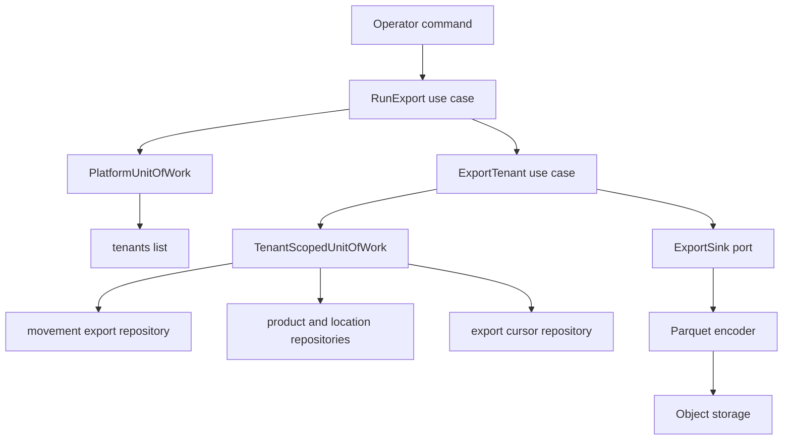
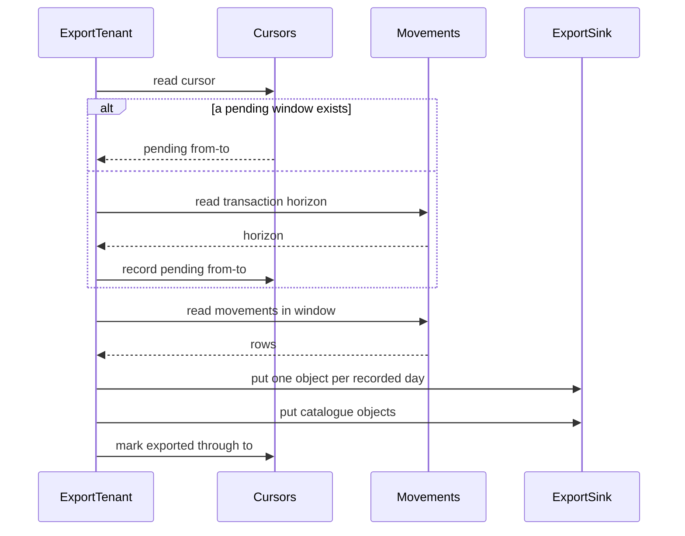

# Design — s3-data-export

## Overview

A nightly extraction of inventory history from PostgreSQL into columnar objects
in S3, partitioned by tenant and by the day a movement was recorded. Movements
are carried incrementally against a transaction-id cursor; the catalogue is
carried whole and replaces its predecessor. An operator runs it with one
command, and a scheduler will run the same operation later without this code
changing.

The design is shaped by one hard requirement (2.6) and one soft one (5.6): the
export may never skip a movement, and it may not get in the transactional API's
way. Both are answered by the same decision — the cursor is a transaction-id
horizon rather than a timestamp — which is why that decision leads everything
below. See `research.md` §1 for the experiment that settled it.

## Goals

- Every movement reaches the exported data exactly once, including across a run
  that failed part-way (2.3, 2.4, 6.6).
- A tenant's failure costs that tenant only (6.1–6.4).
- The exported objects are readable by an analytical engine with no conversion
  step, with types intact (4.6, 4.7).
- The operation is runnable unattended today and callable by a scheduler later
  (5.1, 9.3 of requirements' scope boundaries).

## Non-goals

- Registering tables or partitions with a query engine; that is step 7.
- Scheduling itself, compaction, retention, or erasure.
- Any dataset beyond movements, products and locations.

## Boundary Commitments

### This spec owns

- The **export cursor** — how far each tenant has been carried, and the
  two-phase transition that makes a retry safe.
- The **windowing rule**: which movements belong to a run.
- The **object layout**: which key a row's partition lands under, and what
  replaces what.
- The **columnar encoding** of the exported rows, and the column names and types
  an analytical reader will see.
- The **run report** and the exit status.
- The `export_cursors` table, its policies and its grants.
- One added column on `stock_movements` (below), and nothing else about that
  table.

### Out of boundary

- **Table definitions, partition discovery and queries** over the exported data
  — `athena-analytics-query` (step 7). This design chooses Hive-style partition
  names because that is what step 7 will discover partitions from, and depends
  on nothing about how it does so.
- **Metric definitions** — `cube-semantic-layer` (step 8).
- **The scheduler and the runtime it lives in** — the deployment feature. This
  spec exposes an operation with no interactive input; it does not schedule.
- **Compaction, retention, lifecycle rules, erasure.**
- **Tenant isolation as a mechanism**, and the append-only guarantee on
  movements. Inherited from `rbac-authorization-guards` and
  `inventory-sync-api` respectively.

### Allowed dependencies

Dependencies point inward. The existing ESLint boundary rule enforces the first
row.

| Layer | May import |
|---|---|
| `src/domain/export/**` | `src/domain/**` only |
| `src/application/export/**` | `src/domain/**`, `src/application/ports/**`, Nest decorators |
| `src/adapters/**` | anything |

Additionally, and specific to this feature:

- The export reads a tenant's rows **only** through
  `TenantScopedUnitOfWork.runInTenant`, and lists tenants **only** through
  `PlatformUnitOfWork.runAsOperator`. No new database identity, and no query
  that names a tenant in a predicate the seam would have supplied.
- The application layer never sees bytes. `ExportSink` takes rows and a key; the
  adapter behind it decides what a Parquet file is.
- No inventory code imports anything from `src/application/export/**`. The
  dependency runs one way: the export reads inventory, inventory knows nothing
  of the export.

### Revalidation triggers

- A movement becoming amendable or removable. The deterministic rewrite that
  makes a retry safe assumes a written window never changes.
- A dataset whose single-run output stops fitting comfortably in memory.
- More than one export running at a time.
- Adding a dataset that is not append-only and not small enough to snapshot.
- A consumer reading the objects by the key names this design chose rather than
  through step 7's catalogue.

**One trigger of another spec fires here.** `inventory-sync-api` lists "any
consumer beginning to read these tables directly rather than through the routes
here" as a revalidation trigger. This is that consumer, and it also adds a
column to `stock_movements`. That table stays append-only, its policies and
grants are untouched, and the column is written only by its existing default —
recorded in that spec's notes rather than left for someone to discover.

## Architecture



The two seams that matter are `TenantScopedUnitOfWork`, which is what makes the
export inherit row-level security rather than restate it, and `ExportSink`,
which is what keeps the application layer from knowing what a file is.

### One tenant, one run



**Key decisions not visible in the diagram.** The horizon is read once per
tenant, so movements recorded after the run began are left for the next run
(2.5). A pending window found at the start is replayed with the *same*
boundaries, which is what makes the object keys — and therefore the bytes —
identical to the failed attempt's (2.3, 6.6).

## File Structure Plan

### Created

| Path | Responsibility |
|---|---|
| `src/domain/export/window.ts` | `TransactionId`, `ExportWindow`, half-open window rules |
| `src/domain/export/window.spec.ts` | The window invariants, pure |
| `src/domain/export/cursor.ts` | `ExportCursor` state and its transitions: idle, pending, exported |
| `src/domain/export/cursor.spec.ts` | The transitions, including replay of a pending window |
| `src/domain/export/partition.ts` | `PartitionDay`, `ObjectKey`, and the key each dataset lands under |
| `src/domain/export/partition.spec.ts` | Key construction, including the backdated case |
| `src/domain/export/exported-row.ts` | `ExportedMovementRow`, `ExportedCatalogueRow` — the columns a reader sees |
| `src/domain/export/report.ts` | `TenantOutcome`, `ExportReport`, and how a run's status is decided |
| `src/domain/export/report.spec.ts` | Aggregation, including one failure among many |
| `src/application/ports/export-sink.ts` | `ExportSink`: write rows under a key, replace an object |
| `src/application/ports/export-cursor.repository.ts` | `ExportCursorRepository` |
| `src/application/ports/movement-export.repository.ts` | `MovementExportRepository`: horizon, and rows in a window |
| `src/application/export/export-tenant.use-case.ts` | One tenant: cursor, window, rows, objects, cursor |
| `src/application/export/export-tenant.use-case.spec.ts` | With doubles, including a sink that fails mid-run |
| `src/application/export/run-export.use-case.ts` | Every tenant, continuing past a failure, building the report |
| `src/application/export/run-export.use-case.spec.ts` | Per-tenant isolation of failure, and the report |
| `src/adapters/persistence/postgres/postgres-movement-export.repository.ts` | The horizon and the windowed read |
| `src/adapters/persistence/postgres/postgres-export-cursor.repository.ts` | Cursor read and the two-phase write |
| `src/adapters/persistence/in-memory/in-memory-export-store.ts` | Cursor and movement-export doubles over the existing inventory store |
| `src/adapters/storage/parquet-export-sink.ts` | Encodes rows as Parquet and puts objects; the only file that knows either library |
| `src/adapters/storage/object-storage-config.ts` | Bucket, endpoint and credentials from the environment, and its refusals |
| `src/adapters/storage/in-memory-export-sink.ts` | Captures keys and rows, for use-case tests |
| `src/export.module.ts` | Binds these ports to these adapters |
| `drizzle/0014_movement_export_xid.sql` | `recorded_xid` on `stock_movements`, and the index the export walks |
| `drizzle/0015_export_cursors.sql` | `export_cursors`, its policies and grants |
| `src/adapters/persistence/postgres/schema/xid8.ts` | Drizzle has no `xid8`; this names it once |
| `src/adapters/persistence/postgres/schema/export-cursors.ts` | Table |
| `test/integration/export-schema.integration-spec.ts` | What the two migrations guarantee, against a real database |
| `scripts/export.ts` | `pnpm ops:export`, argument handling, exit status |
| `test/integration/export-cursor.integration-spec.ts` | The horizon against a held-open transaction |
| `test/integration/export-objects.integration-spec.ts` | Real objects in the emulator, read back with an independent reader |
| `test/integration/export-run.integration-spec.ts` | A whole run: many tenants, one failing |
| `test/integration/export-isolation.integration-spec.ts` | No tenant's rows under another's key |

### Modified

| Path | Change |
|---|---|
| `src/application/ports/tenant-scoped-unit-of-work.ts` | Add `movementExport` and `exportCursors` to `TenantScopedRepositories` |
| `src/adapters/persistence/postgres/postgres-tenant-scoped-unit-of-work.ts` | Construct the two new repositories inside the transaction |
| `src/adapters/persistence/in-memory/in-memory-tenant-scoped-unit-of-work.ts` | The same, for tests |
| `src/adapters/persistence/postgres/schema/stock-movements.ts` | The `recorded_xid` column |
| `src/adapters/persistence/postgres/schema/index.ts` | Export the new table |
| `src/app.module.ts` | Import `ExportModule` |
| `package.json` | `ops:export` script; `hyparquet-writer`, `hyparquet`, `@aws-sdk/client-s3` |
| `.env.example` | The destination bucket |
| `.kiro/specs/inventory-sync-api/tasks.md` | Note that a revalidation trigger fired |

The migrations are numbered in the order they land: the movement column first,
because the cursor table is meaningless without something to compare against.
The design had them the other way round; corrected here rather than left to be
noticed by whoever runs them.

The one file two tasks both want is `tenant-scoped-unit-of-work.ts`, on both
sides of the seam, exactly as in the previous feature. It is a two-line addition
and should land before the repositories that fill it.

## Components and Interfaces

| Component | Layer | Intent | Requirements |
|---|---|---|---|
| `ExportWindow`, `ExportCursor` | domain | What "how far" means, and how it moves | 2.1, 2.2, 2.3, 2.4, 6.3, 6.6 |
| `PartitionDay`, `ObjectKey` | domain | Where a row lands | 4.1, 4.2, 4.3, 4.4, 4.5 |
| `ExportReport` | domain | What a run says it did | 5.3, 5.4, 5.5, 5.7, 6.2 |
| `ExportSink` | port | Rows under a key; nothing about bytes | 4.6, 4.7, 3.3, 3.5 |
| `MovementExportRepository` | port | The horizon, and the rows in a window | 2.1, 2.5, 2.6, 2.7 |
| `ExportCursorRepository` | port | The two-phase cursor | 2.2, 6.3, 6.6 |
| `ExportTenantUseCase` | application | One tenant, end to end | 1.1–1.5, 2.x, 3.x, 4.x |
| `RunExportUseCase` | application | Every tenant, past a failure | 5.2–5.7, 6.1–6.5, 7.2, 7.4 |
| `ParquetExportSink` | adapter | The only file that knows Parquet or S3 | 4.6, 4.7, 8.1, 8.2 |
| `scripts/export.ts` | adapter | The operator's entry point | 5.1, 5.2, 5.4, 5.5 |

### The cursor

```ts
/** A PostgreSQL 64-bit transaction id. Monotonic, epoch-carrying. */
export type TransactionId = bigint & { readonly __brand: 'TransactionId' };

/** Half-open: `from` was already exported, `to` has not been. */
export interface ExportWindow {
  readonly from: TransactionId;
  readonly to: TransactionId;
}

export type ExportCursor =
  | { readonly state: 'never-exported' }
  | { readonly state: 'exported'; readonly through: TransactionId }
  | { readonly state: 'pending'; readonly window: ExportWindow };
```

A cursor in `pending` is a run that wrote something and did not finish. The next
run **replays that window rather than computing a new one**, which is the whole
of requirement 6.6: the same rows produce the same keys, and writing them again
overwrites identical bytes. `research.md` §2 records why a run identifier in the
key would have made this impossible.

```ts
export interface ExportCursorRepository {
  read(dataset: DatasetName): Promise<ExportCursor>;
  markPending(dataset: DatasetName, window: ExportWindow): Promise<void>;
  markExported(dataset: DatasetName, through: TransactionId): Promise<void>;
}
```

### Reading movements

```ts
export interface MovementExportRepository {
  /**
   * The transaction id below which nothing is still in flight. A movement is
   * exportable only once its own id is below this, which is what stops a
   * concurrent insert from being skipped for ever (2.6).
   */
  horizon(): Promise<TransactionId>;

  /** Movements whose transaction id lies in `[window.from, window.to)`. */
  inWindow(window: ExportWindow): Promise<readonly ExportedMovementRow[]>;
}
```

### The sink

```ts
export interface ExportSink {
  /**
   * Writes an object at `key`, replacing whatever was there.
   *
   * One method, not an `add` and a `replace`: object storage has no such
   * distinction, and inventing one in the interface would have been a promise
   * the adapter cannot keep. Whether a write adds or replaces is decided by the
   * **key** — a movement file names its window and so is new every time (4.4),
   * a catalogue file has a fixed name and so replaces (3.3). Writing the same
   * key twice with the same rows leaves one object with those rows, which is
   * what makes a replayed window safe (2.3).
   */
  put(key: ObjectKey, rows: readonly ExportedRow[]): Promise<void>;

  /** Refuses early: unreachable storage or rejected credentials must be known
   *  before any tenant is touched (8.1, 8.2, 6.5). */
  reachable(): Promise<void>;
}
```

### The report

```ts
export type TenantOutcome =
  | { readonly status: 'exported'; readonly movements: number; readonly partitions: number; readonly through: TransactionId }
  | { readonly status: 'up-to-date' }
  | { readonly status: 'failed'; readonly reason: ExportFailureReason };

export type ExportFailureReason =
  | 'storage-unreachable'
  | 'storage-rejected'
  | 'database-unavailable'
  | 'write-failed';
```

A reason names a class of problem and never a record, a key or another tenant
(7.2, 7.3).

## Data Models

### `export_cursors`

| Column | Type | Notes |
|---|---|---|
| `tenant_id` | uuid | references `tenants`, part of the key |
| `dataset` | text | `movements` today; the column exists so step 7 need not migrate |
| `exported_through` | `xid8` | nullable until a first run succeeds |
| `pending_from` | `xid8` | set together with `pending_to`, or both null |
| `pending_to` | `xid8` | |
| `updated_at` | timestamptz | |

Primary key `(tenant_id, dataset)`. `ENABLE` plus `FORCE` row-level security
with one policy for `cubeforge_app` under `current_tenant_id()`, matching every
other tenant-owned table. Grants: `SELECT`, `INSERT`, `UPDATE`. No `DELETE` —
forgetting how far a tenant was exported is not an operation this feature wants
to have.

### `stock_movements.recorded_xid`

`xid8 NOT NULL DEFAULT pg_current_xact_id()`. Written only by its default, read
only by this feature. Existing rows take the migration's own id, which is above
every id already committed, so a first export carries the whole history once.

### The exported columns

| Column | Type | From |
|---|---|---|
| `external_id` | string | the identifier the source system supplied |
| `sku`, `location_code`, `kind` | string | |
| `quantity` | int32 | signed; a sale is negative |
| `occurred_at`, `recorded_at` | timestamp, UTC | both, deliberately (1.3) |

`tenant_id` and `recorded_date` are **not** columns; they are the partition, and
a reader gets them from the key. Products and locations carry `code`, `name`,
and `category` where present.

## Error handling

- **Configuration missing** — `ops:export` refuses before opening a database
  connection and names the missing setting (8.1).
- **Storage unreachable or credentials rejected** — `reachable()` runs once,
  before the first tenant, so a bad destination costs nothing and advances
  nothing (6.5, 8.2).
- **One tenant fails** — caught in `RunExportUseCase`, recorded as a
  `TenantOutcome`, and the run continues. That tenant's cursor keeps whatever it
  had, including a `pending` window for the next run to replay (6.1–6.4).
- **Every failure is reported with the run's correlation identifier** (7.4),
  following the platform convention already used by the HTTP layer.

## Testing strategy

Derived from the acceptance criteria, not from a coverage habit.

**Pure, no infrastructure**

- A window is half-open, and a cursor that has never exported starts below every
  id (2.1).
- A pending cursor replays the recorded window rather than a fresh one (6.6).
- A movement recorded on a later day than it occurred lands in the partition of
  the day it was recorded (4.3).
- A report with one failed tenant among four reports failure and still names
  three successes (5.5, 6.1, 6.2).

**Against PostgreSQL**

- **The experiment from `research.md` §1, as a test.** A transaction held open
  while a later one commits: the later row is not exported, and after the first
  commits, both are, each once (2.6, 2.7). This is the test the whole cursor
  design exists for; without it the design is a claim.
- A cursor does not advance when the sink fails (2.2, 6.3).
- A replayed pending window writes the same keys as the attempt that failed
  (2.3, 2.4).

**Against PostgreSQL and the emulator**

- Objects land under `tenant_id=…/recorded_date=…`, and reading them back with
  an independent Parquet reader yields the rows, with a quantity that is a
  number and a moment that is a moment (4.1, 4.2, 4.6, 4.7).
- Two tenants holding the same SKU produce two sets of objects, and neither
  tenant's rows appear under the other's prefix (4.5, 7.1).
- A second run with nothing new writes no movement object and reports the tenant
  up to date (5.7).
- A renamed product is named once, currently, after the next run (3.2, 3.3).
- A catalogue write that fails leaves the previous catalogue readable (3.5).

**Probes each of these must survive:** removing the horizon comparison, so the
cursor becomes a plain maximum; naming objects by run instead of by window;
letting a tenant's failure escape `RunExportUseCase`; dropping the tenant from
the object key.

## Requirements Traceability

| Requirement | Where it lives |
|---|---|
| 1.1 | `RunExportUseCase` iterating the operator's tenant list |
| 1.2 | Nothing but three repositories is reachable from `ExportTenantUseCase` |
| 1.3 | `ExportedMovementRow`, both timestamps |
| 1.4 | `ExportedCatalogueRow` |
| 1.5 | The tenant list filters on active status |
| 2.1 | `ExportWindow` from the cursor |
| 2.2 | `markExported` after the sink returns |
| 2.3, 2.4 | Two-phase cursor plus window-derived object keys |
| 2.5 | `horizon()` read once, at the start of the tenant's export |
| 2.6, 2.7 | `pg_snapshot_xmin(pg_current_snapshot())` as the horizon |
| 2.8 | Written objects are never revisited except by an identical rewrite |
| 3.1, 3.3 | `ExportSink.put` on a fixed catalogue key |
| 3.2 | The snapshot is read fresh each run |
| 3.4 | An empty catalogue writes an empty object |
| 3.5 | Replacement is a single put; the previous object stays readable until it lands |
| 4.1, 4.2 | `ObjectKey` carries `tenant_id` and `recorded_date` |
| 4.3 | The partition comes from `recordedAt`, never `occurredAt` |
| 4.4 | Each run's day file is named for its window |
| 4.5 | The key is built from the tenant the seam supplied |
| 4.6, 4.7 | `ParquetExportSink`, with typed columns |
| 5.1, 5.2 | `scripts/export.ts` |
| 5.3 | `ExportReport` |
| 5.4, 5.5 | Exit status derived from the report |
| 5.6 | Reads only; no exclusive locks, and the horizon read is a snapshot function |
| 5.7 | An empty window writes nothing and reports `up-to-date` |
| 6.1, 6.2 | `RunExportUseCase` catches per tenant |
| 6.3 | The cursor is advanced only on success |
| 6.4 | Each tenant runs in its own transaction |
| 6.5 | `reachable()` before the first tenant |
| 6.6 | Replay of a pending window |
| 7.1 | `runInTenant` plus row-level security |
| 7.2, 7.3 | `ExportFailureReason` is a closed union naming no records |
| 7.4 | One correlation identifier per run |
| 8.1, 8.2 | `object-storage-config.ts` and `reachable()` |
| 8.3 | Endpoint and credentials come from the environment; the emulator is the only target |
| 8.4 | No configuration value is written into the repository |

## Open questions

1. **`dataset` on the cursor is a column with one value today.** It is there so
   that step 7, or a second dataset, does not need a migration on a table that
   by then holds each tenant's position. The alternative — a cursor per tenant
   with no dataset — is smaller and would have to be migrated the first time a
   second dataset exists.
2. **An empty catalogue writes an empty object rather than deleting the previous
   one** (3.4). Deleting would need a delete grant on object storage that
   nothing else in this feature wants. Named because a reader will see an object
   with no rows, which is not the same as no object.
