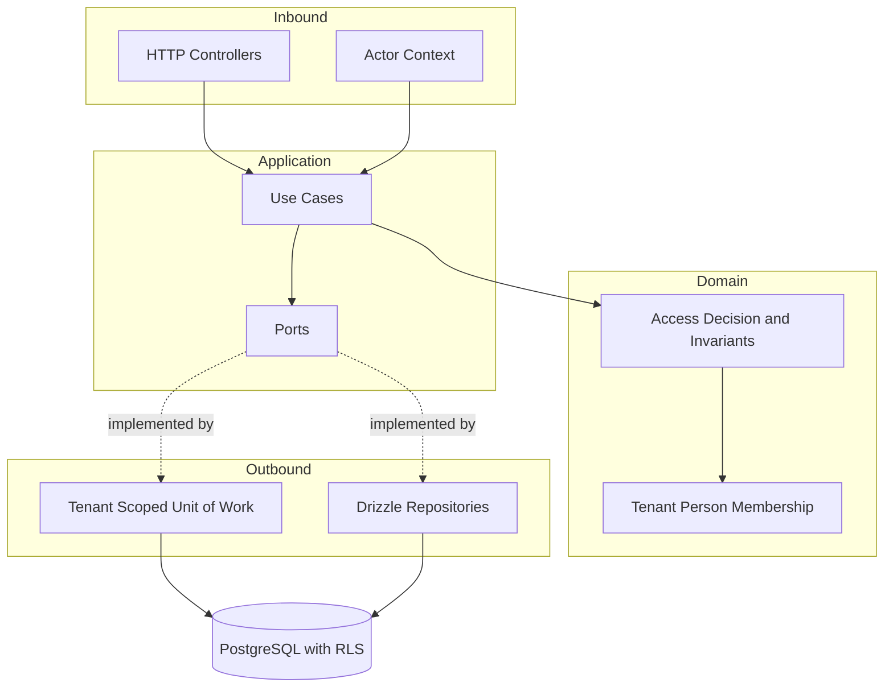
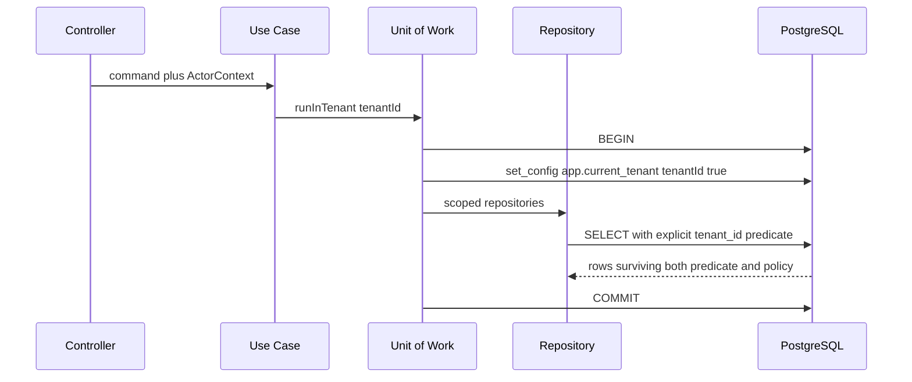
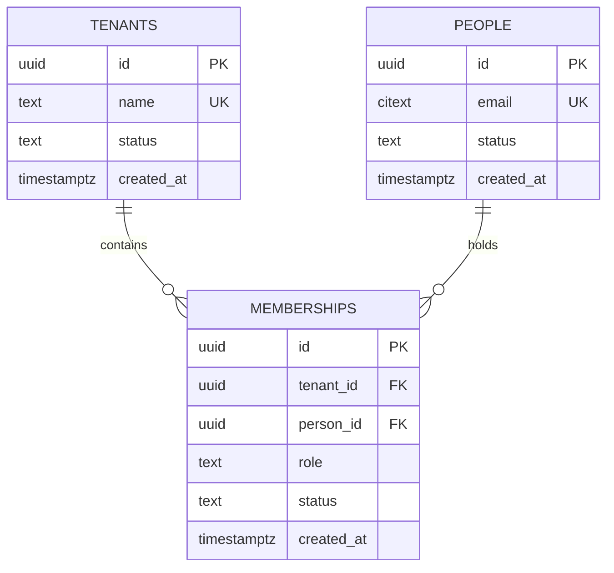

# Design — tenant-and-user-management

## Overview

This feature introduces the three records every later feature is scoped by —
tenants, people, and the memberships that connect them — and the operations that
manage their lifecycle.

The design is shaped by one property that is easy to claim and hard to keep:
cross-tenant access must be impossible, not merely unimplemented. That is served
by two enforcement layers that do not share a point of failure. Application code
scopes every query by tenant, and PostgreSQL row-level security independently
refuses rows the current tenant context does not own. Either layer alone would
satisfy the requirements on a good day; both together survive a bad one.

The second shaping force is a research finding: tenant context set outside a
transaction is either absent or leaks into an unrelated request through a pooled
connection. The architecture therefore makes the transaction boundary the only
route to tenant-scoped data, so the failure mode is structurally unavailable
rather than left to discipline.

## Goals

- Persist tenants, people and memberships with soft deactivation throughout.
- Make cross-tenant reads and writes impossible through two independent layers.
- Keep the platform-operator boundary enforceable by the database, not only by
  application code.
- Keep the rules that later features must reuse — role semantics, access
  evaluation, the last-administrator invariant — in framework-free domain code
  that tests can exercise without a container or a database.

## Non-Goals

- Authenticating callers, issuing tokens or keys, or storing credentials.
- Reusable Guard infrastructure for role enforcement.
- Invitation flows, email delivery, self-service signup.
- Hard deletion, reactivation, renaming, or email change.

## Boundary Commitments

### This spec owns

- The `tenants`, `people` and `memberships` tables, their policies, and the
  migration that creates them.
- The database roles that runtime code connects as, and the separation between
  the migration identity and the runtime identities.
- The transaction boundary that publishes tenant context, and the guarantee that
  tenant-scoped repositories are unreachable outside it.
- Domain rules for role validity, access evaluation, and the last-administrator
  invariant.
- The eight use cases listed under Components, and the request and response
  contracts that expose them.
- The `find_or_create_person(uuid, citext)` function, which resolves a person by
  email across the whole platform without granting the application any read over
  `people`. Added after the policies were verified against a real database: the
  application identity cannot see a person who belongs only to another tenant,
  yet `people.email` is unique platform-wide, so adding a member whose address is
  already registered elsewhere failed with a duplicate-key error. That made
  requirement 4.2 impossible to satisfy and disclosed the person's existence,
  breaking 4.3. The function runs `SECURITY DEFINER` with a pinned `search_path`,
  returns an identifier and nothing else, and is executable only by
  `cubeforge_app`. It is the single sanctioned crossing of the people-read
  boundary; any future need to widen what it returns is a design change, not an
  implementation detail.

### Out of boundary

- **Resolving who the caller is.** This spec consumes an `ActorContext` that
  states the actor's identity, kind and tenant. Producing it from a credential
  is feature 2. Until then a provisional middleware reads it from the request in
  non-production environments, and tests supply it directly.
- **Reusable role enforcement.** Use cases assert the actor's authority inline
  against the domain access decision. Feature 3 will lift that into Guards. This
  spec must not introduce a Guard base class, decorator or metadata convention,
  because doing so would pre-commit feature 3's design from outside it.
- **Business data owned by tenants.** Later features add their own tables. They
  must adopt the tenant-scoping pattern established here; this spec does not
  write their policies.

### Allowed dependencies

| From | May depend on |
|---|---|
| `src/domain/**` | itself only |
| `src/application/**` | `src/domain`, its own ports, Nest DI decorators |
| `src/adapters/http/**` | `src/application`, `src/domain`, Nest, validation |
| `src/adapters/persistence/**` | `src/application` ports, `src/domain`, Drizzle |

Enforced by the existing `no-restricted-imports` rules in `eslint.config.mjs`.
A violation is a failing lint, not a review comment.

### Revalidation triggers

Revisit this design if any of the following changes:

- Authentication (feature 2) resolves an actor shape incompatible with
  `ActorContext`.
- A later feature needs tenant-scoped reads outside a transaction, for example
  a streaming export.
- A tenant-owned table is introduced that cannot carry a `tenant_id` column.
- Deployment moves to a transaction-mode connection pooler, which disables
  prepared statements.

## Architecture

### Dependency direction

`domain → ports → use cases → adapters`. Imports point leftward only. The
composition root wires adapters to ports; nothing inward knows an adapter exists.



### The two isolation layers



The repository writes the tenant predicate itself; the policy applies it again
independently. A repository that forgets the predicate still returns nothing
foreign, and a policy misconfiguration still meets a correct predicate.

### Database identities

Three roles, created by migration:

| Role | Owns tables | Purpose |
|---|---|---|
| `cubeforge_migrator` | yes | Runs `drizzle-kit` migrations only. Never used at runtime. |
| `cubeforge_app` | no | Tenant-scoped runtime work. Policies restrict every row to the current tenant context. |
| `cubeforge_operator` | no | Platform-operator work. Granted the tenants table and person deactivation; granted nothing on memberships or tenant-owned data. |

All tenant-owned tables are created with RLS enabled and `FORCE ROW LEVEL
SECURITY`, so table ownership can never silently re-open access.

`cubeforge_operator` is why requirement 3.2 is a database guarantee rather than
an application promise: an operator session has no grant that could return a
membership row, whatever the application asks for.

## File Structure Plan

### Created

| Path | Responsibility |
|---|---|
| `src/domain/tenant/tenant.entity.ts` | Tenant identity, name, status, activation invariants |
| `src/domain/person/person.entity.ts` | Platform-wide person, email, status |
| `src/domain/membership/membership.entity.ts` | Person-to-tenant link carrying a role and status |
| `src/domain/membership/role.ts` | `Role` union, parsing, and permitted-value reporting |
| `src/domain/access/access-decision.ts` | Single evaluation of whether an actor may act in a tenant |
| `src/domain/tenant/tenant-administration.policy.ts` | Last-administrator invariant |
| `src/domain/identifiers.ts` | Branded `TenantId`, `PersonId`, `MembershipId`, `EmailAddress` |
| `src/domain/errors.ts` | Typed domain error union |
| `src/application/ports/tenant.repository.ts` | Tenant persistence contract |
| `src/application/ports/person.repository.ts` | Person persistence contract |
| `src/application/ports/membership.repository.ts` | Membership persistence contract |
| `src/application/ports/tenant-scoped-unit-of-work.ts` | Transactional tenant-context contract and its scoped repository bundle |
| `src/application/ports/platform-unit-of-work.ts` | Operator-scoped contract, deliberately exposing no membership access |
| `src/application/ports/clock.ts` | Time source |
| `src/application/ports/identifier-generator.ts` | Identifier source |
| `src/application/actor-context.ts` | Actor shape consumed from the inbound edge |
| `src/application/tenant/provision-tenant.use-case.ts` | Requirement 1 |
| `src/application/tenant/deactivate-tenant.use-case.ts` | Requirement 2 |
| `src/application/tenant/list-tenants.use-case.ts` | Requirement 3 read side |
| `src/application/membership/create-tenant-member.use-case.ts` | Requirement 4 |
| `src/application/membership/change-member-role.use-case.ts` | Requirements 5, 7 |
| `src/application/membership/revoke-membership.use-case.ts` | Requirements 6, 7 |
| `src/application/membership/list-tenant-members.use-case.ts` | Requirement 10 |
| `src/application/person/deactivate-person.use-case.ts` | Requirement 8 |
| `src/adapters/http/tenants.controller.ts` | Operator-facing tenant routes |
| `src/adapters/http/tenant-members.controller.ts` | Administrator-facing member routes |
| `src/adapters/http/platform-people.controller.ts` | Operator-facing person deactivation |
| `src/adapters/http/dto/` | Request and response shapes with validation |
| `src/adapters/http/actor-context.middleware.ts` | Provisional actor resolution, replaced by feature 2 |
| `src/adapters/http/domain-error.filter.ts` | Maps the domain error union to responses |
| `src/adapters/persistence/postgres/schema/tenants.ts` | Table plus policies |
| `src/adapters/persistence/postgres/schema/people.ts` | Table plus policies |
| `src/adapters/persistence/postgres/schema/memberships.ts` | Table plus policies |
| `src/adapters/persistence/postgres/schema/roles.sql.ts` | Database role creation and grants |
| `src/adapters/persistence/postgres/drizzle.module.ts` | First-party Nest wiring for Drizzle |
| `src/adapters/persistence/postgres/tenant-scoped-unit-of-work.ts` | Transaction plus `set_config`, connecting as `cubeforge_app` |
| `src/adapters/persistence/postgres/platform-unit-of-work.ts` | Operator transactions, connecting as `cubeforge_operator` |
| `src/adapters/persistence/postgres/*.repository.ts` | Three repository implementations |
| `src/adapters/persistence/in-memory/*.repository.ts` | Test doubles satisfying the same ports |
| `src/identity.module.ts` | Feature module binding ports to adapters |

### Modified

| Path | Change |
|---|---|
| `src/app.module.ts` | Import `IdentityModule` |
| `drizzle.config.ts` | Created if absent; migration configuration |
| `.env.example` | Separate migration and runtime connection settings |

## Components & Interfaces

| Component | Layer | Intent | Requirements |
|---|---|---|---|
| Domain entities | domain | Records and their invariants | 1.4, 2.3, 5.1, 5.2, 8.2 |
| Access decision | domain | One answer to "may this actor act here" | 2.2, 6.2, 8.1, 9.1, 9.3 |
| Administration policy | domain | Last-administrator invariant | 7.1, 7.2 |
| Use cases | application | Orchestrate domain and ports | 1.1–1.3, 2.1, 2.4, 3.1, 4.1–4.6, 5.3, 6.1, 6.3, 8.1, 8.3, 10.1, 10.2 |
| Unit of work | outbound | Transaction plus tenant context | 9.1, 9.2 |
| Repositories | outbound | Persistence with explicit tenant predicates | 9.1, 10.3 |
| Schema and policies | outbound | Independent database-level isolation | 3.2, 9.1, 9.3 |
| Controllers and filter | inbound | Contracts and uniform error mapping | 1.2, 4.4, 4.5, 9.2 |

### Access decision (domain)

The generalization identified during synthesis: tenant inactive, membership
revoked, person deactivated and wrong tenant are one question with four causes.

```typescript
export type AccessRefusal =
  | { readonly kind: 'tenant-inactive' }
  | { readonly kind: 'no-membership' }
  | { readonly kind: 'membership-revoked' }
  | { readonly kind: 'person-deactivated' };

export type AccessDecision =
  | { readonly granted: true; readonly role: Role }
  | { readonly granted: false; readonly refusal: AccessRefusal };

export function decideAccess(input: {
  readonly tenant: Tenant;
  readonly person: Person;
  readonly membership: Membership | null;
}): AccessDecision;
```

Every refusal reaches the caller as the same not-found response (9.2). The
discriminated union exists for logs and tests, never for the response body.

### Administration policy (domain)

```typescript
export function assertTenantRetainsAdministrator(input: {
  readonly activeAdministratorCount: number;
  readonly changeRemovesAnAdministrator: boolean;
}): void; // throws LastAdministratorError
```

Pure arithmetic over a count supplied by the caller, so the invariant is unit
testable with no database.

### Tenant-scoped unit of work (port)

The only route to tenant-scoped repositories. Callers cannot obtain a repository
without a tenant, which is what makes the pooling hazard structurally
unavailable.

```typescript
export interface TenantScopedRepositories {
  readonly memberships: MembershipRepository;
  readonly people: PersonRepository;
  readonly tenants: TenantReadRepository;
}

export interface TenantScopedUnitOfWork {
  runInTenant<T>(
    tenantId: TenantId,
    work: (repositories: TenantScopedRepositories) => Promise<T>,
  ): Promise<T>;
}

export interface PlatformUnitOfWork {
  runAsOperator<T>(
    work: (repositories: PlatformRepositories) => Promise<T>,
  ): Promise<T>;
}
```

`PlatformUnitOfWork` connects as `cubeforge_operator` and exposes only tenant and
person-deactivation operations, so requirement 3.2 cannot be violated by calling
the wrong method — the method does not exist.

### Create tenant member (application)

Carries the non-disclosure requirement, so its shape is deliberate.

```typescript
export interface CreateTenantMemberCommand {
  readonly actor: ActorContext;
  readonly tenantId: TenantId;
  readonly email: EmailAddress;
  readonly role: Role;
}

export interface CreateTenantMemberResult {
  readonly membershipId: MembershipId;
  readonly personId: PersonId;
  readonly role: Role;
}
```

The use case runs one transaction that always performs the same steps in the
same order: look up the person by email, create them if absent, check for an
existing active membership in *this* tenant, then insert the membership. It never
returns early on the "already known" branch, and the result is identical in both
cases (4.2, 4.3). Rejection happens only for a duplicate membership in the
actor's own tenant (4.4), which discloses nothing about other tenants.

### Repositories (ports)

Every tenant-scoped method takes its tenant from the unit of work rather than a
parameter, so a caller cannot pass the wrong one.

```typescript
export interface MembershipRepository {
  findByPersonAndTenant(personId: PersonId): Promise<Membership | null>;
  countActiveAdministrators(): Promise<number>;
  listMembers(options: { readonly includeInactive: boolean }): Promise<MembershipWithPerson[]>;
  insert(membership: Membership): Promise<void>;
  updateStatus(membershipId: MembershipId, status: MembershipStatus): Promise<void>;
  updateRole(membershipId: MembershipId, role: Role): Promise<void>;
}
```

### Implementation notes

- **Integration:** `IdentityModule` binds ports to Postgres adapters; tests bind
  the same ports to in-memory adapters. The domain layer is identical in both.
- **Validation:** DTOs validate shape at the edge; the domain re-validates
  invariants it owns. Role parsing lives in the domain so 4.5 reports the same
  permitted values everywhere.
- **Risk:** the provisional actor middleware is trust-on-input and must never be
  enabled in production. It is registered only when the environment is not
  production, and feature 2 deletes it.

## Data Models



Notes that matter:

- `memberships` carries `tenant_id` explicitly even though it is reachable
  through a join. The column is what both the repository predicate and the RLS
  policy key on.
- A unique constraint on `(tenant_id, person_id)` enforces 4.4 at the database,
  so the check is not a race between reading and inserting.
- `people.email` is case-insensitive and unique platform-wide, which is what
  makes 4.2 possible at all.
- `status` columns are text with a check constraint rather than an enum type,
  because adding a value to a Postgres enum inside a transaction has historically
  been restricted, and status values will grow when reactivation arrives.
- No row is ever deleted. Deactivation is a status transition (2.3).

### Policies

| Table | `cubeforge_app` | `cubeforge_operator` |
|---|---|---|
| `tenants` | select where `id = current_setting('app.current_tenant')` | select, insert, update |
| `memberships` | all where `tenant_id = current_setting('app.current_tenant')` | no grant |
| `people` | select where the person holds a membership in the current tenant | update status only |

## Error Handling

A single discriminated union crosses the application boundary; the HTTP filter is
the only place that knows about transport.

```typescript
export type DomainError =
  | { readonly kind: 'validation'; readonly field: string; readonly detail: string }
  | { readonly kind: 'tenant-name-taken' }
  | { readonly kind: 'already-a-member' }
  | { readonly kind: 'invalid-role'; readonly permitted: readonly Role[] }
  | { readonly kind: 'last-administrator' }
  | { readonly kind: 'not-found' }
  | { readonly kind: 'forbidden' };

```

The filter maps `forbidden` and every access refusal to the same response as
`not-found` (9.2). `forbidden` remains distinct internally so logs and tests can
tell a denial from a genuinely absent record — the distinction exists everywhere
except the response.

## Testing Strategy

Derived from acceptance criteria, not from generic layering.

**Domain unit tests, no infrastructure:**
- `decideAccess` returns the correct refusal for each of tenant inactive,
  membership absent, membership revoked, person deactivated (2.2, 6.2, 8.1).
- The last-administrator invariant rejects both the revocation and the role-change
  path, and permits both when another administrator remains (7.1, 7.2).
- Role parsing accepts exactly admin, editor, viewer, and reports the permitted
  set on rejection (4.5, 5.1).

**Use-case tests against in-memory adapters:**
- Creating a member with a new email and with a known email produce identical
  result shapes (4.1, 4.2, 4.3).
- A second creation for the same person in the same tenant is rejected (4.4).
- Role change affects one membership and leaves the person's other memberships
  untouched (5.2, 5.3).
- Revocation in one tenant leaves memberships elsewhere active (6.1).

**Integration tests against PostgreSQL, the ones that justify the design:**
- The isolation matrix: for each role in {admin, editor, viewer}, a member of
  tenant A is refused every read and write against tenant B, and receives
  not-found rather than forbidden (9.1, 9.2, 9.3).
- The same person holding admin in A and viewer in B gets exactly the permissions
  of the tenant in context, in both directions (5.2, 5.4).
- A repository query that omits its tenant predicate still returns no foreign
  rows — this asserts the second layer actually works rather than assuming it.
- Connecting as `cubeforge_operator`, a membership query returns nothing, and no
  response reveals tenant participation (3.2, 3.3).
- Every tenant-owned table has RLS enabled and forced. This fails when a future
  table ships without a policy.
- Deactivating a tenant denies every subsequent request in it regardless of role
  (2.2), and deactivating a person denies them in every tenant at once (8.1).

## Requirements Traceability

| Requirement | Criteria | Components |
|---|---|---|
| 1 Tenant provisioning | 1.1, 1.2, 1.3, 1.4 | `provision-tenant.use-case`, `tenants` schema, `tenants.controller`, `domain-error.filter` |
| 2 Tenant deactivation | 2.1, 2.2, 2.3, 2.4 | `deactivate-tenant.use-case`, `access-decision`, `tenant.entity` |
| 3 Operator boundary | 3.1, 3.2, 3.3 | `PlatformUnitOfWork`, `cubeforge_operator` role and grants, `list-tenants.use-case`, `platform-people.controller` |
| 4 User creation | 4.1, 4.2, 4.3, 4.4, 4.5, 4.6 | `create-tenant-member.use-case`, unique `(tenant_id, person_id)`, `role.ts`, `tenant-members.controller` |
| 5 Roles and memberships | 5.1, 5.2, 5.3, 5.4 | `role.ts`, `membership.entity`, `change-member-role.use-case`, `access-decision` |
| 6 Membership revocation | 6.1, 6.2, 6.3 | `revoke-membership.use-case`, `access-decision`, membership policies |
| 7 Last administrator | 7.1, 7.2 | `tenant-administration.policy`, `countActiveAdministrators` |
| 8 Platform-wide deactivation | 8.1, 8.2, 8.3 | `deactivate-person.use-case`, `person.entity`, `PlatformUnitOfWork` |
| 9 Tenant isolation | 9.1, 9.2, 9.3 | `TenantScopedUnitOfWork`, repository predicates, RLS policies, `domain-error.filter` |
| 10 Listing and retrieval | 10.1, 10.2, 10.3 | `list-tenant-members.use-case`, `people` policy, member response DTO |

## Open Questions

- The exact Drizzle table-level RLS enablement API differs across sources and
  must be confirmed against the installed version. One line, no design impact.
- UUIDv7 is preferred for time-ordered identifiers; UUIDv4 is an acceptable
  fallback with no behavioral difference.
